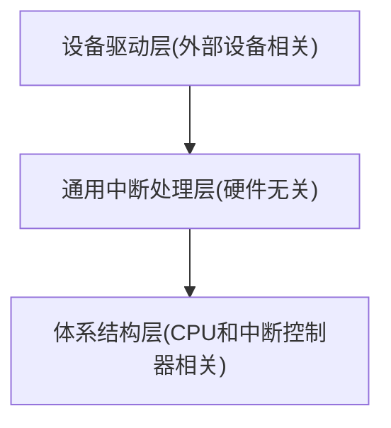

<!-- 中断子系统-基础 -->

<!-- 
1. 什么是中断
2. 软件中断 比如缺页异常是怎么处理的 和设备产生的中断区别在哪
3. 中断的亲和性问题
4. 中断的优先级问题
5. 中断屏蔽
6. 关中断过程中丢失中断怎么办

 -->
## 前言

中断是操作系统中核心的一种机制，中断机制通过打断`CPU`正在执行的任务转而执行更加紧迫和重要的任务从而保障关键服务的实时性。比如网卡收包时，`CPU`需要迅速响应处理，否则就会出现网卡队列过载出现丢包。因此中断是`Linux`内核中非常重要的一种机制，理解中断的触发和处理过程是非常有必要的。

## 中断的分类

中断的分类方式很多，最常见的是按照同步中断和异步中断来分类，
- 同步中断（软件中断）：所谓同步指的是就是中断与当前执行的指令直接相关。同步中断是在处理器内部执行指令时检测到的错误或者内部中断，比如指令执行过程中出现了除零、缺页等异常或者执行的是特殊中断指令（比如`int 0x80`）等。
- 异步中断（硬件中断）：异步中断同理，指中断与当前CPU正在执行的指令无关，这些中断由硬件设备产生，比如网卡、时钟等。硬件中断会通过中断控制器的仲裁、屏蔽校验后再通知`CPU`。中断控制器作为中间角色管理来自各个设备的中断请求，实现方案与`CPU`和中断控制器的硬件设计有关（不同的`CPU`架构、中断控制器拓扑等等），这里暂不关注，只需要理解设备通过`irq line`连接中断控制器，然后以某种方式`CPU`能够感知到中断控制器当前有中断需要执行。

因此不管是同步中断还是异步中断都是`CPU`在硬件上可以感知到的，也被称为硬中断。但是在Linux内核中还有一个软中断(`softirq`)的概念，软中断是内核模拟的一种异步中断，纯粹通过软件实现，通过`raise_softirq`触发，将需要推迟执行的软中断记录在一个位图中，软中断的检查和处理发生在每一次中断处理程序执行完成时，但是如果软中断过多，不能一直处理下去，剩余的软中断会交给内核线程`ksoftirqd`进行处理。
这里需要区分软中断(`softirq`)与软件中断(`software interrupt`)这两个概念，软件中断指的是由软件主动触发的中断，比如系统调用、程序出错等，这些中断虽然由软件产生但是会被硬件检测到，属于硬中断的范畴，而软中断是一个`Linux`内核中的概念，并不是一个操作系统中的通用概念。所以提到中断，一般指的是与硬件相关的同步中断与异步中断。

## 中断子系统的代码架构

从前面的内容可知，中断会涉及到硬件，包括设备、中断控制器、CPU，而中断控制器与CPU是与体系结构相关的，有独立的中断处理逻辑。而设备与体系结构无关，但是需要编写设备的设备驱动程序来处理设备发起的中断。除了这些硬件相关的部分，剩下的则是通用中断处理逻辑。自上而下的的代码架构如下：
