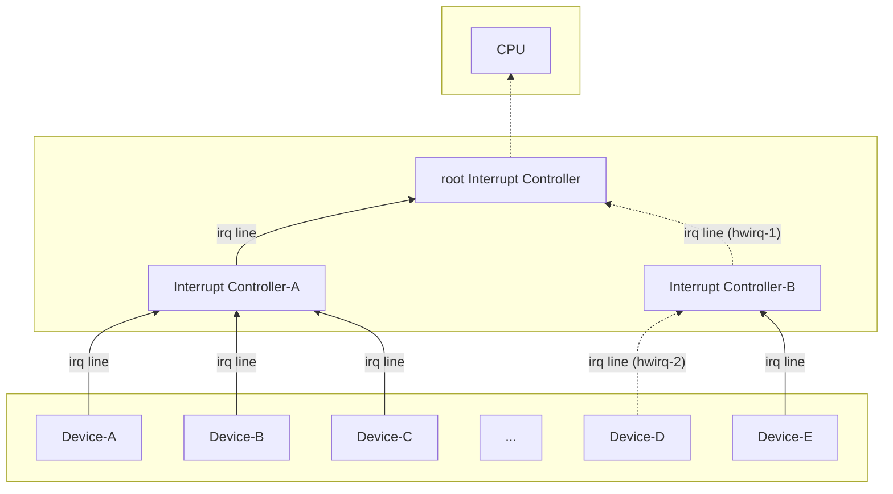

<!-- 介绍中断子系统的中断源管理机制 -->

## 前言

在现代计算机系统中，中断模块的硬件越来越复杂，有可能有多个中断控制器（`Interrupt Controller, IC`）之间进行级联从而拓展可以管理的中断源数量。这就会产生几个问题，每个`IC`上都连接着多个设备，`IC`会给`irq line`连接的每一个设备分配一个硬件中断请求号(`HW interrupt number，hwirq`)，不同的`IC`之间是独立的，因此`hwirq`会有可能复用，`CPU`就无法仅依赖连接的`root IC`的`hwirq`来区分中断源。

此外，内核并不理解`hwirq`，内核通过中断描述符表（` interrupt descriptor table, IDT`）来管理所有的中断处理函数(`Interrupt Service Routine, ISR`)，每一个中断描述符中包含了该中断的描述信息和处理函数，而定位一个中断描述符依赖于`IRQ number`，这是一个逻辑中断号(下文缩写为`virq`)。

因此，内核在进行中断处理前需要识别不同的设备中断源才能找到并执行设备的`ISR`，这就需要将接收到的`hwirq`转化为`virq`。本文介绍了中断子系统是如何对该部分进行抽象建模、屏蔽不同硬件之间的差异形成通用的中断处理模块的，在这个通用的中断处理模块中`hwirq`又是如何翻译为`virq`的。

**Note:** 本文避免讨论与硬件或体系结构相关的细节，专注于通用的中断处理模块，另外本文的源码解读基于`Linux 5.10` 

本文涉及的相关名词缩写如下：
- `IC`: `Interrupt Controller`, 中断控制器
- `hwirq`: `Hardware Interrupt Number`, 硬件中断请求号
- `virq`: `Virtual Interrupt Number`, 虚拟中断请求号
- `ISR`: `Interrupt Service Routine`, 中断服务程序
- `GIC`: `Generic Interrupt Controller`, 通用中断控制器

## 中断源识别的例子

为了帮助理解内核代码，首先我们先梳理一下`CPU`和`IC`之间是如何连接的，以及在这个架构下内核是如何识别中断源的，有了这个概念以后再去理解内核代码就更加容易。



<center>三个中断控制器级联的例子</center>

如图所示，有三个`IC`进行级联（级联呈现树状结构），`root IC`作为根`IC`连接到`CPU`上，假设设备`Device-D`发起了一个中断请求（如图中虚线所示），此时`CPU`会检测到`root IC`的电平变化并从`root IC`的寄存器中取出硬件中断号`hwirq-1`（对应`IC-B`连接到`root IC`的`irq line`），此时`CPU`根据`hwirq-1`找到并执行`IC-B`的中断处理函数`handler-B`，`handler-B`是一个特殊的`ISR`，他处理的是`IC`的中断请求而不是普通设备的中断请求，`handler-B`会从`IC-B`的寄存器中找到此时真正发起中断请求的设备的`hwirq`（即`hwirq-2`），并将`hwirq-2`翻译为`Device-D`对应的`virq`，并执行对应的`ISR`，至此就完成了一次中断请求的识别和执行。

在这个例子中可以很清晰的看到找到`Device-D`的`ISR`前需要逐级地对`hwirq`进行转化，最终转化为设备中断的`virq`，定位到设备的中断描述符，执行相应的`ISR`。显然在每一级转化中（`hwirq`转化为`virq`）需要依赖于一个映射表，每一个`IC`需要维护一个自己的映射表，维护的这个映射表在内核中由结构体`struct irq_domain`实现。

## irq_domain

### struct irq_domain 结构体
`irq_domain`可以理解为一个`KV`数据库，专门用于在某个`IC`内部查询`hwirq`对应的`virq`。
```c
struct irq_domain {
    // 链表节点，所有的irq_domain会放在一个全局的链表中
    struct list_head link;
    // irq_domain name
    const char *name;
    // irq_domain的操作函数集合
    const struct irq_domain_ops *ops;   
    // IC私有数据，不同控制器类型自定义
    void *host_data; 
    /* Optional data */
    // 对应的IC设备信息
    struct fwnode_handle *fwnode;
    // 存储KV的数据结构
    irq_hw_number_t hwirq_max;
    unsigned int revmap_direct_max_irq;
    unsigned int revmap_size;
    struct radix_tree_root revmap_tree;
    struct mutex revmap_tree_mutex;
    unsigned int linear_revmap[];
};
```
`irq_domain`结构体其中有一些关键的成员变量：
- `link`：`irq_domain`会被放置在一个全局的链表`irq_domain_list`中进行管理
- `ops`：`ops`中定义了一系列的`callback`函数，这些函数是与具体的硬件相关的，比如在`mapping`（建立映射）的过程中除了要在`irq_domian`中记录`KV`关系之外还需要进行一些硬件相关的操作，一个具体的例子就是`IC`可以依据`hwirq`的范围设置不同的`handler`等等，在这些`IC`驱动自定义的`callback`函数中可以进行一些非通用的操作。
```c
struct irq_domain_ops {
    int (*match)(struct irq_domain *d, struct device_node *node,
             enum irq_domain_bus_token bus_token);
    int (*select)(struct irq_domain *d, struct irq_fwspec *fwspec,
              enum irq_domain_bus_token bus_token);
    int (*map)(struct irq_domain *d, unsigned int virq, irq_hw_number_t hw);
    void (*unmap)(struct irq_domain *d, unsigned int virq);
    int (*xlate)(struct irq_domain *d, struct device_node *node,
             const u32 *intspec, unsigned int intsize,
             unsigned long *out_hwirq, unsigned int *out_type);
};
```
- `host_data`：存放了一些`IC`的私有数据，由`IC`驱动进行自定义，可能会在`callback`函数中使用
- `fwnode`：`IC`设备信息
- `revmap*`：真正存储`KV`映射的数据结构，有线性映射和`raidx-tree`两种模式，根据映射关系是否稀疏可以选择其中一种，`revmap_size`和`linear_revmap`用于线性存储，`revmap_tree`用于`radix-tree`，还有一种直接映射的场景(`hwirq`即`virq`)，此时使用`revmap_direct_max_irq`字段。

### irq_domain的创建和初始化
`irq_domain`有一系列的创建函数，用于`linear`、`nomap`、`legacy`、`radix-tree`各种模式，这些函数会在`IC`驱动程序初始化相关的代码中被调用，这些函数都是通过调用`__irq_domain_add()`实现，但是在参数上有一些差异，可以结合上一小节中关于`revmap*`变量的说明进行阅读。
```c
static inline struct irq_domain *irq_domain_add_linear(struct device_node *of_node,
                     unsigned int size,
                     const struct irq_domain_ops *ops,
                     void *host_data)
{
    return __irq_domain_add(of_node_to_fwnode(of_node), size, size, 0, ops, host_data);
}
static inline struct irq_domain *irq_domain_add_nomap(struct device_node *of_node,
                     unsigned int max_irq,
                     const struct irq_domain_ops *ops,
                     void *host_data)
{
    return __irq_domain_add(of_node_to_fwnode(of_node), 0, max_irq, max_irq, ops, host_data);
}
static inline struct irq_domain *irq_domain_add_legacy_isa(
                struct device_node *of_node,
                const struct irq_domain_ops *ops,
                void *host_data)
{
    return irq_domain_add_legacy(of_node, NUM_ISA_INTERRUPTS, 0, 0, ops,
                     host_data);
}
static inline struct irq_domain *irq_domain_add_tree(struct device_node *of_node,
                     const struct irq_domain_ops *ops,
                     void *host_data)
{
    return __irq_domain_add(of_node_to_fwnode(of_node), 0, ~0, 0, ops, host_data);
}
```

### 系统的启动流程 - irq_domain的创建和映射添加

在系统启动时会创建好所有的`irq_domain`，但是在此之前内核需要知道硬件之间的拓扑结构，掌握触发中断的设备和`IC`之间是如何连接的，这部分信息需要通过`DTS`文件（`Device Tree Source`）或者`ACPI`文件（`Advanced Configuration and Power Interface`）来描述，`DTS`常用于嵌入式系统，`DTS`文件存在于内核源码之中，在进行内核编译时会编译成`.dtb`文件，放置在固定的目录，而`ACPI`用于传统`PC`和服务器，`ACPI`文件放置在`BIOS`或者`UEFI`固件之中。总之系统在启动时能够获取到硬件之间的拓扑信息，在这个过程中会进行`irq_doamin`的创建和初始化，并对每一个能够发起中断的设备分配一个`virq`，然后建立映射并添加到对应的`irq_domain`。这里对具体的初始化流程不做深入分析。

对于设备驱动来说，创建中断映射前并不知道自身在连接的`IC`中对应的`hwirq`，但映射的建立的需要`irq_domain`、`hwirq`、`virq`三个参数，建立映射相关的`API`如下，分别用于创建一个映射和创建多个连续映射。

```c
int irq_domain_associate(struct irq_domain *domain, unsigned int virq,
             irq_hw_number_t hwirq);
void irq_domain_associate_many(struct irq_domain *domain, unsigned int irq_base,
                   irq_hw_number_t hwirq_base, int count);
```

因此在设备驱动中创建一个映射一般是调用`irq_of_parse_and_map()`函数，该函数对`irq_domain_associate()`进行了多层的封装，以`device_node`作为参数输入尝试建立一个映射并返回`virq`，。
```c
unsigned int irq_of_parse_and_map(struct device_node *dev, int index)
{
    struct of_phandle_args oirq;

    if (of_irq_parse_one(dev, index, &oirq))
        return 0;

    return irq_create_of_mapping(&oirq);
}
EXPORT_SYMBOL_GPL(irq_of_parse_and_map);
```

`irq_of_parse_and_map`完成映射建立需要三步：
- 获取设备对应的`hwirq`：需要由`IC`的`irq_domain`来识别设备树节点信息，得到对应`hwirq`，这个过程由`irq_domain_translate()`函数完成，涉及到`ops->xlate()`这个`callback`函数，如果`IC`有配置自己的翻译方法则使用`IC`自己的方式，否则就从设备的中断描述信息中获取（在`DTS`或者`ACPI`中定义）。
```c
static int irq_domain_translate(struct irq_domain *d,
                struct irq_fwspec *fwspec,
                irq_hw_number_t *hwirq, unsigned int *type)
{
    if (d->ops->xlate)
        return d->ops->xlate(d, to_of_node(fwspec->fwnode),
                     fwspec->param, fwspec->param_count,
                     hwirq, type);

    /* If domain has no translation, then we assume interrupt line */
    *hwirq = fwspec->param[0];
    return 0;
}
```

- 另外还需要从内核中分配一个有效的中断描述符，通过`irq_domain_alloc_descs()`函数完成，该函数可以为一个指定的`virq`或者由内核分配一个`virq`并创建对应的中断描述符，总之如果分配成功可以获取一个有效的`virq`。

```c
int irq_domain_alloc_descs(int virq, unsigned int cnt, irq_hw_number_t hwirq,
               int node, const struct irq_affinity_desc *affinity)
{
    unsigned int hint;

    if (virq >= 0) {
        virq = __irq_alloc_descs(virq, virq, cnt, node, THIS_MODULE,
                     affinity);
    } else {
        hint = hwirq % nr_irqs;
        if (hint == 0)
            hint++;
        virq = __irq_alloc_descs(-1, hint, cnt, node, THIS_MODULE,
                     affinity);
        if (virq <= 0 && hint > 1) {
            virq = __irq_alloc_descs(-1, 1, cnt, node, THIS_MODULE,
                         affinity);
        }
    }

    return virq;
}
```
- 最后通过`irq_domain_associate()`将`hwirq`和`virq`间的映射添加到`irq_domain`中。

## hwirq的翻译流程

通过以上的内容应该对内核在硬件层面的中断管理有了大致的了解，假设系统已经正常启动，内核将`root IC`中的`hwirq`翻译为最底层设备的`virq`还需要依赖于次级`IC`（`Secondary IC`）的`ISR`。`root IC`不连接到任何其他的`IC`上，因此仅作为`IC`使用，但是次级`IC`除了接受其他设备的连接以外自身还需要连接到其他的`IC`上，因此就具备了设备和`IC`两重身份，不仅需要管理一个`irq_domain`，还需要注册自己的`ISR`。

这里以`GIC`级联为例，看看`root GIC`和`Secondary GIC`之间的处理是如何联动的。首先是`root GIC`的处理函数`gic_handle_irq`，该函数在`CPU`收到了来自中断分发器（`Interrupt Distributor`）的中断时执行，该函数会读取`GIC`的中断识别寄存器(`Interrupt ACKnowledge Register, IAR`)并赋值给`irqstat`，然后从`irqstat`中获取`hwirq`，调用`handle_domain_irq()`进行处理。
```c
static void __exception_irq_entry gic_handle_irq(struct pt_regs *regs)
{
    u32 irqstat, irqnr;
    struct gic_chip_data *gic = &gic_data[0];
    void __iomem *cpu_base = gic_data_cpu_base(gic);
    ...
    do {
        irqstat = readl_relaxed(cpu_base + GIC_CPU_INTACK);
        irqnr = irqstat & GICC_IAR_INT_ID_MASK;

        if (unlikely(irqnr >= 1020))
            break;
        ....
        handle_domain_irq(gic->domain, irqnr, regs);
    } while (1);
}
```
`handle_domain_irq()`调用了`__handle_domain_irq()`，该函数增加了一个参数`lookup=true`，表示需要通过查找映射关系将`hwirq`转化为`virq`，`irq_find_mapping()`就是从`irq_domain`中查找映射关系，得到`virq`后调用`generic_handle_irq()`找到`virq`对应的中断描述符并执行对应的`ISR`，在当前场景下也就是执行次级`GIC`的`ISR`。
```c
int __handle_domain_irq(struct irq_domain *domain, unsigned int hwirq,
            bool lookup, struct pt_regs *regs)
{
    ...
    if (lookup)
        irq = irq_find_mapping(domain, hwirq);

    if (unlikely(!irq || irq >= nr_irqs)) {
        ack_bad_irq(irq);
        ret = -EINVAL;
    } else {
        generic_handle_irq(irq);
    }
    ...
}
```
次级GIC注册的`ISR`如下，它以次级`GIC`的中断描述符作为参数，该函数会获取寄存器的地址信息，读取次级`GIC`的中断识别寄存器并得到`hwirq`，然后通过次级`GIC`的`irq_domain`进行翻译得到下一级设备的`virq`，假设下一级设备就是最底层的网卡设备，此时根据该`virq`就能执行网卡的`ISR`，如果不是则继续转到次次级的`GIC`中断处理函数中。
```c
static void gic_handle_cascade_irq(struct irq_desc *desc)
{
    struct gic_chip_data *chip_data = irq_desc_get_handler_data(desc);
    struct irq_chip *chip = irq_desc_get_chip(desc);
    unsigned int cascade_irq, gic_irq;
    unsigned long status;
    ...
    status = readl_relaxed(gic_data_cpu_base(chip_data) + GIC_CPU_INTACK);

    gic_irq = (status & GICC_IAR_INT_ID_MASK);
    if (gic_irq == GICC_INT_SPURIOUS)
        goto out;

    cascade_irq = irq_find_mapping(chip_data->domain, gic_irq);
    if (unlikely(gic_irq < 32 || gic_irq > 1020)) {
        handle_bad_irq(desc);
    } else {
        isb();
        generic_handle_irq(cascade_irq);
    }
    ...
}
```

## 总结

内核对`IC`的建模和抽象实现了多级级联场景下依然能够正确的识别中断设备，执行正确的中断处理函数，其中最关键的设计就是`irq_domain`和`virq`。本文的内容主要分析了内核在中断处理函数执行之前做的一些通用工作，后续将会对中断处理相关的内容进行分析，包括中断描述符、软中断等内容。