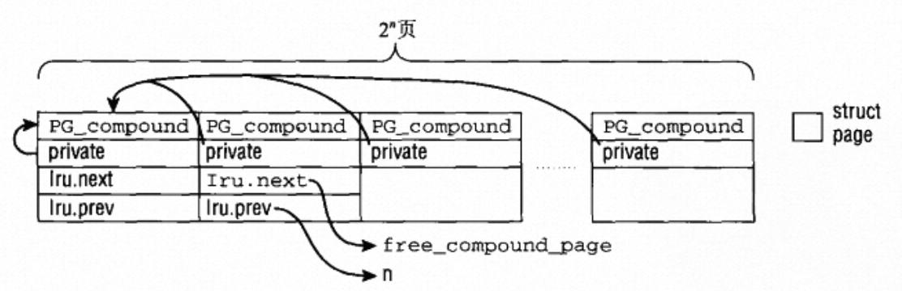

# 复合页机制

## 前言

在从伙伴系统进行内存分配时有一个`__GFP_COMP`分配flag，该flag表示从伙伴系统分配的连续页帧为一个复合页。复合页就是将多个页帧进行组合，视作一个更大size的页。

复合页可以用于hugetlb，减少tlb中地址转化的次数，减少tlb miss几率，同时提高tlb的地址转化速度。slab分配器也会分配复合页用于管理。这里我对复合页的具体用途不展开详谈，先描述一下复合页在内核中是如何实现、分配以及释放的。

## 复合页的设计

复合页由连续的多个page构成，其中首个page称为head page，剩余的page都称作tail page。


<!--  -->
<center>复合页的设计</center>

所有的page的`first_page`字段都存放指向head page的指针（该图来自于《深入Linux内核架构》，图中用的是private指针和阅读的code中的实现略有区别），此外head page后的第一个page，即第一个tail page的`lru.next`和`lru.prev`分别存放释放复合页的函数指针以及复合页的分配阶。

head page的`lru.next`和`lru.prev`用于将复合页链入放入某个队列进行管理。

此外，所有的page都被标记上`PG_compound`，表明是复合页的一部分。

## 复合页的分配

复合页的分配和普通的伙伴系统内存分配相同，区别在于分配完成后`prep_new_page`针对复合页做了额外的初始化操作。

```c
static int prep_new_page(struct page *page, int order, gfp_t gfp_flags)
{
    ...
    if (order && (gfp_flags & __GFP_COMP))
        prep_compound_page(page, order);
    ...
}
```

在`prep_compound_page`中，`set_compound_page_dtor`会设置好析构函数用于后续释放复合页，存放位置为`page[1].lru.next`。`set_compound_order`设置复合页的分配阶，存放位置为`page[1].lru.prev`。可以看到析构函数和分配阶都是存放在复合页的第一个tail page中。

然后为head page以及每个tail page设置好PG_flag，`__SetPageHead`给**head page**的flags会添加`PG_compound`，而`__SetPageTail`会对每一个**tail page**同时设置`PG_reclaim`和`PG_compound`，用以区分head page和tail page。

```c
static void prep_compound_page(struct page *page, unsigned long order)
{
    int i;
    int nr_pages = 1 << order;

    set_compound_page_dtor(page, free_compound_page);
    set_compound_order(page, order);
    __SetPageHead(page);
    for (i = 1; i < nr_pages; i++) {
        struct page *p = page + i;

        __SetPageTail(p);
        p->first_page = page;
    }
}
```

## 复合页的释放

首先释放复合页需要从page指针的`first_page`找到head page，然后从第一个tail page的`lru.next`上获取析构函数，`lru.prev`上获取分配阶，调用析构函数即可。

```c
static void put_compound_page(struct page *page)
{
    page = compound_head(page);
    if (put_page_testzero(page)) {
        compound_page_dtor *dtor;

        dtor = get_compound_page_dtor(page);
        (*dtor)(page);
    }
}
```
