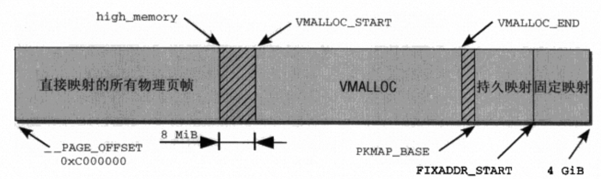

# 持久映射和固定映射

## 前言

<!--  -->

<center>内核地址空间的划分</center>

`VMALLOC_START`和`VMALLOC_END`之间的区域用于`vmalloc`分配逻辑上连续物理上不连续的内存。

内核地址空间中还有一段区间用于高端内存的持久映射，`PKMAP_BASE`和`FIXADDR_START`，如果存在高端内存可以通过`alloc_pages_node`分配高端内存，然后调用`kmap`在持久映射区建立映射关系。

## 持久映射和固定映射的区别与联系

好像`vmalloc`也可以实现分配高端内存然后建立虚拟地址与高端物理内存的映射，那持久映射还有什么意义呢？我个人认为，`vmalloc`为的是分配逻辑上连续物理上可不连续的大块内存，对于分配的内存是否是高端内存没有限制（尽管优先分配的是高端内存）。而持久映射只为访问高端内存，如果需要访问的总内存量超过`vmalloc`区域能够映射的范围，vmalloc不能够灵活访问所有的内存。因此通过`alloc_pages_node`自己申请一大片内存然后通过`kamp`的方式建立映射，这样才能够保证数据不丢的同时能访问所有的高端内存，毕竟`vmalloc`和`vfree`已经将从伙伴系统申请页帧的操作封装好了，没有机会自己管理页帧。

那固定映射有什么用呢？固定映射区域被划分为了per-cpu的多个子区域，每个子区域内部又划分为了多个固定用途的子项。子项的个数和用途在编译时就固定了，但是具体的映射关系是可改变的，这些固定的映射关系主要用于内核中需要建立到高端内存的映射同时又不能睡眠的场景，比如中断上下文。持久映射区的映射数量有限，因此当`kmap`发现无可用映射时就会陷入睡眠。而固定映射区的映射已经为每个cpu提前划分好了一部分，可以自由选择修改和使用哪一个映射，不会出现竞争导致睡眠的情况。

## 相关API

- `kmap`: 接收page指针为参数，如果该page是高端内存时才会在持久映射区建立映射，因为持久映射区的范围有限，如果没有空闲地址时就会陷入睡眠，因此在不允许睡眠的场景无法使用。
- `kmap_atomic`: 和kamp类似，接收一个page指针和`km_type`作为参数，但是`kmap_atomic`是原子的不会陷入睡眠，建立的映射位于固定映射区。

**Note**: 当系统中不存在高端内存时(现在很多64位系统都不存在高端内存)持久映射区，这些操作都没有意义，因为分配不出高端内存。如果将其他内存区的页帧作为参数，以上操作会直接返回线性映射的虚拟地址。

```c
enum km_type {
    /* arch specific kmaps - change the numbers attached to these at your peril */
    __KM_CACHE,  /* cache flush page attachment point */
    __KM_PGD,  /* current page directory */
    __KM_ITLB_PTD,  /* current instruction TLB miss page table lookup */
    __KM_DTLB_PTD,  /* current data TLB miss page table lookup */

    /* general kmaps */
    KM_BOUNCE_READ,
    KM_SKB_SUNRPC_DATA,
    KM_SKB_DATA_SOFTIRQ,
    KM_USER0,
    KM_USER1,
    KM_BIO_SRC_IRQ,
    KM_BIO_DST_IRQ,
    KM_PTE0,
    KM_PTE1,
    KM_IRQ0,
    KM_IRQ1,
    KM_SOFTIRQ0,
    KM_SOFTIRQ1,
    KM_TYPE_NR
};
```
