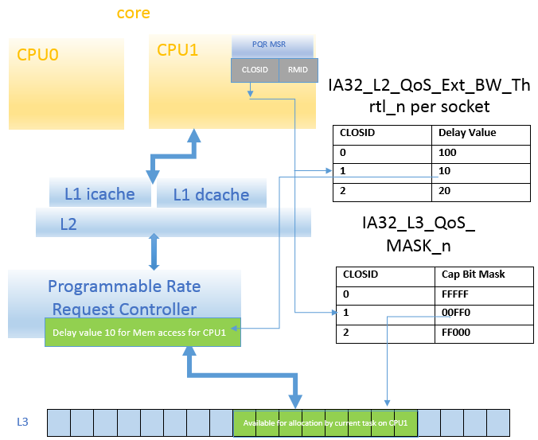

# Intel-RDT 技术浅析

## 前言

RDT技术全称 Resource Director Technology，RDT技术提供了LLC（Last Level Cache）以及MB（Memory Bandwidth）内存带宽的分配和监控能力。

RDT的主要功能有以下几个：

1. CAT（Cache Allocation Technology）：分配和隔离LLC资源
2. CMT（Cache Monitor Technology）：监控LLC的使用情况
3. MBA（Memory Bandwidth Allocation）：内存带宽分配和隔离
4. MBM（Memory Bandwidth Monitor）：内存带宽监控
5. CDP（Code & Data Prioritization）：细化的Code-Cache和Data-Cache的分配

在混合部署场景下，cgroup提供了粗粒度的CPU、内存、IO等资源的隔离和分配，但是从软件层面无法对LLC和内存带宽等共享资源进行隔离，离线业务可以通过争抢LLC和内存带宽来干扰在线业务。RDT从硬件层面提供了细粒度的LLC资源的分配和监控能力，在混部场景运用广泛。

## Intel RDT

### 硬件能力

RDT技术提供了MSR（Model Specific Register）寄存器作为编程接口，主要包括三个寄存器`IA32_PQR_ASSOC`、`IA32_QM_EVTSEL`和`IA32_QM_CTR`。

Note：下文中提到的thread是指的物理线程，而不是软件中线程的概念。在超线程的情况下，每个core包含多个thread，每个socket又包含多个core。

#### IA32_PQR_ASSOC

寄存器的高32位和低32位分别指示当前thread所属的COS（Class of service）和RMID（Resource Monitor ID），COS关联了一组资源控制策略，限定当前thread可以使用的资源总量和范围。RMID则是监控组ID，资源的使用情况被记录到对应的监控组内。

#### IA32_QM_EVTSEL

`IA32_QM_EVTSEL`是一个事件查询寄存器，在寄存器的指定位指定了查询的监控组ID和事件ID以后，可以通过`IA32_QM_CTR`寄存器获取到对应的监控数据。
支持的监控指标包括：

- `occupancy monitoring`：LLC的占有量
- `total memory bandwidth`：全部的内存带宽（本地的内存带宽+远端的内存带宽）
- `local memory bandwidth`：本地的内存带宽

#### IA32_QM_CTR

对`IA32_QM_EVTSEL`寄存器进行编程以后，可以在`IA32_QM_CTR`寄存器获取对应的查询结果。

### CLOSID和RMID

Intel 提供的内存带宽和LLC的分配和监控能力，核心就在于CLOSID（Class of Service ID）和RMID。每一个thread的`IA32_PQR_ASSOC`寄存器上指定的CLOSID限制了当前thread可以访问的资源，RMID指定了记录监控事件的监控组。每一个thread（可能存在超线程情况）都包含一组RDT的MSR寄存器，进程在thread上运行时受到的资源限制策略和监控由当前thread的`IA32_PQR_ASSOC`寄存器决定。

CLOSID是资源分配策略表的索引，由硬件支持，当thread发起对LLC的访问时首先通过CLOSID作为偏移在`IA32_L3_QoS_MASK_n`中找到位掩码CBM（Cache Bit Mask），RDT将LLC进行分块，每一个Bit对应一块，该thread只允许访问在位掩码中的Cache块。同时，CLOSID也作为`IA32_L2_QoS_Ext_BW_Thrtl_n`的偏移得到Delay Value，可编程的请求控制器（Programmable Rate Request Controller）根据这个值增加访存指令对LLC的访问延迟来降低指令的执行速度，从而减少由LLC Miss导致的访存次数，自然也就能降低使用到的内存带宽。大体的机制可以参考下图：

RMID则是用于指定当前thread上的事件统计的监控组。比如对内存读写了多少字节、占用了多少Cache等数据会写入对应的计数寄存器。

## 注意事项

在这里有几个需要注意的点：

1. `IA32_PQR_ASSOC`、`IA32_QM_EVTSEL`和`IA32_QM_CTR`三个寄存器是RDT技术的可编程接口寄存器，用于配置分配策略和读取监控事件，需要注意这组寄存器是**per-thread**的，因此可以在thread粒度上进行资源配置和监控。但是同样的，进程在进行上下文切换时可以重新编程当前thread的`IA32_PQR_ASSOC`寄存器，设置新的分配策略和监控组以实现进程级别的资源配置和监控。更进一步，可以对一组线程使用同样的配置和监控组，从而实现对一组进程进行资源限制和监控，Linux内核的resctrl文件系统就是基于这种方式实现的。
2. `IA32_L3_QoS_MASK_n`和`IA32_L2_QoS_Ext_BW_Thrtl_n`是存储内存带宽和LLC分配策略的寄存器组，是**per-socket**的，每个socket的所有thread共享这个策略表，这两组寄存器的数量是有限的，因此**CLOSID作为索引其数量和表的大小一致，也是有限的**，如何分配CLOSID和切换thread的CLOSID这是上层软件需要关注的事情。
3. RMID与CLOSID类似，硬件不可能支持无限的监控组，因此**RMID的数量也是有限**的。
4. 第2条中提到，`IA32_L3_QoS_MASK_n`与`IA32_L2_QoS_Ext_BW_Thrtl_n`是per-socket的硬件寄存器，因此RMID和CLOSID自然也是per-socket的，**不同socket上的相同ID完全独立**。
5. 上文在描述内存带宽限制时提到了可编程的请求控制器，该控制器比较特殊，在某些芯片上是per-core的，因此在这类CPU上同core上的不同thread即使具备不同的延迟值也做不到分别限制速率，实际上控制器会使用两个thread中较大的延迟值进行速率控制，这种情况下，如果在线业务线程和离线业务线程出现同时运行在一个core上会影响到在线业务的执行速度。当然**也有一些CPU支持per-thread的细粒度内存带宽限制**。

## RDT技术应用

RDT技术作为intel提供的硬件特性，自然也存在一些相应的上层软件方便用户使用RDT的资源配置和监控能力，比如pqos、pcm等等。Linux内核在4.10版本也提供了resctrl文件系统用于操控RDT。
