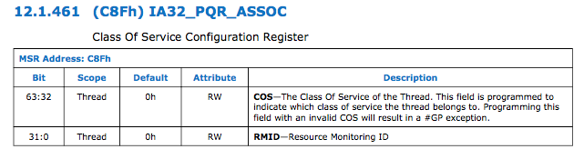
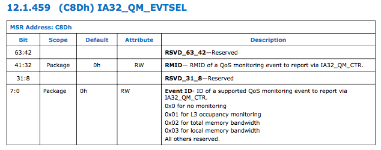
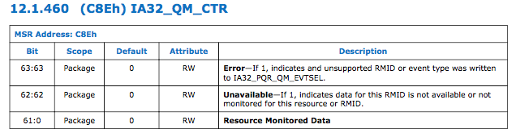

# Intel-RDT 技术浅析

## 前言

RDT技术全称 Resource Director Technology，RDT技术提供了LLC（Last Level Cache）以及MB（Memory Bandwidth）内存带宽的分配和监控能力。

RDT的主要功能有以下几个：

1. CAT（Cache Allocation Technology）：分配和隔离LLC资源
2. CMT（Cache Monitor Technology）：监控LLC的使用情况
3. MBA（Memory Bandwidth Allocation）：内存带宽分配和隔离
4. MBM（Memory Bandwidth Monitor）：内存带宽监控
5. CDP（Code & Data Prioritization）：细化的Code-Cache和Data-Cache的分配

在混合部署场景下，cgroup提供了粗粒度的CPU、内存、IO等资源的隔离和分配，但是从软件层面无法对LLC和内存带宽等共享资源进行隔离，离线业务可以通过争抢LLC和内存带宽来干扰在线业务。RDT从硬件层面提供了细粒度的LLC资源的分配和监控能力，在混部场景运用广泛。

## Intel RDT

### 硬件能力

RDT技术提供了MSR（Model Specific Register）寄存器作为编程接口，主要包括三个寄存器`IA32_PQR_ASSOC`、`IA32_QM_EVTSEL`和`IA32_QM_CTR`。

#### IA32_PQR_ASSOC

寄存器的高32位和低32位分别指示当前物理线程所属的COS（Class of service）和RMID（Resource Monitor ID），COS关联了一组资源控制策略，限定当前物理线程可以使用的资源总量和范围。RMID则是监控组ID，资源的使用情况被算入到对应的监控组内。

#### IA32_QM_EVTSEL

这是一个事件查询寄存器，在寄存器的指定位指定了RMID和Event ID以后，可以通过`IA32_QM_CTR`寄存器获取到对应监控组指定事件的监控数据。
支持的监控指标包括：

- L3 occupancy：LLC的占有量
- Total memory bandwidth：全部的内存带宽（本地的内存带宽+远端的内存带宽）
- Local memory bandwidth：本地的内存带宽

#### IA32_QM_CTR

对`IA32_QM_EVTSEL`寄存器进行编程以后，可以在`IA32_QM_CTR`寄存器获取对应的查询结果。

### CLOSID和RMID

Intel 提供的内存带宽和LLC的分配和监控能力，核心就在于CLOSID（Class of Service ID）和RMID。每一个物理线程的`IA32_PQR_ASSOC`寄存器上指定的CLOSID限制了当前线程可以访问的资源，RMID指定了记录监控事件的监控组。每一个Core上的每一个物理线程（可能存在超线程情况）都包含一组RDT的MSR寄存器，每一个进程在物理线程上运行时可使用的资源由当前物理线程`IA32_PQR_ASSOC`寄存器中的CLOSID控制。

CLOSID是资源分配策略表的索引，由硬件支持，当物理线程发起对LLC的访问时通过CLOSID作为偏移在`IA32_L3_QoS_MASK_n`中找到位掩码CBM（Cache Bit Mask），RDT将LLC进行分块，每一个Bit对应一块，该物理线程只允许访问在CBM中的Cache块。同时CLOSID也作为`IA32_L2_QoS_Ext_BW_Thrtl_n`的偏移得到Delay Value，这个值用于增加对LLC的访问延迟降低访存指令的执行速度，从而减少由LLC Miss导致的访存次数，对应的也就能影响可以使用的内存带宽。可以参考下图：

RMID则是用于指定当前物理线程上的事件统计的监控组。比如内存读写了多少字节、Cache占用了多少等数据会写入对应计数寄存器。

## 注意事项

在这里有几个需要注意的点：

1. `IA32_PQR_ASSOC`、`IA32_QM_EVTSEL`和`IA32_QM_CTR`三个寄存器是RDT技术的可编程接口寄存器，用于配置分配策略和读取监控事件，需要注意这组寄存器是**per-thread**的，因此可以在per-thread粒度上进行资源配置和监控。但是同样的，在thread上进程在进行上下文切换时可以重新编程`IA32_PQR_ASSOC`寄存器以达到进程级别的资源配置和监控，更进一步可以对一组线程使用同样的配置和监控组以达到组监控的目的，Linux内核的resctrl文件系统就是基于这种方式实现的。
2. `IA32_L3_QoS_MASK_n`和`IA32_L2_QoS_Ext_BW_Thrtl_n`是存储内存带宽和LLC分配策略的寄存器组，是**per-socket**的，每个socket的所有thread共享这个策略表，这两组寄存器的数量是有限的，因此**CLOSID作为索引其数量和表的大小一致也是有限**的，如何分配CLOSID、如何切换thread的CLOSID这是上层软件需要关注的事情。
3. RMID与CLOSID类似，硬件不可能支持无限的监控组，因此**RMID的数量也是有限**的。
4. 第2条中提到，`IA32_L3_QoS_MASK_n`与`IA32_L2_QoS_Ext_BW_Thrtl_n`是per-socket的硬件寄存器，因此RMID和CLOSID自然也是per-socket的，**不同socket上的相同ID完全独立**。
5. 上文在描述内存带宽限制时提到了可编程的请求控制器，该控制器比较特殊，在**某些CPU上是per-core**的，因此在特定的CPU上同core上的不同thread即使具备不同的delay value也不是独立的限制策略，实际上会按照两个thread中最大程度的内存带宽限制进行压制。当然**也有一些CPU支持per-thread的细粒度内存带宽限制**。

## RDT技术应用

RDT技术作为intel提供的硬件特性，自然也存在一些相应的上层软件方便用户使用RDT的资源配置和监控能力，比如pqos、pcm等等。Linux内核在4.10版本也提供了resctrl文件系统用于操控RDT。
