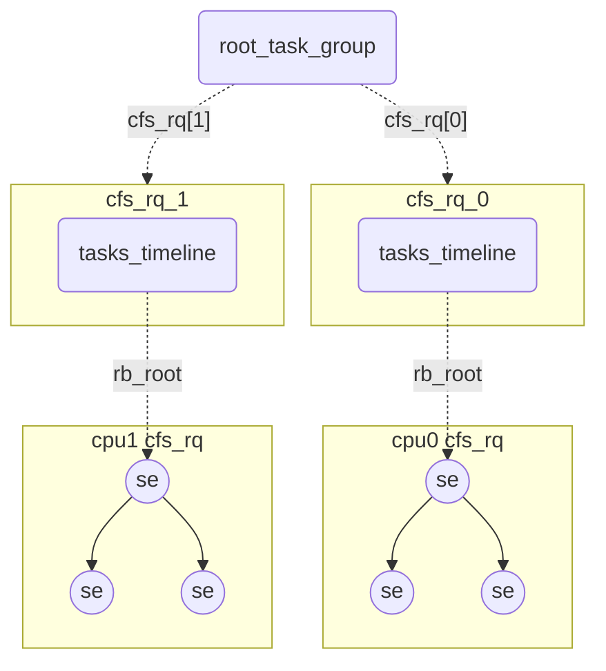
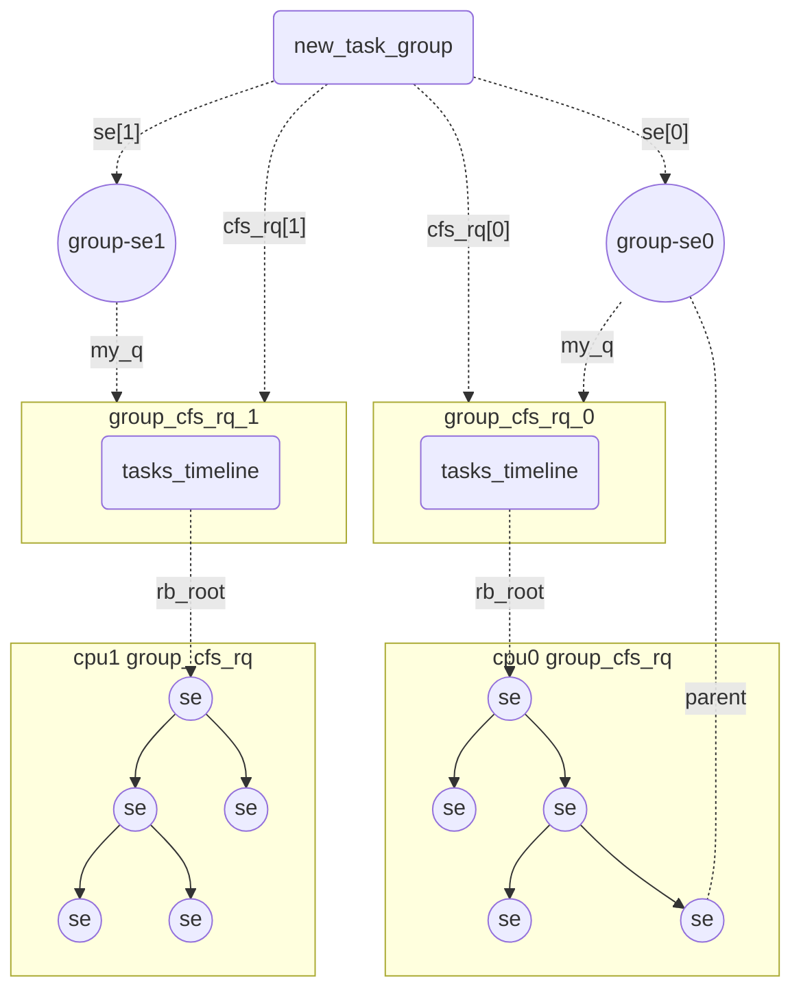

<!-- CFS（五）组调度 -->
# 组调度

## 前言

CFS组调度指的是一种CPU资源的分配方式，普通的CFS调度是以进程为资源的分配单位，而组调度则将进程以组划分，在任务组之间做第一轮的资源分配，然后在组内部再进行第二轮的资源分配。这种特性在容器场景非常有用。

开启CFS组调度需要配置`CONFIG_CGROUP_SCHED`和`CONFIG_FAIR_GROUP_SCHED`选项。

## 组调度相关数据结构的组织

CFS为了支持组调度主要有以下几点设计上的改变：

- 是调度实体对应的可能是一组Task，并且这组Task的管理也是使用的`cfs_rq`，层级的`cfs_rq`形成了一种嵌套的树状结构，这种表示一组任务的调度实体暂时被称作`group-se`，`group-se`用`my_q`指针指向一个`cfs_rq`。
- 组调度管理的多个`se`可能会分布在多个CPU上，因此不同核上的`se`需要在每个CPU上独立管理。
- 不同核上的`se`归根结底还是属于一个任务组，需要有一个数据结构`task_group`管理任务组在所有核上的调度实体，通过`task_group`可以找到每个核上的`group-se`与其对应的`cfs_rq`。

### task_group

```c
/* Task group related information */
struct task_group {
    struct sched_entity	**se;   /* per-cpu的表示任务组调度实体 */
    struct cfs_rq		**cfs_rq;  /* per-cpu的管理每个cpu上调度实体的runq */
    struct task_group	*parent;    /* 上层的task group */
    unsigned long		shares; /* 任务组的份额 */
}
```

`task_group`表示一个任务组，其中`se`和`cfs_rq`是PER-CPU的指针数组。

- `per-cpu-cfs_rq`用于管理任务组中分布在不同CPU上的调度实体。
- `per-cpu-se`是`group-se`，每个核上的`se[cpu]->my_q`指向`cfs_rq[cpu]`。任务组在每一个CPU上的都有一个`group-se`。
- `parent`可以找到上层`task_group`，`task_group->se[cpu]->cfs_rq`（`se`所处的`cfs_rq`）指向的就是`task_group->parent->cfs_rq[cpu]`。

在内核初始化的时候有一个全局的`struct task_group`命名为`root_task_group`，在CFS的视角，系统启动时中所有的任务都属于根任务组。根任务组具有一些特殊性，其`parent = NULL`并且`se = {NULL, NULL, ...}`，根任务组已经没有上层的任务组了，因此不需要`se`和`parent`。

### cfs_rq

`cfs_rq`新增了两个成员变量：

- `rq`指向当前`cfs_rq`所属的`rq`。
- `tg`指向所属的`task_group`。

```c
struct cfs_rq {
    struct rq		*rq;    /* 指向当前cfs_rq 挂载到的rq，用以区分不同cpu */
    struct task_group	*tg; /* 指向所属的task_group */
}
```

### sched_entity

`group-se`需要下面会挂载一个`cfs_rq`，因此为了支持组调度`sched_entity`新增了一些变量。

- `depth`表示层级，`root_task_group`的`cfs_rq`管理的`se`的`depth`都是0，对于其他调度实体`se->depth = parent->depth + 1`。
- `parent`指向任务组在上层`cfs_rq`中的`group-se`。`root_task_group`中的`se->parent`为`NULL`。
- `cfs_rq`指向管理当前`se`的`cfs_rq`
- `my_q`可以用以区分`task-se`和`group-se`。`group-se`的`my_q`指向管理的`cfs_rq`。`task-se`的`my_q`为`NULL`。

```c
struct sched_entity {
#ifdef CONFIG_FAIR_GROUP_SCHED
    int				depth;      /* 调度实体所处组的深度 */
    struct sched_entity		*parent;    /* 所属任务组在上一层中的调度实体 */
    struct cfs_rq			*cfs_rq;    /* 调度实体所在的任务组runq */
    struct cfs_rq			*my_q;      /* 如果是一个group-se my_q指向管理的任务组runq*/
#endif
}
```

### 一些数据结构间关系的例子

上述的内容比较抽象，这里举一个简单的例子辅助理解，假设系统初始化时系统中只有一个`root_task_group`。系统有两个核，核上的Task数量都为3。初始的层级结构如下，系统中只有一个`root_task_group`，两个`cfs_rq`，这与不支持组调度的场景是一致的。



此时`se`的状态如下。

```c
struct task_group root_task_group {
    .parent = NULL;
    .cfs_rq = {&cfs_rq_0, &cfs_rq_1};
    .se = {NULL, NULL};
}
/* cpu0上的cfs_rq */
struct cfs_rq cfs_rq_0 {
    .nr_running = 3;
    .h_nr_running = 3;
    .tg = &root_task_group;
}
/* cpu0上的某个调度实体 */
struct sched_entity se {
    .depth = 0;
    .parent = NULL;
    .cfs_rq = &cpu0_cfs_rq;
    .my_q = NULL;
}
```

假设此时新建一个任务组，该任务组包含10个任务，每个cpu上分别有5个任务。需要新创建的数据结构包括两个`group-se`放入根任务组的`cfs_rq`中、两个`cfs_rq`分别挂到`group-se`下面，以及一个 `struct task_group`挂在`root_task_group`下面，需要创建的10个`task-se`此处先忽略。这些新建数据结构间的连接方式如下图所示。



由于结构基本对称就以cpu0的为例，此时相关数据结构的信息如下：

- `new_task_group`能找到新建的`cfs_rq`以及两个`group-se`。`parent`指向`root_task_group`.
- `group_cfs_rq_0`的`tg`指向`new_task_group`，`nr_running`和`h_nr_running`都是5。
- `group-se0`要位于根任务组因此`depth`为0，`parent`为`NULL`。`cfs_rq`指针指向根任务组的`cfs_rq_0`。`my_q`指向新建的`group_cfs_rq_0`。
- `se`位于`group_cfs_rq_0`的`rb-tree`中，`parent`指向`group-se0`，`depth`为`parent->depth`加1。`cfs_rq`指向新建的`group_cfs_rq_0`。因为是`task-se`，所以`my_q`为`NULL`.

```c
/* 新建的任务组 */
struct task_group new_task_group {
    .cfs_rq[2] = {&group_cfs_rq_0, group_cfs_rq_1};
    .se[2] = {&group-se0, &group-se1};
    .parent = &root_task_group;
}
/* cpu0上新建的cfs_rq */
struct cfs_rq group_cfs_rq_0 {
    .nr_running = 5;
    .h_nr_running = 5;
    .tg = &new_task_group;
}
/* 位于根任务组 cpu0的cfs_rq中的group-se */
struct sched_entity group-se0 {
    .parent = NULL;
    .depth = 0;
    .cfs_rq = &cfs_rq_0;
    .my_q = &group_cfs_rq_0;
}
/* 新任务组在cpu0上的某个调度实体 */
struct sched_entity se {
    .parent = &group-se0;
    .depth = 1;
    .cfs_rq = &group_cfs_rq_0;
    .my_q = 0;
}
```

合入只需要将两个`group-se`分别挂入根任务组的对应的cpu上的`cfs_rq`并且调整`cfs_rq`的`nr_running`和`h_nr_running`，让`new_task_group`的`parent`指针指向`root_task_group`就可以了。

**NOTE**：`nr_running`表示本`cfs_rq`中的调度实体数量，`h_nr_running`表示本层级及以下的所有`cfs_rq`的调度实体数量总数。新建后的根任务组的`cfs_rq`的`nr_running`应该为4，`h_nr_running`应该为9。

## 组调度的时间分配

回想一下不支持组调度的场景，一个`se`在调度周期内分配的时间总量为其权重占`cfs_rq`的比例。而组调度实现了一种树状的嵌套结构，每一个任务组能够得到的总时间需要看其`group-se`在上层队列中的权重占比，确认了分配时间总量后，再进一步将时间分配到任务组内的调度实体上，这个过程会持续到本组内全部都是`task-se`为止。比如在根任务组有两个`se`，权重值为`1:2`，分别占有占有`33.3%`和`66.6%`的cpu时间，第一个`se`是`group-se`，其`my_q`指向的`cfs_rq`又包含两个`se`权重值相同，则每个`se`能够得到`16.6%`的时间。

计算某个`se`的在调度周期内应得的时间片的函数为`sched_slice`，逻辑是上面的这个逻辑，但是实现上`sched_slice`是自低向上计算的（结果是一致），计算顺序自左向右为`slice * 1/2 * 1/3`。

```c
#define for_each_sched_entity(se) \
        for (; se; se = se->parent)
        
static u64 sched_slice(struct cfs_rq *cfs_rq, struct sched_entity *se)
{
    u64 slice = __sched_period(cfs_rq->nr_running + !se->on_rq);

    for_each_sched_entity(se) {
        struct load_weight *load;
        struct load_weight lw;

        cfs_rq = cfs_rq_of(se);
        load = &cfs_rq->load;

        slice = __calc_delta(slice, se->load.weight, load);
    }
    return slice;
}

```

## 组调度的任务选择

组调度在选择任务时自顶向下搜索`vruntime`最小的`se`，如果在某一层找到的`vruntime`最小的`se`是`group-se`则继续寻找，直到遇到一个`se`的`my_q`为`NULL`时停止，即遇到一个`task-se`。

**NOTE**：`group_cfs_rq`返回`se->my_q`

```c
static struct task_struct *
pick_next_task_fair(struct rq *rq, struct task_struct *prev, struct rq_flags *rf)
{
    struct cfs_rq *cfs_rq = &rq->cfs;
    struct sched_entity *se;
    struct task_struct *p;
    put_prev_task(rq, prev);

    do {
        /* 获取cfs_rq中vruntime最小的se */
        se = pick_next_entity(cfs_rq, NULL);
        set_next_entity(cfs_rq, se);
        /* 获取se的my_q */
        cfs_rq = group_cfs_rq(se);
    } while (cfs_rq);

    p = task_of(se);
}
```

## 组调度的权重

我们知道权重会影响cpu的时间分配比例，但是一个任务组的多个任务会分布在多个cpu上执行，每个cpu上的`group_cfs_rq`管理的任务数量和任务权重是不一样的，因此任务组的权重应该按照比例分配到每个cpu的`group-se`上这样才是合理的，因此`group_se.load.weight = tg->shares * ratio`，总量由`tg->shares`决定，分配比例`ratio`由各个`group-se`下面的`se`的权重之和的占比确定。

但是上述是理论上的计算方法，实际上的由于计算`tg->load.weight`需要对`cfs_rq->load.weight`的权重求和，访问多个核上的数据会产生锁竞争，因此并没有使用`load.weight`的占比求`ratio`，`load.weight`的替代品是`load_avg`，因此`load_avg`更新时就需要更新对应的`group-se`的权重，具体的更新点会发生在四处位置：

- `entity_tick()`时钟Tick
- `enqueue_entity()`任务组加入新任务
- `dequeue_entity()`任务组移除任务
- `sched_group_set_shares()`任务组设置可分配的总权重

在这里先不考虑是如何设定任务组的总权重`shares`的，只关注如何权重`shaers`是如何分配到每个`group-se`上的。在每次`shares`变化或者某个`cfs_rq`或者`se`的`load_avg`变化时调用`update_cfs_group`更新该cpu上`group-se`的`load.weight`，这个过程可能是递归的，因为本层的`load_avg`改变了会导致上层任务组的总负载也会发生改变，所以需要自底向上每一层都调用`update_cfs_group`来进行更新。就像这样：

```c
for_each_sched_entity(se) {
    cfs_rq = cfs_rq_of(se);
    update_load_avg(cfs_rq, se, UPDATE_TG);
    update_cfs_group(se);
}
```

`update_load_avg`会重新计算`load_avg`，具体算法我们先不关注，假设`load_avg`已计算好，在`update_cfs_group`内会调用`calc_group_shares`计算`group-se`应该从`task_group`的`shares`中得到多少的权重，具体的份额与其`my_q`指向的`cfs_rq`的负载有关。

通过看注释以及一些其他的相关文章，该部分计算公式存在多次迭代，最初想法也是按照`cfs_rq->load.weight`的比例计算，但是这种方式性能开销比较大所以转而使用`load_avg`平均负载的比例来替代`load.weight`权重。`load_avg`由于变化缓慢这个特点（优点也是缺点），在某些边界条件时表现的就不够好，比如某个核上空闲，但是其他核上有同组的任务在运行，在该核上突然启动一个任务执行时，该核的`cfs_rq->load_avg`需要一定的时间才能达到正常水平，为了处理这些问题算法做了一些近似调整以满足边界情况最终得到了下述的公式。有兴趣的可以深究一下，我是真的看不太懂，简单理解就是按照权重比例计算的一种更快的近似算法。

```bash
                             tg->shares * load
se->load.weight = -------------------------------------------------		  
                  tg->load_avg - cfs_rq->tg_load_avg_contrib + load
                  
load = max(cfs_rq->load.weight, cfs_rq->avg.load_avg)
```

公式中相关的参数含义如下：

- `tg->load_avg`: 所有核上的总负载
- `cfs_rq->avg.load_avg`: `cfs_rq`的当前负载
- `cfs_rq->load.weight`: `cfs_rq`的当前权重（所有`se`的权重之和）
- `cfs_rq->tg_load_avg_contrib`: `cfs_rq`已贡献给`tg->load_avg`的负载，因为`cfs_rq->load_avg`是波动的，当波动幅度不大时没有必要产生更新操作。只有当`cfs_rq->load_avg`的波动幅度（不管是上涨还是下跌）达到了`cfs_rq->tg_load_avg_contrib`的`1/64`时才会更新`tg->load_avg`和`cfs_rq->tg_load_avg_contrib`。

`calc_group_shares`函数是公式对应的代码实现。

```c
static long calc_group_shares(struct cfs_rq *cfs_rq)
{
    long tg_weight, tg_shares, load, shares;
    struct task_group *tg = cfs_rq->tg;

    tg_shares = READ_ONCE(tg->shares);
    /* load = cfs_rq->load.weight */
    load = max(scale_load_down(cfs_rq->load.weight), cfs_rq->avg.load_avg);

    /* 计算分母 */
    tg_weight = atomic_long_read(&tg->load_avg);
    tg_weight -= cfs_rq->tg_load_avg_contrib;
    tg_weight += load;
    /* 计算分子 */
    shares = (tg_shares * load);
    /* 计算权重 */
    if (tg_weight)
        shares /= tg_weight;

    /* 返回一个值在 MIN_SHARES 和 tg_shares之前，如果超过返回最大值 如果小于最小值 返回最小值*/
    return clamp_t(long, shares, MIN_SHARES, tg_shares);
}
```

### 组调度的tick抢占

举例，一些状态描述如下

- 当前在`CPU-0`上，根任务组的`cfs_rq`有3个`se`分别是`A`、`B`、`C`，该`cfs_rq`称作`root_cfs_rq`.
- `A`是一个`group-se`，下面的`cfs_rq`有`D`、`E`两个`task-se`,该`cfs_rq`称作`child_cfs_rq`。
- `child_cfs_rq->curr`是`D`
- `root_cfs_rq->curr`是`A`

此时发生Tick抢占检查，检查会自低向上进行，首先检查`child_cfs_rq`能否发生抢占`D`，如果抢占成功则标记`TIF_NEED_RESCHED`，然后上层依然要检查`B`（假设`B`是`vruntime`最小的）能否抢占`A`。逐层的检查中只要有一层抢占成功了就需要重新调度。

**Note**：`entity_tick()`不止做抢占检查，还有一些周期性Tick的数据更新，因此即使抢占已经给`current`标记了`TIF_NEED_RESCHED`依然需要向上执行。

```c
static void task_tick_fair(struct rq *rq, struct task_struct *curr, int queued)
{
    struct cfs_rq *cfs_rq;
    struct sched_entity *se = &curr->se;
    /* 逐层向上检查 */
    for_each_sched_entity(se) {
        cfs_rq = cfs_rq_of(se);
        /* 检查每一层能否抢占成功 */
        entity_tick(cfs_rq, se, queued);
    }

    if (static_branch_unlikely(&sched_numa_balancing))
        task_tick_numa(rq, curr);
}
```

## 总结

组调度的实现的关键在于`group-se`和`task_group`，这两个数据结构建立起了层级的可嵌套的调度队列。这种复杂的数据结构也带了一些问题，不管是出队、入队、Tick等操作，原本对`se`的操作都需要转成迭代的操作，因为上层的调度信息（权重、负载、统计信息等）都依赖于底层，会触发连锁的更新。除此之外，组调度的核心在于CPU时间的按组分配，而任务组有在每个CPU上都有一个化身`group-se`，因此任务组的权重需要在`group-se`间分配，因此在本文中介绍了`task_group->shares`是如何分配到每个核上的`group-se`上的，分配算法依赖于`cfs_rq`的负载信息，但是本文没有详细介绍负载是如何更新和统计的，这部分内容与`PELT（per-entity load tracking）`相关。
