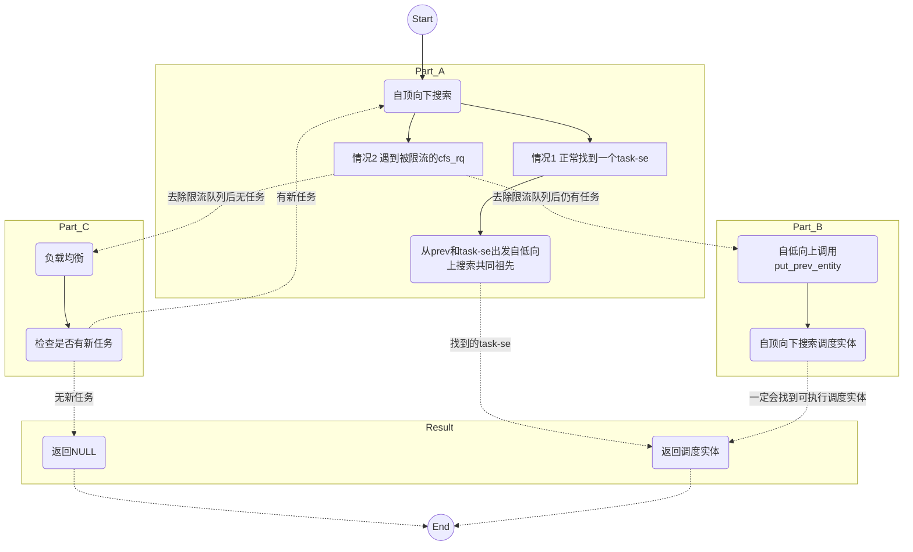

# 带宽控制

## 前言

CFS带宽控制顾名思义是控制CPU的使用量，作为CFS一个可配置特性需要开启`CONFIG_CGROUP_SCHED` `CONFIG_FAIR_GROUP_SCHED` 和 `CONFIG_CFS_BANDWIDTH`三个配置选项，实现的效果就是对任务组实施CPU带宽限流，让任务组在单位周期内只能使用定量的CPU时间。这里有两个关键点，一个是实施的对象是任务组，第二个是限制的资源是CPU时间而不是算力（没有考虑异构系统的算力不均衡）。

## 核心思想

为了实现带宽控制，内核采取了一种单一中心端的分布式架构模型，任务组`task_group`就是中心端，管理CPU时间资源池。每个核上的`cfs_rq`作为子节点，有运行需求前需要检查本地持有的时间资源，如果不足就向中心端（`task_group`）索取，而中心端的时间资源也不是无限的，当子节点申请资源失败后就会被限流停止运行。逻辑讲到这里还没有闭环，因为中心端的时间资源还处于只出不进的状态，内核为每一个时间资源池提供了一个定时器负责周期性的给中心端重置时间资源。以上就是任务组带宽控制的基础模型。

## 相关数据结构

### 中心端-task_group

`task_group`增加了一个`struct cfs_bandwidth`结构体用于管理时间资源池，相关的成员变量的含义和作用我写在了注释中。

```c
struct task_group {
    struct cfs_bandwidth	cfs_bandwidth; /* 带宽控制相关 */
}

struct cfs_bandwidth {
#ifdef CONFIG_CFS_BANDWIDTH
    raw_spinlock_t		lock;       /* 锁 */
    ktime_t			period;         /* 周期 */
    u64			quota;              /* 每个周期CPU时间配额 */
    u64			runtime;            /* 当前周期剩余时间 */
    s64			hierarchical_quota; /* 用于quota和period合法性检查 */
    u64			runtime_expires;    /* 当前周期的过期时间（下次重置的时刻） */
    int			expires_seq;        /* 过期序列号（递增） */

    short			idle;           /* 是否处于idle状态（资源池时间没有消耗） */
    short			period_active;  /* period定时器是否处于激活状态 */
    struct hrtimer		period_timer;       /* 周期配额定时器 */
    struct hrtimer		slack_timer;        /* 回收时间定时器 */
    struct list_head	throttled_cfs_rq;   /* 被限流的cfs_rq都要放入这个链表 */

    /* Statistics: */
    int			nr_periods;     /* 周期总数 */
    int			nr_throttled;   /* 发生限流次数 */
    u64			throttled_time; /* 限流的总时长 */

    bool                    distribute_running; /* 是否正在分发时间 */
#endif
};
```

`cfs_bandwidth`规定了时间池的更新周期`period`，每个周期重置的时间资源池容量`quota`，在时间分发的过程中记录剩余的时间资源`runtime`，设定了周期定时器`period_timer`用于重新填充资源池。这四个变量是最核心元素。

### 节点端-cfs_rq

每个任务组有PER-CPU的`cfs_rq`（不清楚的可以了解一下组调度的数据组织结构），`cfs_rq`作为节点端要从中心端申请时间资源放入`runtime_remaining`，当`runtime_remaining`不足会向中心端申请，如果申请失败就会发生限流，`cfs_rq`更新相关限流信息并放入`tg->cfs_bandwidth.throttled_cfs_rq`链表中。带宽控制相关的变量含义我写在了注释中。

```c
struct cfs_rq {
    int			runtime_enabled;			/* 启用带宽控制 */
    int			expires_seq;				/* 过期序列号（用于同步） */
    u64			runtime_expires;            /* 下一次过期的时间（用于同步） */
    s64			runtime_remaining;			/* 局部剩余剩余的时间 */

    u64			throttled_clock;			/* 开始限流的rq->clock时间戳 */
    u64			throttled_clock_task;       /* 开始限流的rq->clock_task时间戳 */
    u64			throttled_clock_task_time;  /* 处于限流状态的总时长 */
    int			throttled;					/* 是否处于限流状态 */
    int			throttle_count;				/* 限流次数 */
    struct list_head	throttled_list;		/* 被限流时用于将本cfs_rq挂入cfs_bandwidth中的链表 */
}
```

## 源码解析

通过了解带宽控制的思路和相关数据结构应该对该机制有了一个大概的了解，下面就通过对源码解析学习一下带宽控制的一些细节。带宽控制主要有几个方面：

* 带宽控制初始化
* 时间资源补充
* 节点端时间申请
* 限流和解除限流
* 时间回收

### 带宽控制初始化

当创建一个任务组时需要调用`init_cfs_bandwidth`初始化带宽控制信息，初始化操作如下：

* 初始化`quota` `period` `runtime`，默认新任务组拥有无限时间资源，周期为`0.1s`，时间资源池`runtime`为0
* 初始化限流链表
* 初始化周期性的资源重置定时器`period_timer`和时间回收定时器`slack_timer`。`period_timer`使用绝对时间，对应的回调函数为`sched_cfs_period_timer`；`slack_timer`使用相对时间，对应的回调函数为`sched_cfs_slack_timer`。
* 初始化`distribute_running`为`0`，表示不处于时间分发状态。

现在提到的一些概念，比如时间回收、时间分发在后面会详细解释。

```c
void init_cfs_bandwidth(struct cfs_bandwidth *cfs_b)
{
    raw_spin_lock_init(&cfs_b->lock);
    /* 1. 初始化时间资源为0 quota为无限 period为默认值0.1s */
    cfs_b->runtime = 0;
    cfs_b->quota = RUNTIME_INF;
    cfs_b->period = ns_to_ktime(default_cfs_period());
    /* 2. 初始化限流链表 存放被限流的cfs_rq */
    INIT_LIST_HEAD(&cfs_b->throttled_cfs_rq);
    /* 3. 初始化周期性资源重置定时器 */
    hrtimer_init(&cfs_b->period_timer， CLOCK_MONOTONIC， HRTIMER_MODE_ABS_PINNED);
    cfs_b->period_timer.function = sched_cfs_period_timer;
    /* 4. 初始化时间回收计时器 */
    hrtimer_init(&cfs_b->slack_timer， CLOCK_MONOTONIC， HRTIMER_MODE_REL);
    cfs_b->slack_timer.function = sched_cfs_slack_timer;
    /* 5. 设置不处于时间分发状态 */
    cfs_b->distribute_running = 0;
}
```

### 时间资源补充

`cfs_bandwidth`管理了一个时间池，上面提到的`period_timer`会定期的补充资源池。首先研究一下这个定时器的启动逻辑，`period_timer`的启动函数为`start_cfs_bandwidth`，该函数的调用发生在两处：

* `assign_cfs_rq_runtime`: `cfs_rq`每一次申请时间资源（仅对于设定了quota的任务组）时都会启动定时器（如果定时器还没启动），这样做的好处在于如果任务组没有任务在执行，时间资源始终处于满额，不需要触发更新。
* `throttle_cfs_rq`: 第一个被限流的`cfs_rq`尝试启动定时器，这样做的目的是确保被限流`cfs_rq`有机会被唤醒。

除此之外，`period_timer`被唤醒执行回调函数后可以选择再次启动定时器（如果时间在回调函数处理过程中被消耗了）。

`start_cfs_bandwidth`实现如下：`cfs_b->period_active`是一个标志位，避免重复启动`period_timer`定时器。如果可以启动定时器则调用`hrtimer_forward_now`设置定时器在一个period后超时，返回值（`overrun = (now - expire)/period`）是now和旧的超时时间expires之间相差的周期个数，更新`cfs_bandwidth`下一次超时的时间`runtime_expires`和超时序列号`expires_seq`，调用`hrtimer_start_expires`正式启动定时器。

```c
void start_cfs_bandwidth(struct cfs_bandwidth *cfs_b)
{
    u64 overrun;

    lockdep_assert_held(&cfs_b->lock);
    /* 检查是否已经定时器已经处于激活状态 */
    if (cfs_b->period_active)
        return;

    cfs_b->period_active = 1;
    /*  hrtimer_forward_now：
        如果now 早于旧的expires 返回0
        否则设置定时器在一个period后超时，并返回now和旧的expires之间相差的周期个数，不足一个周期的按一个算 
    */
    overrun = hrtimer_forward_now(&cfs_b->period_timer， cfs_b->period);
    /* 更新超时时间 */
    cfs_b->runtime_expires += (overrun + 1) * ktime_to_ns(cfs_b->period);
    /* 超时序列号+1 */
    cfs_b->expires_seq++;
    /* 启动定时器 */
    hrtimer_start_expires(&cfs_b->period_timer， HRTIMER_MODE_ABS_PINNED);
}
```

当定时器`period_timer`超时发生时就会填充时间资源池，回调函数为`sched_cfs_period_timer`，该函数的返回值会决定是否需要重启定时器，具体的由`idle`决定。这段代码的关键在于循环内部，根据上面关于`hrtimer_forward_now`的解读，第一次循环时的`overrun`一般为`1`（定时器的分辨率应该比较高），此时`do_sched_cfs_period_timer`会更新时间资源池，具体的内容等下再看。第二次循环时，`overrun`为`0`，因为第一个调用已经更新了`expires`，第二次调用时应该大于`now`大约一个`period`，此时会退出循环。但是以上都是基于定时器比较准和系统执行正常的情况，如果出现很大的延迟偏差也是有可能的，但这里我们就只考虑一般情况即可（可以看到内核的代码确实非常严谨）。

```c
static enum hrtimer_restart sched_cfs_period_timer(struct hrtimer *timer)
{
    /* 1. 找到timer所属的cfs_bandwidth */
    struct cfs_bandwidth *cfs_b =
        container_of(timer， struct cfs_bandwidth， period_timer);
    int overrun;    /* 时钟延迟 */
    int idle = 0;   /* idle状态 */

    raw_spin_lock(&cfs_b->lock);
    for (;;) {
        /* 2. 检查now和预计的expire时间之间 */
        overrun = hrtimer_forward_now(timer， cfs_b->period);
        if (!overrun)
            break;
        /* 3. 填充时间池 */
        idle = do_sched_cfs_period_timer(cfs_b， overrun);
    }
    if (idle)
        cfs_b->period_active = 0;
    raw_spin_unlock(&cfs_b->lock);

    return idle ? HRTIMER_NORESTART : HRTIMER_RESTART;
}
```

`do_sched_cfs_period_timer`的结果会影响是否重启定时器，让我们看看`do_sched_cfs_period_timer`是如何填充时间资源池的。重置时间池的函数是`__refill_cfs_bandwidth_runtime`，在执行前需要检查一些可以不进行时间填充的特殊情况：

* 第一种是`quota`无限，此时`cfs_rq`申请多少就给多少不需要时间池管理
* 第二种情况是时间池是满的，不需要重置，那么第二种情况如何检查呢？`cfs_b->idle`在时间池填充后检查任务组是否有限流链表是否为空，如果为空此时此刻时间池会处于满的状态，`cfs_b->idle`被标记为`1`，那么`idle`什么时候会被重新标记为`0`呢？当时间池的资源被申请或者主动分发到`cfs_rq`用于解除限流时，`idle`被重置为`0`，表示资源不满。因此当重置资源时状态处于`idle`并且当前无被限流的`cfs_rq`就可以认为资源在这个周期内没有发生过分配。
这两种情况下跳转到`out_deactivate`返回值为`1`，告诉上层当前处于`idle`状态，定时器不需要再重启了。注意区分一下上层函数的局部变量`idle`和`cfs_b->idle`，含义存在差异。

上面是一些特殊情况的处理，如果调用`__refill_cfs_bandwidth_runtime`重置了时间资源池（执行`cfs_b->runtime = quota`）以后，当前的限流链表中存在一些被限流的`cfs_rq`此时应该主动的分发时间资源唤醒这些`cfs_rq`参与调度，`cfs_b->distribute_running`这个标志位用于限流链表管理，表示当前正处于时间分发状态（解除限流中），可以看到分发的过程实际上是放开了锁的，因此分发过程与那些没有被限流的`cfs_rq`申请时间是可以同时发生的，有可能导致时间被过度使用，那为什么还是可以并发呢？通过阅读注释，作者认为竞争只有一些极端情况才会发生，我猜测是真实情况下产生竞争的概率不高，即使发生竞态影响也不会很大。

```c
static int do_sched_cfs_period_timer(struct cfs_bandwidth *cfs_b， int overrun)
{
    u64 runtime， runtime_expires;
    int throttled;
    /* 1. 如果quota无限 不需要管理时间池 */
    if (cfs_b->quota == RUNTIME_INF)
        goto out_deactivate;

    throttled = !list_empty(&cfs_b->throttled_cfs_rq);
    cfs_b->nr_periods += overrun;
    /* 2. 如果cfs_b处于idle状态 并且当前无被限流的cfs_rq时 时间池是满的不需要填充 */
    if (cfs_b->idle && !throttled)
        goto out_deactivate;
    /* 3. 填充时间池子 */
    __refill_cfs_bandwidth_runtime(cfs_b);
    /* 4. 如果时间池满 但是此时没有被限流的cfs_rq 标记为idle状态 */
    if (!throttled) {
        cfs_b->idle = 1;
        return 0;
    }

    cfs_b->nr_throttled += overrun;

    runtime_expires = cfs_b->runtime_expires;
    /* 5. 时间池重置后如果有被限流的cfs_rq 开始主动分发时间 */
    while (throttled && cfs_b->runtime > 0 && !cfs_b->distribute_running) {
        runtime = cfs_b->runtime;
        cfs_b->distribute_running = 1;
        raw_spin_unlock(&cfs_b->lock);
        /* we can't nest cfs_b->lock while distributing bandwidth */
        runtime = distribute_cfs_runtime(cfs_b， runtime，
                         runtime_expires);
        raw_spin_lock(&cfs_b->lock);

        cfs_b->distribute_running = 0;
        throttled = !list_empty(&cfs_b->throttled_cfs_rq);

        cfs_b->runtime -= min(runtime， cfs_b->runtime);
    }

    cfs_b->idle = 0;

    return 0;

out_deactivate:
    return 1;
}
```

此处我们还没有谈及`cfs_rq`主动申请时间，但是先植入一个概念，申请时间时如果资源池充足则期望申请到的时间片能补足到`5ms`（在用超了的情况下会尝试多申请一部分用于补足）。继续看看`distribute_cfs_runtime`是怎么主动分发时间的，遍历整个限流链表对每个`cfs_rq`计算要分配的时间是多少，这里的逻辑是想让被解除限流的`cfs_rq`只持有`1ns`的时间，但进入限流时剩余时间可能已经处于用超的状态（`runtime_remaining`是负数），因此需要补足上次用超的部分。对于每一个`cfs_rq`如果分配成功(补足到了`1ns`)则调用`unthrottle_cfs_rq`解除限流，如果分配失败或者说不能补足则还得等下个周期的时间接着补。

```c
static u64 distribute_cfs_runtime(struct cfs_bandwidth *cfs_b，
        u64 remaining， u64 expires)
{
    struct cfs_rq *cfs_rq;
    u64 runtime;
    u64 starting_runtime = remaining;

    rcu_read_lock();
    list_for_each_entry_rcu(cfs_rq， &cfs_b->throttled_cfs_rq，
                throttled_list) {
        struct rq *rq = rq_of(cfs_rq);
        struct rq_flags rf;

        rq_lock(rq， &rf);
        if (!cfs_rq_throttled(cfs_rq))
            goto next;
        /* 1. 计算要分配的时间 runtime */
        runtime = -cfs_rq->runtime_remaining + 1;
        if (runtime > remaining)
            runtime = remaining;
        remaining -= runtime;
        /* 2. 分配给cfs_rq */
        cfs_rq->runtime_remaining += runtime;
        cfs_rq->runtime_expires = expires;

        /* 3. 如果分配成功 解除限流 */
        if (cfs_rq->runtime_remaining > 0)
            unthrottle_cfs_rq(cfs_rq);

next:
        rq_unlock(rq， &rf);

        if (!remaining)
            break;
    }
    rcu_read_unlock();

    return starting_runtime - remaining;
}
```

### 节点端时间申请

`cfs_rq`会在剩余时间不足时向`task_group`申请时间片，如果申请失败就会产生限流，将`cfs_rq`挂入限流链表。申请时间需要清楚当前的剩余时间，因此在时间信息更新时比如Tick或者调度发生时都会进行检查（典型函数就是`update_curr`）。

剩余时间的检查和不足时的申请由`account_cfs_rq_runtime`完成，首先`cfs_bandwidth_used()`需要检查系统是否开启相关带宽控制，`cfs_rq->runtime_enabled`则是检查`cfs_rq`是否受带宽控制，该状态由中心端的`quota`影响，如果`quota`为	`RUNTIME_INF`则不存在带宽限制。

```c
static __always_inline
void account_cfs_rq_runtime(struct cfs_rq *cfs_rq， u64 delta_exec)
{
    /* 1. 检查是系统否开启带宽控制 以及当前cfs_rq是否受带宽控制 */
    if (!cfs_bandwidth_used() || !cfs_rq->runtime_enabled)
        return;
    /* 2. core 函数 */
    __account_cfs_rq_runtime(cfs_rq， delta_exec);
}
```

假设是一个配置了带宽控制的场景，重点关注函数`__account_cfs_rq_runtime`。`delta_exec`是本次消耗的时间，该段代码不复杂

* 首先更新剩余时间，然后检查剩余时间是否过期，如果当前周期已经过去了，剩余的时间也就不做数了需要重新申请，`runtime_remaining`也被降为0。
* 如果此时剩余时间小于等于零了（很有可能用超，tick的精度不高时还会超很多，比如极端情况下剩余0.1ms的运行时间时投入运行，tick精度为10ms，此时会多用9.9ms）就需要申请时间
* 如果分配结束以后仍然不满足继续运行条件并且处于运行状态则设置调度标记，等到调度发生时进入限流过程。

```c
static void __account_cfs_rq_runtime(struct cfs_rq *cfs_rq， u64 delta_exec)
{
    /* 1. 更新剩余时间 */
    cfs_rq->runtime_remaining -= delta_exec;
    /* 2. 检查剩余时间是否过期 */
    expire_cfs_rq_runtime(cfs_rq);
    
    if (likely(cfs_rq->runtime_remaining > 0))
        return;
    /* 3. 申请时间 */
    if (!assign_cfs_rq_runtime(cfs_rq) && likely(cfs_rq->curr))
        resched_curr(rq_of(cfs_rq));
}
```

`assign_cfs_rq_runtime`申请时间时要考虑当前`cfs_rq`用超的部分、时间池的剩余量等，尽力去分配时间，函数的返回值表示能否继续运行。具体的检查和分配流程可以看代码的注释。

```c
static int assign_cfs_rq_runtime(struct cfs_rq *cfs_rq)
{
    struct task_group *tg = cfs_rq->tg;
    struct cfs_bandwidth *cfs_b = tg_cfs_bandwidth(tg);
    u64 amount = 0， min_amount， expires;
    int expires_seq;
    /* 1. 计算期望申请的量 要考虑到runtime_remaining为负数 */
    min_amount = sched_cfs_bandwidth_slice() - cfs_rq->runtime_remaining;

    raw_spin_lock(&cfs_b->lock);
    /* 2. 如果没有带宽控制直接给予期望值 */
    if (cfs_b->quota == RUNTIME_INF)
        amount = min_amount;
    else {
        start_cfs_bandwidth(cfs_b); /* 尝试启动周期定时器 */

        /* 3. 如果有带宽控制则要考虑时间池的余量能否支持 */
        if (cfs_b->runtime > 0) {
            amount = min(cfs_b->runtime， min_amount);
            cfs_b->runtime -= amount;
            cfs_b->idle = 0; /* 发生分配行为时标记为非idle状态 */
        }
    }
    expires_seq = cfs_b->expires_seq;
    expires = cfs_b->runtime_expires;
    raw_spin_unlock(&cfs_b->lock);
    /* 4. 结束分配 */
    cfs_rq->runtime_remaining += amount;

    /* 5. 如果当前周期过期了则更新一下过期序列号和时间 */
    if (cfs_rq->expires_seq != expires_seq) {
        cfs_rq->expires_seq = expires_seq;
        cfs_rq->runtime_expires = expires;
    }
    /* 6. 返回值表示是否要被限流 */
    return cfs_rq->runtime_remaining > 0;
}
```

### 限流和解除限流

每次更新时间信息发现`cfs_rq`的剩余时间不足时会发起时间申请，如果申请的时间无法满足需求就会设置调度标记，剩余时间的检查和限流出现在调度决策过程`pick_next_task_fair`中。

在引入了限流以后选择任务的逻辑就复杂了一些，我提取了关键的代码如下，首先需要明确两点：

* `cfs_rq`的剩余时间在`update_curr`内减少
* 限流检查和操作发生在`check_cfs_rq_runtime`和`put_prev_entity`（会调用`check_cfs_rq_runtime`），因为有可能被限流的一定是`cfs_rq`才更新了运行时间信息的（也就是当前占有CPU执行权的相关调度实体），这样子就很好理解了。

重新阅读一下调度决策的代码，这里我们将代码划分为三个Part，`again`到`simple`之间称为**part A**，`simple`到`done`之间称为**part B**，`idle`到结尾称为**Part C**。可以结合代码注释以及下方的流程图一起理解。



* **Part A**：`do while`循环里自顶向下搜索`vruntime`最小的调度实体。假设一路搜索的过程中遇到的`cfs_rq`都不需要限流，我们将这种情况称为**情况1**，将限流检查出现限流`cfs_rq`的路径称作**情况2**。
  1. **情况1**，搜索会找到一个`vruntime`最小的调度实体，然后采取了一个算法搜索共同祖先，并在搜索过程中分别更新`cfs_rq->curr`，在`put_prev_entity`中会做限流检查，可以看到限流过程是自底向上的，这样会导致一个结果，当一个`cfs_rq`解除限流时能否参与调度还要看其父层级的`cfs_rq`是否处于限流状态；
  2. **情况2**，在搜索的过程中找到了一个限流的`cfs_rq`，此时限流的`cfs_rq`被移出调度队列，检查根`cfs_rq`的`nr_running`的数量，如果没有调度实体可运行进入**Part C**处理idle。如果还有调度实体进入**Part B**进行简单搜索。这是与情况1的区别在于自顶向下的搜索第一个被限流的`cfs_rq`移除后下面的所有调度实体都无法参与调度了。
* **Part B**：正常情况下应该先找到可调度的实体以后再调用`put_prev_entity`将当前调度实体放回队列，但是**PartA**去除了所有可能被限流的`cfs_rq`后，此时一定可以找到一个可运行的调度实体（没被限流而且是个`task-se`）并且放回的调度实体也无法被搜索到（因为最顶层的`group-se`已经在**part A**移出了），所以可以先调用`put_prev_task`自低向上从`prev->se`开始调用`put_prev_entity`更新时间+检查限流，然后再从根节点出发向下搜索调度实体去执行。
* **Part C**：当`prev`无法放回队列参与调度（被限流）同时又没有其他可调度实体时（`nr_running`为0），此时会从**Part A**转入**Part C**进行`idle`处理。进行一次负载均衡，如果拿回了一些任务则回到**Part A**重新搜索，如果还没找到就返回`NULL`表示没有可执行的任务。

```c
static struct task_struct *
pick_next_task_fair(struct rq *rq， struct task_struct *prev， struct rq_flags *rf)
{
    struct cfs_rq *cfs_rq = &rq->cfs;
    struct sched_entity *se;
    struct task_struct *p;
    int new_tasks;

again:
    /* Part A */
    /* 自顶向下进行遍历 */
    do {
        struct sched_entity *curr = cfs_rq->curr;

        if (curr) {
            if (curr->on_rq)
                update_curr(cfs_rq);
            else
                curr = NULL;
            if (unlikely(check_cfs_rq_runtime(cfs_rq))) {
                /* 情况2 */
                cfs_rq = &rq->cfs;

                if (!cfs_rq->nr_running)
                    goto idle;

                goto simple;
            }
        }

        se = pick_next_entity(cfs_rq， curr);
        cfs_rq = group_cfs_rq(se);
    } while (cfs_rq);
    /* 情况1 */
    p = task_of(se);
    /* 自底向上 对于perv修改cfs_rq的curr为NULL 和做限流检查 
              对于next设置cfs_rq的curr为对应的se
              put_prev_entity和set_next_entity的顺序是有讲究的
    */
    if (prev != p) {
        struct sched_entity *pse = &prev->se;

        while (!(cfs_rq = is_same_group(se， pse))) {
            int se_depth = se->depth;
            int pse_depth = pse->depth;

            if (se_depth <= pse_depth) {
                put_prev_entity(cfs_rq_of(pse)， pse);
                pse = parent_entity(pse);
            }
            if (se_depth >= pse_depth) {
                set_next_entity(cfs_rq_of(se)， se);
                se = parent_entity(se);
            }
        }

        put_prev_entity(cfs_rq， pse);
        set_next_entity(cfs_rq， se);
    }

    goto done;

simple:
    /* part B */
    /* 前置条件 整个队列中不存在被限流的调度实体 */
    put_prev_task(rq， prev);

    do {
        se = pick_next_entity(cfs_rq， NULL);
        set_next_entity(cfs_rq， se);
        cfs_rq = group_cfs_rq(se);
    } while (cfs_rq);

    p = task_of(se);

done: __maybe_unused;
    return p;
idle:
    /* Part C */
    /* 没任务时 进行负载均衡 如果有新任务则回到part A*/
    new_tasks = idle_balance(rq， rf);

    if (new_tasks < 0)
        return RETRY_TASK;

    if (new_tasks > 0)
        goto again;
    return NULL;
}
```

上面是发生限流的位置，限流一个`cfs_rq`具体要做什么呢？`check_cfs_rq_runtime`首先会检查是否满足限流条件：

* 开启了相关系统层面CONFIG
* 设置了`cfs_rq`的带宽控制参数
* 已经没有了剩余时间
* 目前不处于限流状态

只有以上四个条件都满足时才会进入限流过程。

```c
static bool check_cfs_rq_runtime(struct cfs_rq *cfs_rq)
{
    /* 如果没有开启带宽控制的系统配置不需要限流 */
    if (!cfs_bandwidth_used())
        return false;
    /* 没有设置带宽控制参数 或者设置了还有剩余时间 不需要限流 */
    if (likely(!cfs_rq->runtime_enabled || cfs_rq->runtime_remaining > 0))
        return false;
    /* 如果已经被限流 不需要重复限流*/
    if (cfs_rq_throttled(cfs_rq))
        return true;
    /* 开始限流 */
    throttle_cfs_rq(cfs_rq);
    return true;
}
```

限流一个`cfs_rq`除了要将`cfs_rq`挂入限流链表外，还有很多额外的工作。

* 首先考虑到限流信息的统计问题，`walk_tg_tree_from`会自顶向下和自低向上分别遍历执行一些函数，在这里自顶向下会执行`tg_throttle_down`，自低向上执行`tg_nop`(可以理解为什么也不做)，在`tg_throttle_down`中会自增`tg->throttle_count`，可以快速判断是否处于限流状态。父tg限流导致的连坐也被认为是被限流，如果限流个数从0到1，说明开始进入限流的状态，此时要设置进入限流状态的时间戳，退出限流时（计数从1降到0）累计限流时长。
* 第二步，要将被限流的`cfs_rq`对应的`group-se`移出所在的`cfs_rq`，这个过程会导致一批`se`不参与调度，同时会影响`cfs_rq`的负载，所以需要递归向上更新每一层`cfs_rq`的任务数量`h_nr_running`和`nr_running`以及负载权重`load.weight`，如果权重降为0（不会被分配时间了），还需要触发连锁的移除。
* 第三步，设置当前`cfs_rq`处于限流状态，设定限流的开始时间戳。
* 第四步，将`cfs_rq`放入限流链表，这个过程有可能和中心端的时间分发过程产生竞争，如果当前正在进行时间分发`cfs_rq`被放入链表头部，这样分发过程就看不到这个`cfs_rq`，如果不处于分发过程就将`cfs_rq`放入尾部，这样保证FIFO先入先出，不会出现饿死的`cfs_rq`。
* 第五步，如果放入限流链表前链表是空的，尝试启动`period_timer`，保证后续会被唤醒。

```c
static void throttle_cfs_rq(struct cfs_rq *cfs_rq)
{
    struct rq *rq = rq_of(cfs_rq);
    struct cfs_bandwidth *cfs_b = tg_cfs_bandwidth(cfs_rq->tg);
    struct sched_entity *se;
    long task_delta， dequeue = 1;
    bool empty;

    se = cfs_rq->tg->se[cpu_of(rq_of(cfs_rq))];

    /* 1. 更新限流统计信息 */
    rcu_read_lock();
    walk_tg_tree_from(cfs_rq->tg， tg_throttle_down， tg_nop， (void *)rq);
    rcu_read_unlock();
    /* 2. 移除group-se任务 */
    task_delta = cfs_rq->h_nr_running;
    for_each_sched_entity(se) {
        struct cfs_rq *qcfs_rq = cfs_rq_of(se);
        if (!se->on_rq)
            break;

        if (dequeue)
            dequeue_entity(qcfs_rq， se， DEQUEUE_SLEEP);
        qcfs_rq->h_nr_running -= task_delta;

        if (qcfs_rq->load.weight)
            dequeue = 0;
    }
    /* !se表示根cfs_rq减少了h_nr_running 因此也需要更新rq的nr_running*/
    if (!se)
        sub_nr_running(rq， task_delta);
    /* 3. 设置限流状态和限流时钟 */
    cfs_rq->throttled = 1;
    cfs_rq->throttled_clock = rq_clock(rq);
    raw_spin_lock(&cfs_b->lock);
    empty = list_empty(&cfs_b->throttled_cfs_rq);

    /* 4. 如果cfs_b处于分发时间的过程 需要添加到首部，这样分开就不会看到这个cfs_rq */
    /*    如果不处于分发过程则添加到尾部 这样保证了FIFO性质 不会出现饿死的cfs_rq */
    if (cfs_b->distribute_running)
        list_add_rcu(&cfs_rq->throttled_list， &cfs_b->throttled_cfs_rq);
    else
        list_add_tail_rcu(&cfs_rq->throttled_list， &cfs_b->throttled_cfs_rq);

    /* 5. 如果是第一个限流的cfs_rq 尝试启动period_timer 保证一定有机会唤醒 */
    if (empty)
        start_cfs_bandwidth(cfs_b);

    raw_spin_unlock(&cfs_b->lock);
}
```

以上是限流的触发路径以及限流的过程。解除限流发生在`period_timer`定时器触发后进行时间分发的过程中，分发的逻辑在上面的小节中有描述。这里我们假设已经给`cfs_rq`分配了满足运行的剩余时间，代码逻辑上基本上与限流是逆操作，具体的请参考注释和限流操作。需要注意的一个点是解除限流过程中有两次限流时间的累计，但是这两个限流时间的含义和使用的时钟是不一样的。`cfs_b->throttled_time`累计的整个任务组的限流时间，使用的时钟是`rq->clock`，这个时钟包含了`irq`在内的cpu时间，`tg_unthrottle_up`会在`cfs_rq->throttled_count`降为0时累计`cfs_rq`的限流时间`throttled_clock_task_time`，使用的时钟是`rq->clock_task`，这个时间是不包含`irq`在内的。

```c
void unthrottle_cfs_rq(struct cfs_rq *cfs_rq)
{
    struct rq *rq = rq_of(cfs_rq);
    struct cfs_bandwidth *cfs_b = tg_cfs_bandwidth(cfs_rq->tg);
    struct sched_entity *se;
    int enqueue = 1;
    long task_delta;

    se = cfs_rq->tg->se[cpu_of(rq)];

    cfs_rq->throttled = 0;

    update_rq_clock(rq);
    /* 累计限流时间 throttled_time */
    raw_spin_lock(&cfs_b->lock);
    cfs_b->throttled_time += rq_clock(rq) - cfs_rq->throttled_clock;
    list_del_rcu(&cfs_rq->throttled_list);
    raw_spin_unlock(&cfs_b->lock);

    /* 自底向上减少限流计数 累计限流时间 throttled_clock_task_time */
    walk_tg_tree_from(cfs_rq->tg， tg_nop， tg_unthrottle_up， (void *)rq);

    if (!cfs_rq->load.weight)
        return;
    /* 将group-se入队 */
    task_delta = cfs_rq->h_nr_running;
    for_each_sched_entity(se) {
        if (se->on_rq)
            enqueue = 0;

        cfs_rq = cfs_rq_of(se);
        if (enqueue)
            enqueue_entity(cfs_rq， se， ENQUEUE_WAKEUP);
        cfs_rq->h_nr_running += task_delta;

        if (cfs_rq_throttled(cfs_rq))
            break;
    }

    if (!se)
        add_nr_running(rq， task_delta);
    
    /* 如果是idle 状态 唤醒CPU */
    if (rq->curr == rq->idle && rq->cfs.nr_running)
        resched_curr(rq);
}
```

### 时间回收

`cfs_rq`会向`task_group`申请时间然后才能继续运行，考虑下面一种情况如果某个`cfs_rq`刚拿到时间后队列中的调度实体都陷入睡眠离开了队列，同时别的`cfs_rq`想要时间执行却无法获取资源，这样就会出现资源被不合理的占用了，因此带宽控制设计了回收机制，当`cfs_rq`队列中的最后一个调度实体出队时归还一部分的时间给时间资源池，这些时间可以分配给其他有需要的`cfs_rq`。

`return_cfs_rq_runtime`在`dequeue_entity`内调用，需要做一些带宽控制的前置条件检查，如果相关配置和参数都已配置，并且当前队列中没有可参与调度的实体，调用`__return_cfs_rq_runtime`归还时间给时间资源池。

```c
static __always_inline void return_cfs_rq_runtime(struct cfs_rq *cfs_rq)
{
    if (!cfs_bandwidth_used())
        return;

    if (!cfs_rq->runtime_enabled || cfs_rq->nr_running)
        return;

    __return_cfs_rq_runtime(cfs_rq);
}
```

归还前需要计算可以归还的总量，默认会给当前`cfs_rq`留下`1ms (min_cfs_rq_runtime)`，因此时间不足`1ms`就不需要归还了。如果有可以归还的部分，需要检查一下`quota`和`expires`，如果`quota`无限则不需要归还，如果当前的剩余时间是属于上个周期的过期时间，则这些时间是无效的了，也无需归还。假设满足归还条件，并且归还后的时间资源池总量超过了`sched_cfs_bandwidth_slice()`（之前提到过的`5ms`）并且限流链表中有被限流的`cfs_rq`则尝试启动`slack_timer`，延迟一段时间后再用这些时间解除其他被限流的`cfs_rq`。为什么不立刻分配呢？因为此时正持有`rq->lock`锁，锁的粒度比较大，在分配过程中还会去申请别的`rq->lock`有可能导致持锁时间过长，因此要将分发操作通过`slack_timer`延迟执行。

```c
static void __return_cfs_rq_runtime(struct cfs_rq *cfs_rq)
{
    struct cfs_bandwidth *cfs_b = tg_cfs_bandwidth(cfs_rq->tg);
    /* 1. 计算可归还的时间 */
    s64 slack_runtime = cfs_rq->runtime_remaining - min_cfs_rq_runtime;

    if (slack_runtime <= 0)
        return;
    
    /* 2. 归还时间 */
    raw_spin_lock(&cfs_b->lock);
    if (cfs_b->quota != RUNTIME_INF &&
        cfs_rq->runtime_expires == cfs_b->runtime_expires) {
        cfs_b->runtime += slack_runtime;

        /* 3.如果时间资源池达到了cfs_rq申请的最小期望值（5ms）并且当前有被限流的cfs_rq 
             启动一个定时器 延迟一点时间后解除限流 */
        if (cfs_b->runtime > sched_cfs_bandwidth_slice() &&
            !list_empty(&cfs_b->throttled_cfs_rq))
            start_cfs_slack_bandwidth(cfs_b);
    }
    raw_spin_unlock(&cfs_b->lock);
    
    /* 4. 假设归还失败 也不需要再次尝试 */
    cfs_rq->runtime_remaining -= slack_runtime;
}
```

尝试启动`slack_timer`也是有一点讲究的，预期是延迟`5ms`执行，但是在启动前需要检查一下是不是已经触发或者即触发`period_timer`重置时间池，如果即将重置那就不再需要这些`slack`时间，都多余了嗷。因此`runtime_refresh_within`会检查`period_timer`距离被触发的时间是否超过`7ms = 5ms (cfs_bandwidth_slack_period) + 2ms (min_bandwidth_expiration)`。

```c
static void start_cfs_slack_bandwidth(struct cfs_bandwidth *cfs_b)
{
	u64 min_left = cfs_bandwidth_slack_period + min_bandwidth_expiration;

	/* if there's a quota refresh soon don't bother with slack */
	if (runtime_refresh_within(cfs_b， min_left))
		return;

	hrtimer_start(&cfs_b->slack_timer，
			ns_to_ktime(cfs_bandwidth_slack_period)，
			HRTIMER_MODE_REL);
}
```

假设`slack_timer`设置成功也如期触发，在`cfs_bandwidth`初始化时设置好的回调函数`sched_cfs_slack_timer`就会被执行，回调函数会再调用`do_sched_cfs_slack_timer`处理。做的事情和`period_timer`操作是一样的，将当前资源池的时间用于唤醒被限流的`cfs_rq`们。在正式分发前需要再次检查`period_timer`是不是即将触发，如果距离时间资源池重置还有一段时间就将当前时间资源池的时间分发到各个被限流的`cfs_rq`上，解除限流。

```c
static void do_sched_cfs_slack_timer(struct cfs_bandwidth *cfs_b)
{
	u64 runtime = 0， slice = sched_cfs_bandwidth_slice();
	u64 expires;

    /* 1. 处于分发过程（也就是period_timer触发过程中） */
	raw_spin_lock(&cfs_b->lock);
	if (cfs_b->distribute_running) {
		raw_spin_unlock(&cfs_b->lock);
		return;
	}
    /* 2. 距离period_timer触发不足2ms了 */
	if (runtime_refresh_within(cfs_b， min_bandwidth_expiration)) {
		raw_spin_unlock(&cfs_b->lock);
		return;
	}
    /* 3. 确认分发前的剩余时间以及过期时间 */
	if (cfs_b->quota != RUNTIME_INF && cfs_b->runtime > slice)
		runtime = cfs_b->runtime;

	expires = cfs_b->runtime_expires;
	if (runtime)
		cfs_b->distribute_running = 1;

	raw_spin_unlock(&cfs_b->lock);

	if (!runtime)
		return;
    /* 4. 开始分发和解除限流 */
	runtime = distribute_cfs_runtime(cfs_b， runtime， expires);

	raw_spin_lock(&cfs_b->lock);
	if (expires == cfs_b->runtime_expires)
		cfs_b->runtime -= min(runtime， cfs_b->runtime);
	cfs_b->distribute_running = 0;
	raw_spin_unlock(&cfs_b->lock);
}
```

## 用户接口

带宽限制的关键在设置`quota`和`period`，cgroup提供了相应的接口。通过阅读`tg_set_cfs_bandwidth`函数源码，内核对取值范围有一定的限制，首先`qutoa`和`period`不能少于`1ms`，其次`period`不能超过`1s`。除此之外，`quota/period`表示使用的单核的CPU利用率，比如`quota=200ms period=100ms`，相当于使用两个核的CPU利用率，内核中的任务组是有层级结构的，内核要求每一个子任务组的利用率不能超过其父任务组的利用率（一个任务组可能有多个子任务组），在cgroup-v1上如果设定的值超过了父任务组的利用率会直接设置失败，但是在v2上可以设置超过父任务组，具体原因我不太清楚，但是从原理上来说超过也没意义父任务组限流子任务组也会被限流，建议设置不超过（如果有错误欢迎指正）。

cgroup-v1目录下的相关的设定接口为`cpu.cfs_quota_us`和`cpu.cfs_period_us`。cgroup-v2没有接触过。

以上是对任务组配置带宽的接口，还有一个接口可以用于带宽控制机制的调优，`/proc/sys/kernel/sched_cfs_bandwidth_slice_us (default=5ms)`是每次`cfs_rq`申请的期望目标值，增大该参数会导致带宽精度不够，但是能够减少申请次数，降低开销，反之能够提高精度但是会带来更多的性能开销。

## 总结

带宽控制常用于CPU资源隔离，能有效限制某组任务吃掉过多的资源影响业务，比如一些后台的监控进程等等。希望从原理角度出发理解带宽控制机制后，可以对容器的`quota`和`period`参数设置调优有帮助。
