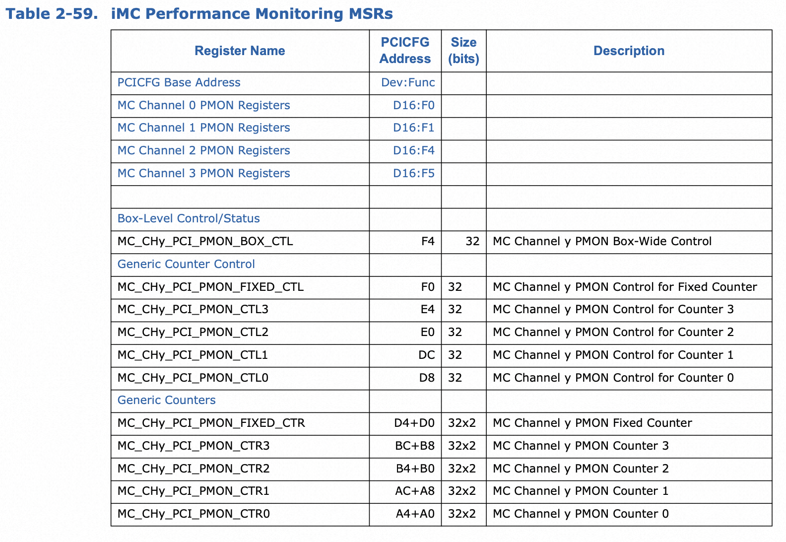

# uncore-imc

## 可编程地址空间

`uncore-imc`的可编程地址空间处于`PCICFG（PCI configuration address space）`。

`iMC`相关的`PCICFG Register Address`如下：

| Address      | Description                       |
| :----------- | :-------------------------------- |
| D16:F0,1,4,5 | F(0,1,4,5) for Channel 0,1,2,3    |
| F4           | Box Control                       |
| F0           | Counter Config Register (Fixed)   |
| E4-D8        | Counter Config Register (General) |
| D4-D0        | Counter Register (Fixed)          |
| BC-A0        | Counter Register (General)        |

## uncore per-socket的性能采样控制

`uncore PMON`并不支持基于中断的采样方式，为了管理以及从大量的分布在多个单元的计数器寄存器中高效地收集数据，`uncore`采取分层的方式管理事件计数的`start`/`stop`/`restart`等等，软件需要在一个监控活动中按照规范使用这些寄存器。

### 开启一个监控活动

* 对于每一个和需要测量的事件相关的box
   1. enable box 接收freeze信号去 start/stop/re-start所有的寄存器
   eg. 设置MC_CHy_PCI_PMON_BOX_CTL.frz_en为1，允许freeze当前box。
   最好在监控活动中保持该位不变。
   2. freeze box的寄存器，准备设置监控活动
   >eg. 设置MC_CHy_PCI_PMON_BOX_CTL.frz为1，停止box的计数活动，开始设置控制寄存器
* 对于每一个需要测量的事件
   1. 将所有的监控寄存器enable
   > eg. 设置MC_CHy_PCI_PMON_CTL1.en为1
   最好将和监控相关的所有box中相关寄存器的en位都设置为1，在监控活动中保持不变。
   2. 如果事件控制寄存器没有被编程，则选择监控事件
   编程控制寄存器的`.ev_sel`和`.umask`，对于需要额外功能的可以设置.`thresh/.edge_det/.invert`
* 对于每一个和需要测量的事件相关的box
   1. 重置每个box中的寄存器，确保没有之前的监控活动留下的旧数据
      > For each CBo, set Cn_MSR_PMON_BOX_CTL[1:0] to 0x2.
       
      > For each Intel® QPI Port, set Q_Py_PCI_PMON_BOX_CTL[1:0] to 0x2. Set PCU_MSR_PMON_BOX_CTL[1:0] to 0x2.
      
      > For each Link, set R3QPI_PCI_PMON_BOX_CTL[1:0] to 0x2. Set R2PCIE_PCI_PMON_BOX_CTL[1:0] to 0x2

      > Note：可以看到以上box中没有提到UBox、iMC和HA，UBox是因为本身没有unit控制寄存器，iMC和HA则是因为unit控制寄存器中没有reset位。因此在UBox、HA以及iMC中的每一个DRAM通道需要通过将0写入数据寄存器手动重置。

   2. 在box level开启计数

   > eg. MC_CHy_PCI_PMON_BOX_CTL.frz为0，此时对应box将会开始计数。

   > Note：Ubox没有控制寄存器，当在监控控制寄存器中写入监控事件后就会开始计数，因此最好在监控控制寄存器中写入0x0表示不监控任何事件，在其他box都启动以后再写入监控事件。

### 读取采样数据

软件可以轮询计数器寄存器获取采样结果。
在每次轮询读取前，推荐做法是freeze每个box中的计数器(通过设置box level控制寄存器的`.frz_en`和`.frz`为1)，读取后软件可以选择重置计数器寄存器或者保持不变，如果保持不变需要在软件层面处理溢出的情况。

## iMC性能监控

### iMC简介

iMC(integrated Memory Controller)内存控制器位于HA(Home-Agent)和DRAM之间，负责翻译读写命令到特定的内存命令，同时负责调度这些内存命令，此外内存控制器的主要功能还有对高级ECC功能支持。

由于iMC的数据路径和HA的数据路径相关，因此HA和iMC是一一对应的。iMC对于每一个DRAM Channel有一套PMON控制和计数器寄存器。

### iMC性能监控寄存器

iMC每个连接的每个Channel包含1个固定计数器寄存器MC_CHy_PCI_PMON_BOX_CTL以及四个通用计数器寄存器MC_CHy_PCI_PMOn_CTL{3:0}，每个计数器寄存器只有48bit范围用户计数。每个计数器寄存器对应一个控制器寄存器用户编程寄存器采集的事件。每个寄存器在每个周期进行更新最多增加0x8b（139）。

iMC box包含的寄存器数量和PCICFG地址空间对应如下：

#### MC box level控制寄存器-MC_CHy_PCI_PMON_BOX_CTL

MC_CHy_PCI_PMON_BOX_CTL寄存器的字段定义如下：

| Field  | Bits  | Attr | HW Reset Val | Desc                                             |
| :----- | :---- | :--- | :----------- | :----------------------------------------------- |
| rsv    | 31:18 | RV   | 0            | 保留位（？）                                     |
| rsv    | 17    | RV   | 0            | 保留位，必须为0                                  |
| frz_en | 16    | WO   | 0            | 开启接收freeze signal                            |
| rsv    | 15:9  | RV   | 0            | 保留位 ？                                        |
| frz    | 8     | WO   | 0            | freeze，当且仅当frz_en也为1时，box进行forzen状态 |
| rsv    | 7:2   | RV   | 0            | 保留位（？）                                     |
| rsv    | 1:0   | WO   | 0            | 保留位，必须为0                                  |

#### MC 控制/计数器寄存器

Memory Controller 中包括通用控制/计数器寄存器、固定控制/计数器寄存器四类。

##### 通用控制寄存器-MC_CHy_PCI_PMON_CTL{3:0}

MC_CHy_PCI_PMON_CTL{3:0}寄存器的字段定义如下：

| Field         | Bits  | Attr | HW Reset Val | Desc                       |
| :------------ | :---- | :--- | :----------- | :------------------------- |
| thresh        | 31:24 | RW-V | 0            | 用于比较的阈值             |
| invert        | 23    | RW-V | 0            | 0-greater or equal 1-less  |
| en            | 16    | RW-V | 0            | Local COunter Enable       |
| rsv           | 21:20 | RV   | 0            | 保留位 0                   |
| rsv           | 19    | Rv   | 0            | 保留位 ?                   |
| edge_det   18 | 7:2   | RW-V | 0            | detect rising edge(0 to 1) |
| rsv           | 17:16 | RV   | 0            | 保留位，必须为0            |
| umask         | 15:8  | RW-V | 0            | subevent                   |
| ev_sel        | 7:0   | RW-V | 0            | event                      |

##### 固定控制寄存器-MC_CHy_PCI_PMON_FIXED_CTL

MC_CHy_PCI_PMON_FIXED_CTL寄存器的字段定义如下：

| Field    | Bits  | Attr | HW Reset Val | Desc                 |
| :------- | :---- | :--- | :----------- | :------------------- |
| rsv      | 31:24 | RV   | 0            | 保留位 ?             |
| rsv      | 23    | RV   | 0            | 保留位 0             |
| en       | 22    | RW-V | 0            | Local COunter Enable |
| rsv      | 21:20 | RV   | 0            | 保留位 0             |
| rst      | 19    | WO   | 0            | 1-clear counter      |
| rsv   18 | 18:0  | RV   | 0            | 保留位 ?             |

#### 计数器寄存器-MC_CHy_PCI_PMON_CTR{FIXED,3:0}

MC_CHy_PCI_PMON_CTR{FIXED,3:0}的字段定义如下：

| Field | Bits  | Attr | HW Reset Val | Desc                  |
| :---- | :---- | :--- | :----------- | :-------------------- |
| rsv   | 63:48 | RV   | 0            | 保留位 ?              |
| rsv   | 47:0  | RW-V | 0            | 48-bit 性能事件计数器 |

#### iMC Box 事件表

| Symbol Name                    | Event Code | Ctrs | Max Inc/ Cyc | Description                      |
| :----------------------------- | :--------- | :--- | :----------- | :------------------------------- |
| ACT_COUNT                      | 0x01       | 0-3  | 1            | DRAM Activate Count              |
| PRE_COUNT                      | 0x02       | 0-3  | 1            | DRAM Precharge commands.         |
| CAS_COUNT                      | 0x04       | 0-3  | 1            | DRAM RD_CAS and WR_CAS Commands. |
| DRAM_REFRESH                   | 0x05       | 0-3  | 1            | Number of DRAM Refreshes Issued  |
| DRAM_PRE_ALL                   | 0x06       | 0-3  | 1            | DRAM Precharge All Commands      |
| MAJOR_MODES                    | 0x07       | 0-3  | 1            | Cycles in a Major Mode           |
| PREEMPTION                     | 0x08       | 0-3  | 1            | Read Preemption Count            |
| ECC_CORRECTABLE_ERRORS         | 0x09       | 0-3  | 1            | ECC Correctable Errors           |
| RPQ_INSERTS                    | 0x10       | 0-3  | 1            | Read Pending Queue Allocations   |
| RPQ_CYCLES_NE                  | 0x11       | 0-3  | 1            | Read Pending Queue Not Empty     |
| RPQ_CYCLES_FULL                | 0x12       | 0-3  | 1            | Read Pending Queue Full Cycles   |
| WPQ_INSERTS                    | 0x20       | 0-3  | 1            | Write Pending Queue Allocations  |
| WPQ_CYCLES_NE                  | 0x21       | 0-3  | 1            | Write Pending Queue Not Empty    |
| WPQ_CYCLES_FULL                | 0x22       | 0-3  | 1            | Write Pending Queue Full Cycles  |
| WPQ_READ_HIT                   | 0x23       | 0-3  | 1            | Write Pending Queue CAM Match    |
| WPQ_WRITE_HIT                  | 0x24       | 0-3  | 1            | Write Pending Queue CAM Match    |
| POWER_THROTTLE_CYCLES          | 0x41       | 0-3  | 1            | Throttle Cycles for Rank 0       |
| POWER_SELF_REFRESH             | 0x43       | 0-3  |              | Clock-Enabled Self-Refresh       |
| RPQ_OCCUPANCY                  | 0x80       | 0-3  | 22           | Read Pending Queue Occupancy     |
| WPQ_OCCUPANCY                  | 0x81       | 0-3  | 32           | Write Pending Queue Occupancy    |
| POWER_CKE_CYCLES               | 0x83       | 0-3  | 16           | CKE_ON_CYCLES by Rank            |
| POWER_CHANNEL_DLLOFF           | 0x84       | 0-3  | 1            | Channel DLLOFF Cycles            |
| POWER_CHANNEL_PPD              | 0x85       | 0-3  | 4            | Channel PPD Cycles               |
| POWER_CRITICAL_THROTTLE_CYCLES | 0x86       | 0-3  | 1            | Critical Throttle Cycles         |

## 参考

1. xeon-e5-2600-uncore-guide
