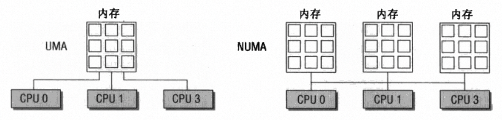

# 内存管理的框架与数据结构设计

## 前言

在谈Linux内存管理框架之前需要了解NUMA，NUMA是非一致性内存访问(Uon-Uniform Memory Access)的缩写，与之相反的是一致性内存访问UMA(Uniform Memory Access)。在多核的UMA架构的机器上，CPU视角下所有的内存都是均匀的，不同CPU访问同一块内存的延迟是相同；而在NUMA架构的机器上内存被划分为不同的区域，对CPU来说内存是不均匀的，存在着远端内存和本地内存的区别，访问远端内存的代价更高。

<!--  -->


<center>UMA与NUMA的区别</center>

## 内核对NUMA的支持

内核使用Node这个概念表示一块均匀的内存，NUMA系统的每一个内存区域就可以用一个Node来表示，这样做有两个优点：

1. 对于UMA架构可以只用一个Node表示，架构上完全兼容。
2. 对于物理内存区域存在空洞的情况（一种不均匀内存的特殊情况，内存在物理上不连续），也可以使用Node的概念进行抽象。

内核使用`struct pg_data_t`结构体表示一个Node，在内核中使用一个全局的数组管理所有的Node，可以根据`node_id`获取Node。每个Node中的内存又按照物理地址范围被划分为多个Zone，被称为内存域，在内核中用`struct zone`结构体表示。

## 内存域（Zone）

在讲Zone之前需要先描述一下虚拟地址空间的划分，在32位系统上可寻址的地址空间为4GB，一般会按照3:1的比例划分为用户地址和内核地址。内核地址空间的前896MB空间被称为直接映射区，对于物理内存地址不超过该范围的页帧可以通过虚拟地址减去内核空间起始地址的方式得到物理地址，这种地址映射方式被称为**直接映射**，对于物理地址超过内核地址空间范围的物理内存则需要通过动态地址映射的方式访问，这种地址映射方式被称为**高端内存映射**。

Zone的类型与其物理地址范围有关，从低地址到高地址划分为`ZONE_DMA`、`ZONE_DMA32`、`ZONE_NORMAL`和`ZONE_HIGHMEM`。

- `ZONE_DMA`: DMA寻址需要，一些外设设备能够访问的地址空间有限，因此需要预留一部分物理内存地址空间给DMA使用。
- `ZONE_DMA32`: `ZONE_DMA32`是为了在64位系统上兼容老旧和特殊的外设而设立的内存区域，在32位系统中`ZONE_DMA32`的内存区域大小为0MB。
- `ZONE_NORMAL`: 能够由内核段直接映射的地址空间，但是该段地址空间不一定有实际的物理内存对应。假设64位系统中只有2GB的物理内存，这2GB的物理内存都属于`ZONE_DMA32`。
- `ZONE_HIGHMEM`: 物理地址空间范围超过了内核段长度的部分。

这里的Zone指的是**物理内存的地址范围**，并不一定存在对应的物理内存。除此之外，内核还提供了一个伪内存区域`ZONE_MOVEABLE`，这是一种减少内存碎片的机制。Zone通过伙伴系统来管理该内存区域内的所有页帧，内核用`struct page`结构体表示一个页帧。

为了满足性能需要，内核会优先在当前CPU所属的Node中分配内存，但是内存分配不一定总是成功，因此每个Node维护了一个备选列表存放可选的Node以及相关的Zone，列表中越靠后的Node和Zone越不适合进行分配。在内核中使用`struct zonelist`结构体表示Node的备用列表。

## Node和Zone的数据结构

### Node的数据结构

```c
typedef struct pglist_data {
    struct zone node_zones[MAX_NR_ZONES];        
    struct zonelist node_zonelists[MAX_ZONELISTS]; 
    int nr_zones;
#ifdef CONFIG_FLAT_NODE_MEM_MAP
    struct page *node_mem_map;
#endif
    unsigned long node_start_pfn;
    unsigned long node_present_pages; /* total number of physical pages */
    unsigned long node_spanned_pages; /* total size of physical page
                         range, including holes */
    int node_id;
} pg_data_t;

```

- `node_zones`: 内存区域数组
- `node_zonelists`: Node和Zone的备选列表
- `nr_zones`: 内存区域个数
- `node_mem_map`: 用于访问Node中的所有页帧
- `node_start_pfn`: Node中第一个Page的逻辑编号，Page的逻辑编号**全局唯一**。
- `node_present_pages`: Node中的Page数目，不包含空洞的页面。
- `node_spanned_pages`: Node以地址空间范围计算的Page数目（包括空洞），和`node_present_pages`不一定相同。
- `node_id`: 全局的Node ID

```c
typedef struct { DECLARE_BITMAP(bits, MAX_NUMNODES); } nodemask_t;
nodemask_t node_states[NR_NODE_STATES];
```

内核用一个位图`nodemask_t`表示所有Node的状态，每一位对应一个Node，`node_states`是一个`nodemask_t`数组，每一个子项就是处于某状态的Node集合。在内核中支持的Node状态有以下几种（注意区分`node_states`，在这里是枚举类型，在上面是变量名）：

```c
enum node_states {
    N_POSSIBLE,		/* The node could become online at some point */
    N_ONLINE,		/* The node is online */
    N_NORMAL_MEMORY,	/* The node has regular memory */
#ifdef CONFIG_HIGHMEM
    N_HIGH_MEMORY,		/* The node has regular or high memory */
#else
    N_HIGH_MEMORY = N_NORMAL_MEMORY,
#endif
    N_MEMORY,		/* The node has memory(regular, high, movable) */
    N_CPU,		/* The node has one or more cpus */
    N_GENERIC_INITIATOR,	/* The node has one or more Generic Initiators */
    NR_NODE_STATES
};
```

- `N_POSSIBLE`: 某个时刻后能够变成ONLINE状态
- `N_ONLINE`: Node当前处于在线状态
- `N_NORMAL_MEMORY`: Node包含普通内存域
- `N_HIGH_MEMORY`: Node包含普通内存或者高端内存
- `N_MEMORY`: 节点拥有内存（包括常规、高端、可移动内存）。此状态通常用于表示节点具备任何形式的可用内存资源。
- `N_CPU`: Node包含一个或者多个CPU
- `N_GENERIC_INITIATOR`: 节点拥有一个或多个通用启动器（`Generic Initiator`）

其中`N_POSSIBLE`、`N_ONLINE`和`N_CPU`与内存和CPU的热插拔有关。`N_NORMAL_MEMORY`、`N_HIGH_MEMORY`和`N_MEMORY`与内存管理相关。

### Zone的数据结构

```c
struct zone {
    unsigned long _watermark[NR_WMARK];
    long lowmem_reserve[MAX_NR_ZONES];
    struct pglist_data	*zone_pgdat;
    struct per_cpu_pageset __percpu *pageset;

    /* zone_start_pfn == zone_start_paddr >> PAGE_SHIFT */
    unsigned long		zone_start_pfn;
    atomic_long_t		managed_pages;
    unsigned long		spanned_pages;
    unsigned long		present_pages;

    struct free_area	free_area[MAX_ORDER];
    unsigned long		flags;
} ____cacheline_internodealigned_in_smp;

```

- `_watermark`: 存放Zone的内存水线值，内存水线分为min、low和high三个等级，用于表示当前的内存压力，水位压力会影响内存回收的行为。
- `lowmem_reserve`: 每个内存域的保留的内存页，用于完成一些不能失败的分配，每个内存域的保留内存数量不同。
- `pageset`: 一个PER-CPU数组，`struct per_cpu_pageset`存储了PER-CPU的冷热页信息，热页指内容仍在Cache中的Page，这些Page访问时只需要重新建立映射，访问速度更快，而访问冷页需要进行重新装载。
- `zone_start_pfn`: Zone第一个页面的页号。
- `managed_pages`: Zone在伙伴系统中管理的页面总数，由`present_pages`减去预留的内存计算得到。
- `spanned_pages`: Zone通过地址空间范围计算的物理页面总数，包含了空洞页面。计算方式为`spanned_pages = zone_end_pfn - zone_start_pfn`
- `present_pages`: Zone中实际存在的物理页面，不包含空洞的部分，由`spanned_pages`减去空洞页面得到。
- `free_area`: 数组，每个`free_area`存放了固定分配阶的内存块，和伙伴系统相关。
- `flags`: 标志位，表示内存域状态。
  
```c
enum zone_flags {
    ZONE_BOOSTED_WATERMARK,		/* zone recently boosted watermarks.
                     * Cleared when kswapd is woken.
                     */
};
```
