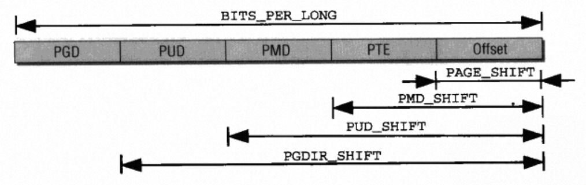

<!-- # 页表 -->
## 前言

页表记录虚拟地址空间到物理地址间的映射关系。Linux系统在启动以后所有的内存访问都是使用的虚拟地址，CPU会让MMU（内存管理单元）按照页表的信息找到虚拟地址对应的物理地址后再访问。

## 页表设计

Linux在2.6.25版本使用的是四级页表。



- PGD全局页目录表
- PUD上层页目录表
- PMD中件页目录表
- PTE页目录表项
- Offset页内偏移

多级页表解决了单级页表带来的空间浪费，但是也增加了访存次数，属于时间换空间的一种计数。

虚拟地址空间按照使用的页表架构不同不同的页表偏移也不相同，每一页中包含的指针数与地址的划分也有关。

每一级的页表的页表项存放的都是下一级页表的物理地址（最后一级除外，存放的是页帧的物理地址），就好像一本字典交给MMU去查询，内核要做的就是维护好这本字典。

每级页表都占用一个完整的页帧，因此MMU访问每一级的页表时都会触发一次访存，因此如果所有的地址转化都通过页表完成，性能会收到很大影响。TLB就是“字典”的缓存，将转化过的结果缓存起来，当再次访问时就不需要查询页表。

## pte

页表项存放物理地址的空间为`unsigned long`，但是实际上由于存在页内偏移，低位的`PAGE_SHIFT`bits都是未使用的，可以存放页帧的相关信息，用于权限检查等。对于`PAGE_SIZE`为4KB的场景，有12bit可以使用。

x86上bit的使用如下，不同架构间可能存在bit定义上的差异。

常见的有：

- _PAGE_BIT_PRESENT: 对应的page是否在内存（有可能swap出去了）。
- _PAGE_BIT_RW: 读写权限
- _PAGE_BIT_USER: 用户空间能否访问。
- _PAGE_BIT_ACCESSED: 访问后会标记，用于换出。
- _PAGE_BIT_DIRTY: 内存的内容被修改过。

这里我写的不够细节，只是简单了解一下。
  
```c
#define _PAGE_BIT_PRESENT 0
#define _PAGE_BIT_RW  1
#define _PAGE_BIT_USER  2
#define _PAGE_BIT_PWT  3
#define _PAGE_BIT_PCD  4
#define _PAGE_BIT_ACCESSED 5
#define _PAGE_BIT_DIRTY  6
#define _PAGE_BIT_FILE  6
#define _PAGE_BIT_PSE  7 /* 4 MB (or 2MB) page */
#define _PAGE_BIT_PAT  7 /* on 4KB pages */
#define _PAGE_BIT_GLOBAL 8 /* Global TLB entry PPro+ */
#define _PAGE_BIT_UNUSED1 9 /* available for programmer */
#define _PAGE_BIT_UNUSED2 10
#define _PAGE_BIT_UNUSED3 11
#define _PAGE_BIT_PAT_LARGE 12 /* On 2MB or 1GB pages */
#define _PAGE_BIT_NX           63       /* No execute: only valid after cpuid check 
```
