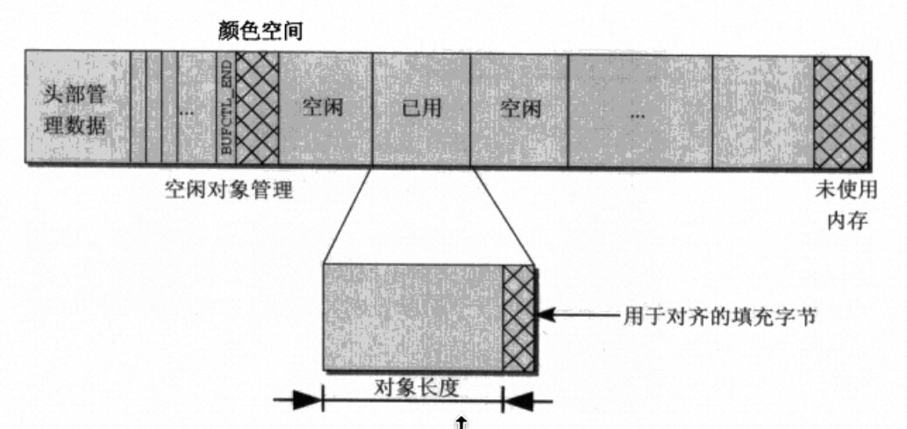

<!-- # slab分配器 -->
## 前言

slab分配器从伙伴系统获取页帧进行管理，对外为一些固定size的小内存块和特定内核数据结构提供缓存和内存分配服务。slab分配器为的是满足内核中小内存块的分配需求，毕竟伙伴系统的内存分配以page为单位实在太大了。

使用slab带来以下几个好处:

- 减少了伙伴系统的访问次数，小内存的分配在slab分析器中就可以完成分配，释放的小内存也会回到slab分配器中，并不返回给伙伴系统，加快了分配和释放速度。
- 提高了分配的内存在cache中驻留的概率。减少伙伴系统操作污染cpu的数据和指令cache。
- 数据如果直接存储在伙伴系统提供的页中会出现对象地址经常处于二的幂次方附近，造成某些cache line成为热点，cache line的访问负载存在不均衡。slab提供了着色机制，以实现对象在cache line中均匀分布。

## slob & slab & slub

slab分配器存在两个问题，在嵌入式系统上slab分配器的代码量和逻辑过于复杂，在超大计算机系统上slab分配器所需要的元数据会占用大量的内存。因此为了满足这两种场景的小内存分配需求内核提供了slob和slub分配器。

- slob: 使用最先适配优先算法+单链表实现，以满足代码量小+简单这个需求。
- slub: 为了减少元数据的空间占用，slub在`struct page`中的一些未使用的字段中存放信息，虽然增加了复杂性，但是确实能够在大型计算机上提供更好的性能。

虽然在实现上三种分配器存在区别，但是在对外提供的接口上却完全一致。

## slab使用接口

slab提供两种服务，第一种以`kmalloc&kfree`为入口，分配指定size的小内存块。第二种提供特定类型的对象缓存服务，但是这种使用方式需要手动创建缓存，相关API有
`kmem_cache_create`、`kmem_cache_alloc`、`kmem_cache_free`。

通过`cat /proc/slabinfo`查看slab信息。

```c
slabinfo - version: 2.1
# name            <active_objs> <num_objs> <objsize> <objperslab> <pagesperslab> : tunables <limit> <batchcount> <sharedfactor> : slabdata <active_slabs> <num_slabs> <sharedavail>
kcopyd_job             0      0   3312    9    8 : tunables    0    0    0 : slabdata      0      0      0
io                     0      0     64   64    1 : tunables    0    0    0 : slabdata      0      0      0
dm_uevent              0      0   2632   12    8 : tunables    0    0    0 : slabdata      0      0      0
dm_old_clone_request      0      0    320   25    2 : tunables    0    0    0 : slabdata      0      0      0
dm_rq_target_io        0      0    120   34    1 : tunables    0    0    0 : slabdata      0      0      0
                                                    ...
kmalloc-8192         122    140   8192    4    8 : tunables    0    0    0 : slabdata     35     35      0
kmalloc-4096         746    760   4096    8    8 : tunables    0    0    0 : slabdata     95     95      0
kmalloc-2048         906   1008   2048   16    8 : tunables    0    0    0 : slabdata     63     63      0
kmalloc-1024        3089   3472   1024   16    4 : tunables    0    0    0 : slabdata    217    217      0
                                                    ...
kmalloc-8           4608   4608      8  512    1 : tunables    0    0    0 : slabdata      9      9      0
kmem_cache_node      384    384     64   64    1 : tunables    0    0    0 : slabdata      6      6      0
kmem_cache           231    231    384   21    2 : tunables    0    0    0 : slabdata     11     11      0
```

`kmalloc`会在命名为`kmalloc-{size}`中的slab分配器中分配内存块。而其他命名的slab分配器则负责分配一些内核对象。

## slab设计

<!--  -->
```mermaid
flowchart RL

subgraph cache_chain
B[kmem_cache] --> A[kmem_cache] -->D[...] --> C[kmem_cache]
end

subgraph data
F[per-node kmem_list3] ~~~ E[per-cpu array_cache] 
end

subgraph array_cache
ent1[entry]<-->ent22[...]<-->ent3[entry]<-->ent4[entry]
end

subgraph kmem_list3
slab1[slabs_full] ~~~ slab2[slabs_partial] ~~~slab3[slabs_free]
end

subgraph slab
page1[slab] <--> page2[slab] <-->page3[...] <-->page4[slab] 

end

C-.->data
E-.->array_cache
F-.->kmem_list3
slab1-.->slab
```
<center>slab分配器管理</center>

全局的`cache_chain`链表管理所有的缓存，每一个缓存用`struct kmem_cache`结构体表示，负责某个size或者某个特定内核结构体的内存分配和释放。

每个`kmem_cache`中有两个关键机制，`array_cache`中的缓存是一个栈，并且是一个per-cpu的数据结构，其思想和冷热链表很像，就是为了提高满足每个cpu上进行内存的分配释放时的速度，冷热链表避免了访问伙伴系统，`array_cache`则是避免了操作slab。同时这两种机制采取了per-cpu的方式，能够提高CPU的cache的命中率，因为内存对象释放后又再次被分配，其内容在cache中依然可能有效。

`struct kmem_list3`则负责管理从伙伴系统分配的页帧以及页帧内的对象。`kmem_list3`是一个per-node的数据结构，毕竟跨node分配内存会带来性能损失，对于不同node上的缓存对象还是需要做区分。每个`kmem_list3`和其名字的含义一致包含三个链表`slabs_free`、`slabs_partial`、`slabs_full`分别对应空闲、部分分配以及全分配。分配时会优先分配partial分配的slab。

每一个slab分配器都由一个头部的管理数据+slab对象数据构成，**头部的管理数据可能和slab对象数据存放在一起，也有可能单独存放在`kmalloc`分配的小内存块中**，不管哪种方式头部管理数据都可以通过指针找到slab对象数据区。

<!--  -->

<center>slab数据管理</center>

管理数据中的管理数组通过一个位图对应所有的slab对象，位图中的每一个位是一个`kmem_bufctl_t（unsiged int）`，记录当前空闲对象的下一个空闲对象的下标。通过阅读源码，`slba->free`指向第一个可用对象，比如当前slab中记录的空闲对象的下标（`slab->free`）是4，此时归还给slab分配器一个对象其下标为6，此时更新`slab->free`为6，并且在管理数组中更新对象6的下一个空闲对象下标为4，分配同理，只需要更新`slba->free`为分配出去对象的下一个对象的下标即可。（和链表的头插法很像，只是指针形式上使用的不是地址而是下标）。

此外在slab对象区还存在着色机制（让slab内的对象整体产生一定的偏移）、对齐机制（每个小对象会补充一定字节以满足对齐需求）。

<!--  -->

<center>着色和对齐</center>

着色机制用以均衡cache line使用，提高cache性能。对齐机制也是类似，提高内存对象的访问速度，减少跨cache line访存的情况。

## slab API分析

### slab初始化

内核初始化时会出现伙伴系统已经可用但是slab分配器还未启动的情况，此时是无法调用`kmalloc`分配小内存块的，但是slab机制相关数据存放又需要使用slab分配器来进行分配，这就陷入了一个互相依赖的局面。为了解决这个问题，slab分配器的初始化操作由`kmem_cache_init`来完成。

内核中所有的`kmem_cache`都在链表`cache_chain`中，初始化slab分配器只需要手动初始化一个`kmem_cache`数据结构，并对其中的`array_cache`、`kmem_list3`做好初始化即可，但是这些数据无法使用slab分配器进行分配，在内核启动时使用静态数据临时使用，将初始化好的`kmem_cache`加入`cache_chain`以后就可以使用`kmem_cache_create`完成其他`kmem_cache`的创建。这个最初的`kmem_cache`命名为是`cache_cache`，其`kmem_list3`的初始化使用的也是静态变量`initkmem_list3`，此时的`cache_cache`在初始化完成以后被用于初始化其他的基本`kmem_cache`。

```c
static struct kmem_cache cache_cache = {
	.batchcount = 1,
	.limit = BOOT_CPUCACHE_ENTRIES,
	.shared = 1,
	.buffer_size = sizeof(struct kmem_cache),
	.name = "kmem_cache",
};

#define NUM_INIT_LISTS (3 * MAX_NUMNODES) // list数量预定义为超量的
struct kmem_list3 __initdata initkmem_list3[NUM_INIT_LISTS]; // 静态的kmem_list3
```

### slab创建

slab不论是小内存块的分配还是固定内核数据结构的分配都使用相同的机制，但是在使用方式上存在一定区别。分配小块内存可以通过`kmalloc`，指定希望分配的字节数就足够了，剩下的交给内核的slab分配器完成。而固定类型的内核数据结构一般需要手动调用`kmem_cache_create`创建一个`kmem_cache`缓存，然后使用`kmem_cache_alloc`从指定`kmem_cache`实例中进行分配。

调用`kmem_cache_create`只需要指定`kmem_cache`的名字、对象尺寸、对齐方式、Slab的flag以及构造函数就可以完成创建。创建过程完成了以下几件事：

- 计算slab的分配阶、对齐值、着色的偏移、对象的大小和个数等等信息
- 分配相应的结构体并初始化
- 加入`cache_chain`

比较迷惑性的是，**`kmem_cache_create`并不从伙伴系统申请内存**，这个操作会延迟到第一次从`kmem_cache`中分配缓存对象时触发。从这里也可以看出slab初始化操作时为什么只需要初始化好几个静态变量就足够了，因为设置好结构体的数据信息以后，向伙伴系统申请内存的操作是延迟到第一次分配对象的时候触发，也能看出来初始化slab分配器之前，伙伴系统已经就绪了。

```c
struct kmem_cache *
kmem_cache_create (const char *name, size_t size, size_t align,
    unsigned long flags,
    void (*ctor)(struct kmem_cache *, void *));
```

### slab对象的分配

<!--  -->
```mermaid
graph TB

A[kmalloc]
B[kmem_cache_alloc]
%% C[kmem_cache_create]
%% D[kmem_cache_init]

%% A ~~~ B ~~~ C ~~~ D

A --> __do_kmalloc --> __find_general_cachep --> F[__cache_alloc]
A --> B
B ---> F[__cache_alloc] --> __do_cache_alloc --> E[____cache__alloc] --> cpu_cache_get

E[____cache_alloc] --> cache_alloc_refill --> cache_grow --> kmem_getpages --> alloc_pages_node
```

<center>slab对象分配调用链</center>

`kmalloc`如果分配的size正好是内核已经存在的size缓存，此时直接将对应的`kmem_cache`作为参数调用`kmem_cache_alloc`分配。但如果是一个一般size的内存块，此时会通过`__find_general_cachep`找到一个适合大小的`kmem_cache`去分配。

最后所有的分配都会落到`__cache_alloc`上。分配有两种路径，第一种直接从`per-cpu`的`array_cache`上分配。如果缓存中无法满足分配，再尝试从slab中批量取出缓存对象放入`array_cache`中后再次进行分配。

如果slab中的对象也不足了，`cache_grow`则会补充一定的`pgae`创建新的slab。可以看到在`cache_grow`中才会真正向伙伴系统申请页帧。
```c
static int cache_grow(struct kmem_cache *cachep,
        gfp_t flags, int nodeid, void *objp)
{
    ...
    local_flags = flags & (GFP_CONSTRAINT_MASK|GFP_RECLAIM_MASK);
    if (!objp)
        objp = kmem_getpages(cachep, local_flags, nodeid);
    ...
    slab_map_pages(cachep, slabp, objp);
}
```

在`cache_grow`中调用`kmem_getpages`成功申请到复合页以后，`slab_map_pages`会对所有的page调用`page_set_cache`和`page_set_slab`，设置`lru.prev`为slab管理头部的`struct slab`指针，设置`lru.next`为`kmem_cache`指针。设置的目的是为了后续释放对象是能够找到对象所属的`kmem_cache`。

```c
static void slab_map_pages(struct kmem_cache *cache, struct slab *slab,
               void *addr)
{
    ...
    do {
        page_set_cache(page, cache);
        page_set_slab(page, slab);
        page++;
    } while (--nr_pages);
}

static inline void page_set_cache(struct page *page, struct kmem_cache *cache)
{
	page->lru.next = (struct list_head *)cache;
}

static inline void page_set_slab(struct page *page, struct slab *slab)
{
	page->lru.prev = (struct list_head *)slab;
}
```

这里会有一个问题，之前了解过复合页设计的同学知道第一个tail page中`lru.next`和`lru.prev`存放了`order`和析构函数`dtor`，在这里似乎被完全覆盖了，如果要回收复合页的时候怎么办呢？其实归还复合页给伙伴系统时在`kmem_cache`的`gfp_order`中已经有分配阶信息，不再需要`order`了；有无析构函数也没关系了，因为复合页的析构函数就是从第一个tail page中获取了其`order`信息，以保证复合页所有的page都被一起释放，slab分配器也保证了这一点，不会出现内存泄漏。


### slab对象的释放

`kmalloc`的返回值为虚拟地址，那么释放该块内存时内核是如何知道内存块的大小和内存块属于的`kmem_cache`呢？首先`kfree`会通过对象的虚拟地址找到对应的`kmem_cache`，slab获取的页帧都来自于NORAML内存域，虚拟地址都属于直接映射区，因此可以直接通过虚拟地址映射到物理地址，将物理地址转化为`pfn`，从而在`pgdat->node_mem_map`找到对象所属页帧的`struct page`。然后通过该page利用复合页的特性找到head page，再从head page的`lru.next`中拿到`kmem_cache`指针，这个指针的设置是在`cache_grow`中完成的。

```c
void kfree(const void *objp)
{
	struct kmem_cache *c;
	c = virt_to_cache(objp);
	__cache_free(c, (void *)objp);
}

static inline struct kmem_cache *virt_to_cache(const void *obj)
{
	struct page *page = virt_to_head_page(obj);
	return page_get_cache(page);
}

static inline struct page *virt_to_head_page(const void *x)
{
	struct page *page = virt_to_page(x);
	return compound_head(page);
}

static inline struct kmem_cache *page_get_cache(struct page *page)
{
	page = compound_head(page);
	return (struct kmem_cache *)page->lru.next;
}
```


找到负责回收的`kmem_cache`以后剩下的就交给`__cache_free`。在`__cache_free`中的操作比较简单，将其放入`array_cache`中就可以了。如果`array_cache`中的对象数量过多会通过`cache_flusharray`回收一批对象给slab，回收的细节这里就不展开了，如果成功回收会更新`ac->avail`然后再将归还的对象`objp`放入`array_cache`。

```c
static inline void __cache_free(struct kmem_cache *cachep, void *objp)
{
	struct array_cache *ac = cpu_cache_get(cachep);
	objp = cache_free_debugcheck(cachep, objp, 
	if (likely(ac->avail < ac->limit)) {
		ac->entry[ac->avail++] = objp;
		return;
	} else {
		cache_flusharray(cachep, ac);
		ac->entry[ac->avail++] = objp;
	}
}
```