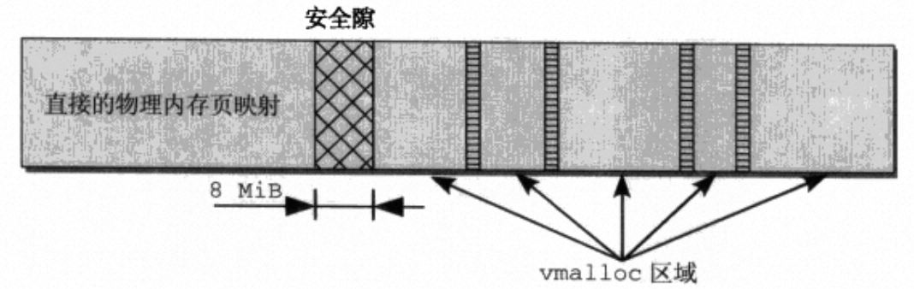
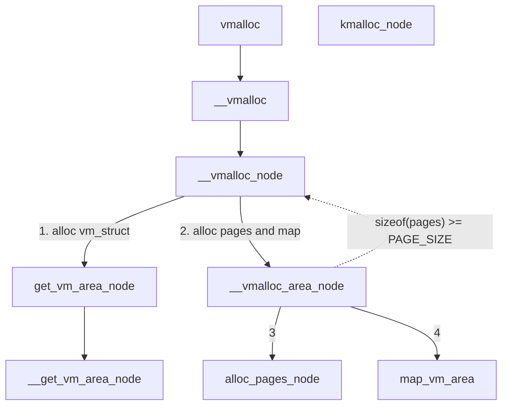
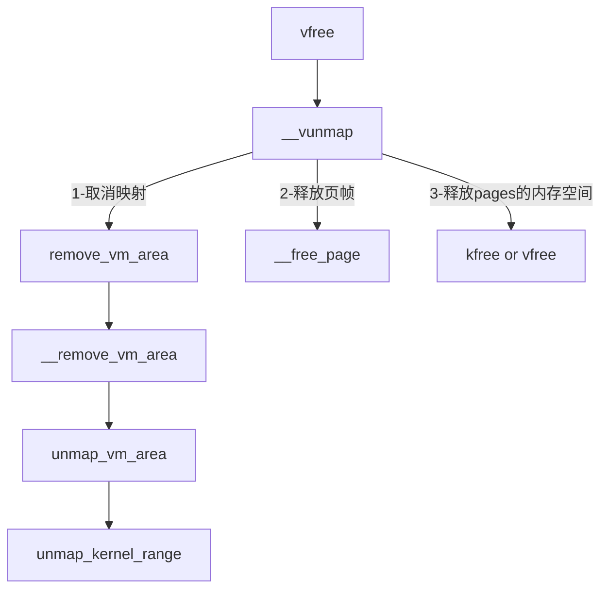

<!-- # vmalloc&vfree -->
## 前言

熟悉伙伴系统的管理机制以及伙伴系统提供的内存分配API方式以后我们知道，伙伴系统提供了以分配阶为参数的连续page的分配接口。但是在内核中并不是在所有时候都要求分配的内存在物理上连续，只需要在逻辑上连续即可。比如，随着系统的使用，分配连续的大的内存块由于内存碎片的存在是有可能失败的。因此分配逻辑连续物理上不连续的内存块也是一种需求，`vmalloc`函数实现了分配逻辑上连续但是物理上不要求连续的内存。

`vmalloc`以字节数为参数分配内存，这和用户态的`malloc`很相似。所以有可能引起混淆，我们知道`malloc`作为一个C库函数分配小块内存实际上会申请大的内存块放入内存池进行管理，后续再分配内存时就不需要向内核提出分配申请，在缓冲池中就可以完成分配，减少进入内核态的次数。而`vmalloc`每次调都会从伙伴系统分配内存，并且分配是以page为单位的。分配几字节的内存也会导致分配一整个page，多余的内存也不能被访问，会出现大量的浪费。因此需要搞清楚`vmalloc`的使用场景，**`vmalloc`用于分配大的逻辑上连续的内存，分配小的内存时应该使用`kmalloc`**，这个与slab相关.

```c
void *vmalloc(unsigned long size)
{
    return __vmalloc(size, GFP_KERNEL | __GFP_HIGHMEM, PAGE_KERNEL);
}
```

从`vmalloc`中我们可以看到申请的内存优先从高端内存分配，因为高端内存无法通过直接映射访问，相比与直接映射区的物理内存更烂大街一些。但是这不意味着`vmalloc`不能建立到`NORMAL`物理内存的映射，在64bit系统中是不存在高端映射的概念的，此时依然可以分配`NORMAL`物理内存并且建立映射。

在内核地址空间中低地址部分采取的是直接映射的方式，通过虚拟地址减去地址偏移就能得到物理地址，vmalloc区域和直接映射区域之间通过8MB的安全间隙隔开，`vmalloc`在每次调用时都会找到一片连续的内核虚拟地址空间满足分配要求，之后分配物理内存并建立页表映射。

<!--  -->

<center>直接映射区与vmalloc区域</center>

因此，调用`vmalloc`分配内存有三步：

1. 找到空闲的连续的虚拟地址
2. 申请n个pages满足size要求
3. 在页表中建立起虚拟地址到物理地址的映射

因此，为了方便查找满足需求的虚拟地址以及并记录`vmalloc`区域信息，需要有对应的数据结构。在内核中由`struct vm_struct`实现。

```c
struct vm_struct {
    /* keep next,addr,size together to speedup lookups */
    struct vm_struct *next; // next vmalloc area
    void   *addr; // 虚拟地址
    unsigned long  size; // vmalloc area 大小
    unsigned long  flags; 
    struct page  **pages; // 不连续的page指针数组
    unsigned int  nr_pages; // page个数
    unsigned long  phys_addr; // ioremap相关的物理地址
};
```

所有的`vm_struct`通过单链表进行管理，flags中存放vmalloc区域的类型。包含的类型如下：
- `VM_ALLOC`: 由vmalloc分配
- `VM_MAP`: 通过vmap()将已有的pages映射到虚拟地址空间
- `VM_IOREMAP`: IO地址空间映射相关，实现和特定体系结实现有关系
- `VM_VPAGES`: 区域用于存放vmalloc过程中存放pages指针对应空间。

与`vmalloc`函数有关的只有`VM_ALLOC`，`vmalloc`分配的`vm_struct`会在flags中标记为`VM_ALLOC`。

## vmalloc实现

`vmalloc`的实现细节我觉得并不是很重要，比如边界的处理、有效地址范围的查找等等。更重要的是`vmalloc`的流程。



<center>vmalloc调用链</center>

从调用链上看`vmalloc`最后会进入`__vmalloc_node`这个核心函数。首先，调用`get_vm_area_node`，该函数查找有效的连续虚拟地址空间，如果找到就分配一个`struct vm_struct`并初始化`addr`、`size`、`flags`、`next`等成员。需要注意的是分配`struct vm_struct`的动作由`kmalloc`完成，也就是交给slab分配器。

第二步，调用`__vmalloc_area_node`做了三件事。
1. 分配`pages`指针需要的空间，`pages`是`vm_struct`中记录所有`page*`指针的数组。`pages`需要分配的空间和`nr_pages`有关，如果空间小于`PAGE_SIZE`则通过`kmalloc`分配空间。如果需要分配的页帧很多，对应的指针数组需要的空间不小于`PAGE_SIZE`时就会调用`__vmalloc_node`分配，也就是使用`vmalloc`分配，这个函数刚好又会调用`__vmalloc_area_node`函数，似乎产生了一个循环调用。但是此处不必担心，因为分配的空间会越来越小，最终会回到`kmalloc`。此外为了后续可以正常释放该块由`vmalloc`申请的用于存放`pages`的内存，需要在该块内存的`flags`加一个标记`VM_VPAGES`，表示`pages`空间由`__vmalloc_node`分配而不是`kmalloc`。
2. 对`pages`中的每一个指针依次从伙伴系统申请分配一个page并让指针指向该page。分配page的操作由`alloc_pages_node`完成，这部分内容其他文章已经提过，最后会通过per-cpu的冷热链表完成分配。
3. 第三件，在页表中建立起虚拟地址空间和物理页帧的映射，由`map_vm_area`完成。涉及到页目录、页表项的分配和赋值。

## vfree实现

`vfree`从逻辑上说只是`vmalloc`的逆操作，实现上调用了`__vunmap`，该函数有一个`deallocate_pages`参数表示是否释放内存，否则就只取消映射关系。对于`vfree`来说自然是要释放内存。

```c
static void __vunmap(const void *addr, int deallocate_pages);
```


<center>vfree的调用链</center>

在`vfree`中也是三步走：
- `remove_vm_area`: 首先查找到地址对应的`vm_struct`结构体，从链表中删除并调用`kfree`释放该对象，然后取消页表建立的虚拟地址空间到物理页帧的地址映射。
- `__free_page`: 释放`pages`中的每一个page，还给伙伴系统。
- `kfree` or `vfree`: 注意释放`vm_struct`的时候并没有释放`pages`指向的空间，该空间是单独分配的。`pages`指针数组由`__vmalloc_node`或者`kmalloc_node`分配，按照flags是否标记`VM_VPAGES`区分调用对应的释放函数。
