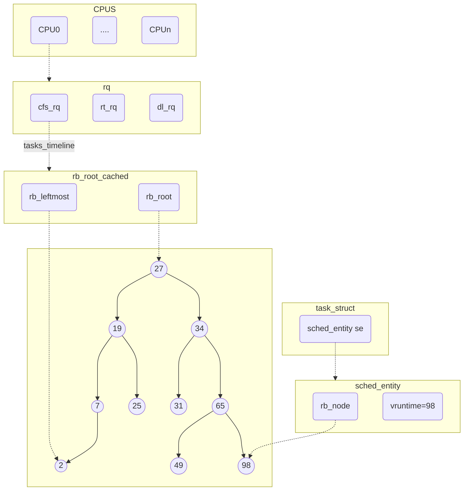

<!-- 设计理念与代码架构 -->
## 前言

本文阐述了`CFS`的设计理念以及`Linux`在内核实现上的基本代码架构，从宏观上梳理调度和`CFS`的脉络。本文的源码分析基于`Linux 4.19`。

## CFS的设计理念和目标

`CFS（Completely Fair Scheduler）`完全公平调度器，从字面上来看定义的已经很清晰了，首先`CFS`的本质是一个调度器，所谓调度就是决定`CPU`的执行权在每个时刻的归属，调度管理的对象就是`CPU`资源。所谓完全公平追求的是一种理想的多任务`CPU`模型，在理想状态下`CPU`资源能够平等地分配给每一个任务，比如某`CPU`上有两个任务，每个任务能够得到50%的`CPU`资源。但是这是一个不可能完成的任务，对于CPU来说一个时刻只能有一个任务在执行，不存在并行执行，在执行的过程中不断地有任务的加入和退出，在这样的复杂场景下只能追求近似的完全公平。

## 设计中的关键点

CFS调度器在`Linux 2.6`中被引入，`CFS`在设计上有一些关键的概念：
1. 虚拟时间（`vruntime`）：在CFS中使用`vruntime`来表示一个`task`在该`CPU`上的运行时间，`vruntime`累计值的计算与任务的优先级（权重）有关。`CFS`的调度逻辑也很简单，当一个调度时机出现时选择当前`runq`中`vruntime`最少的任务获得`CPU`。`vruntime`可以说是`CFS`调度器的灵魂，通过`vruntime`间接地实现了高优先级任务能够相对获取更多的`CPU`时间（高权重任务执行相同的物理时间但是累计的`vruntime`更少，因此能够得到更多的`CPU`时间）。
2. `runq`基于红黑树实现，从逻辑上说任何能实现虚拟时间排序的数据结构都是可以作为`runq`的，但是红黑树在内存、性能的综合考虑下表现最好，在查找、删除、插入等场景下性能表现稳定。
3. `cgroup`：支持按`group`来分配时间片，以组为单位划分`CPU`资源。

## CFS内核实现的相关数据结构

### 调度类

程序等于代码加数据，任何代码都是对数据的操作，在了解一项技术前需要先纵览它的数据结构设计。首先，在内核中`CFS`只是调度器中的一种，为了满足调度器的可拓展性，调度器被抽象为调度类（`Scheduling Class`），类似于`C++`中的虚基类只定义函数的类型，具体的实现交给真正的子类，`CFS`就是其子类之一。

`sched_class`定义了一个调度器应该具备的基本操作，在`fair.c`中定义的`fair_sched_class`就是`CFS`的调度类对象。

```c
const struct sched_class fair_sched_class = {
    .next			= &idle_sched_class,
    .enqueue_task		= enqueue_task_fair,
    .dequeue_task		= dequeue_task_fair,
                    ....
    .update_curr		= update_curr_fair,
};
```

在`sched_class`中的`next`指针指向了下一个调度类，所有的调度类按照优先级降序存放在一个单链表中，按顺序依次是`stop_sched_class`、`dl_sched_class`、`rt_sched_class`、`fair_sched_class`以及`idle_sched_class`。不同的调度类实现了不同的调度策略，在本文中只需要关注`fair_sched_class`，但是需要知道在做调度决策时会优先让高优先级调度器中的任务获取`CPU`执行权。


<center>调度类优先级</center>

### 就绪队列

在调度类中只定义了`CFS`的基本操作，这些函数的操作对象包括就绪队列和任务。在内核中就绪队列通过`struct rq`实现。`struct rq`是一个`per-cpu`的数据结构，可以看到`struct rq`下包含了`cfs`、`rt`、`dl`三个队列对应着三个不同的调度类。

**NOTE**：1. 不同调度类的就绪队列实现是不同的，与其策略相关。2. 每一个`CPU`上的就绪队列是独立的。

```c
struct rq {
    struct cfs_rq		cfs;
    struct rt_rq		rt;
    struct dl_rq		dl;
    ....
    struct task_struct	*curr; // 当前在运行的task
    struct task_struct	*idle; // idle task
    struct task_struct	*stop; // stop task	
};
```

这里存在一个问题，为什么调度类有五个却只有三个就绪队列，因为`stop`和`idle`两个调度类只执行固定的任务，`stop`调度类用于执行`stop`线程，该线程的优先级高于所有的`task`，主要用于负载均衡、热插拔等场景，可以强行停止`CPU`上执行的任务，这也是`stop`调度类优先级最高的原因。`idle`调度类执行的是固定的`idle`线程。因此这两个调度类不需要就绪队列。就绪队列的数据结构组织形式如下图所示：


<center>CFS数据组织结构</center>

这里我们重点关注的是`CFS`的就绪队列`struct cfs_rq`。`cfs_rq`的核心作用就是存放调度实体，也就是上述的红黑树数据结构`struct rb_root_cached`。在内核中实现的红黑树有一些优化，在`rb_root_cached`中不仅存放了红黑树的根节点，还缓存了最小元素的节点指针，可以将访问最小元素的操作优化到`O(1)`。除此之外，内核中实现的红黑树是一个通用数据结构，具体的实现细节这里不详细说明，只需要明确通过`rb_leftmost`这个`struct rb_node`指针我们可以找到其对应的调度实体即可，然后通过调度实体`se`，可以找到其所属的`task_struct`，但是中间的转化会涉及一些编译器与指针的`trick`，这个放在文末进行阐述。

```c
struct cfs_rq {
    struct rb_root_cached	tasks_timeline;
    ...
}

struct rb_root_cached {
    struct rb_root rb_root;
    struct rb_node *rb_leftmost;
};
```

## 题外话

### 编译器与指针转化的trick

在内核中经常会有从一个结构体成员找到其所属结构体指针的操作，比如从红黑树的`rb_node`找到对应的`sched_entity`，以及从`sched_entity`找到对应的`task_struct`。

这里我先罗列出这个例子的相关的数据结构。
```c
struct task_struct {
    ...
    struct sched_entity		se;
    ...
}

struct sched_entity {
    ...
    struct rb_node	run_node;
    ...
}
```

以从`sched_entity*`找到`task_struct`为例，实现函数为`task_of()`，在`task_of()`中用到了一个关键的宏定义`container_of`，如下所示。`container_of`计算`type`结构体的`member`成员变量在结构体内的偏移，然后用`member`的指针减去偏移得到`type`的指针。
```c
static inline struct task_struct *task_of(struct sched_entity *se)
{
	return container_of(se, struct task_struct, se);
}

#define container_of(ptr, type, member) \
    (type *)((char *)(ptr) - (char *) &((type *)0)->member)
```

以`task_of`为例。`container_of(se, struct task_struct, se)`展开后为`(struct task_struct *)((char *)(se) - (char *) &((struct task_struct *)0)->se)`，其中计算偏移的部分是`(char *) &((struct task_struct *)0)->se`，这里利用将`NULL`指针转化为`(struct task_struct *)`然后取成员变量得到结构体内部的变量偏移。将原始指针减去偏移自然得到了`struct task_struct *`的地址。
```c
container_of(se, struct task_struct, se)
// 展开后
(struct task_struct *)((char *)(se) - (char *) &((struct task_struct *)0)->se)
// 去掉最外层类型转化
(char *)(se) - (char *) &((struct task_struct *)0)->se
// 计算偏移的部分
(char *) &((struct task_struct *)0)->se
```

红黑树的通用性也是基于这个原理，其管理的真实对象只需要在结构体内添加一个`struct rb_node`变量，然后利用`container_of`这个宏就能访问到背后的真正对象，只要在转化前知道管理对象的真实类型即可。