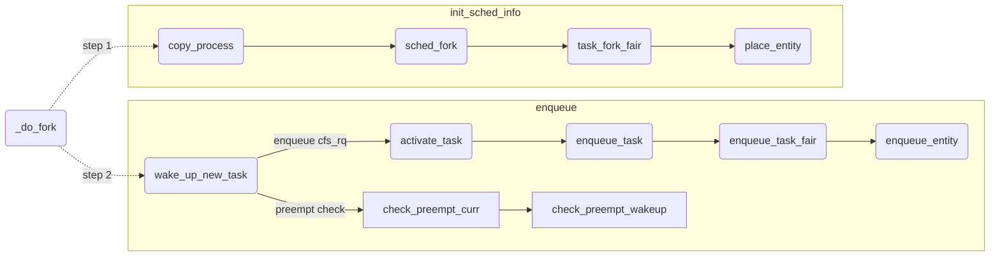

<!-- CFS 新任务task创建 -->

## 前言

新任务产生接口有`clone`、`fork`等系统调用，这些系统调用的都是通过`do_fork`函数实现。本文主要对`do_fork`中CFS新任务的调度初始化过程进行了探究，看看一个CFS新任务如何完成调度信息的初始化以及进入就绪队列的。

## CFS的调度信息初始化

```c
long _do_fork(...)
{
	/* 任务信息初始化 */
    p = copy_process(clone_flags, stack_start, stack_size,
			 child_tidptr, NULL, trace, tls, NUMA_NO_NODE);
    /* 唤醒新任务 */
	wake_up_new_task(p);
}
```
在`_do_fork`中大量的初始化操作在`copy_process`中完成，其中和调度初始化有关的由`sched_fork`完成。

### 优先级与调度类初始化

```c
int sched_fork(unsigned long clone_flags, struct task_struct *p)
{
    /* 1. reset调度数据结构 */
	__sched_fork(clone_flags, p);
	
	p->state = TASK_NEW;
    /* 2. 确保优先级不会随父进程突增 */
	p->prio = current->normal_prio;
    /* 3. sched_reset_on_fork reset优先级信息 */
    if (unlikely(p->sched_reset_on_fork)) {
		if (task_has_dl_policy(p) || task_has_rt_policy(p)) {
			p->policy = SCHED_NORMAL;
			p->static_prio = NICE_TO_PRIO(0);
			p->rt_priority = 0;
		} else if (PRIO_TO_NICE(p->static_prio) < 0)
			p->static_prio = NICE_TO_PRIO(0);

		p->prio = p->normal_prio = __normal_prio(p);
		set_load_weight(p, false);
    	p->sched_reset_on_fork = 0;
	}
    /* 4. 设置调度类 */
	if (dl_prio(p->prio))
		return -EAGAIN;
	else if (rt_prio(p->prio))
		p->sched_class = &rt_sched_class;
	else
		p->sched_class = &fair_sched_class;
    /* 5. 调用CFS的task_fork_fair */
	if (p->sched_class->task_fork)
		p->sched_class->task_fork(p);
}
```
`sched_fork`函数在`core.c`中，在最后一行之前都是调度通用信息的初始化，
**1.** `__sched_fork`将任务的CFS相关数据清零， 设置`p->state`为`TASK_NEW`表示task还在初始化过程中避免被调度。
**2.** 将`prio`设置为`current->normal_prio`是一个比较关键的点，在Linux中`prio`是调度决策时使用的优先级，新任务的优先级默认会继承父进程的优先级，但是继承的必须是`normal_prio`，因为`prio`在特殊情况下会出现临时提高的情况，有可能不是任务正常的优先级。
**3.** `sched_reset_on_fork`标志位的处理，设置此标志位时新任务需要重置优先级为`120`（`120`是`nice=0`的CFS任务对应的优先级），调度策略`policy`为`SCHED_NORMAL`。`set_load_weight`会更新任务的权重信息。如果没有该标志位，自然使用的是父进程的优先级信息。
**4.** 根据`prio`识别和设置所属调度类
**5.** 关键一步，如果所属的调度类是`fair_sched_class`会调用CFS调度器的`task_fork`函数，在CFS中的对应实现为`task_fork_fair`。

### vruntime初始化

截止目前为止，`task`的调度策略、优先级、权重信息（如果是CFS）都已经通过拷贝父进程或者重置的方式初始化完成。但是作为一个`normal-task`CFS调度所依赖的`vruntime`还未初始化。`task_fork_fair`会对新任务的`vruntime`进行初始化。
```c
static void task_fork_fair(struct task_struct *p)
{
    /* 1. 更新rq时钟 */
	update_rq_clock(rq);
    /* 2. 如果是curr调用的fork的处理 */
	curr = cfs_rq->curr;
	if (curr) {
		update_curr(cfs_rq);
		se->vruntime = curr->vruntime;
	}
    /* 3. 设置新任务的vruntime */
	place_entity(cfs_rq, se, 1);
    /* 4. 可能出现的反转 */
	if (sysctl_sched_child_runs_first && curr && entity_before(curr, se)) {
		swap(curr->vruntime, se->vruntime);
		resched_curr(rq);
	}
    /* 5. 得到相对值 */
	se->vruntime -= cfs_rq->min_vruntime;
}
```
新任务的`vruntime`初始化的主要流程如下：
**1.** 更新`rq`的时钟信息，后续如果需要更新`curr`的`vruntime`会用到
**2.** 检查`curr`是否存在，`curr`是当前CFS队列中正在运行task，如果`curr`存在说明是`curr`调用的`fork`在创建新任务，此时需要先更新`curr`的`vruntime`再让子任务继承。`update_curr`核心就做两件事，更新`curr`的`vruntime`，更新`cfs_rq`的`min_vruntime`。如果`curr`不存在说明`fork`的调用者不归`fair_sched_class`管辖，可能是`rt-task`或者`dl-task`创建的子进程，此时不涉及到`vruntime`的更新。
```c
static void update_curr(struct cfs_rq *cfs_rq)
{
	curr->vruntime += calc_delta_fair(delta_exec, curr); /* wall-time转化为虚拟时间 */
	update_min_vruntime(cfs_rq); /* 更新min_vruntime */
}
```
**3.** 关键一步`place_entity`设置新任务的`vruntime`，该值来源有两个，一是`cfs_rq->min_vruntime`的基础上加上一点惩罚，二是继承来自父进程的`vruntime`，取两者间的最大值。`place_entity`会惩罚新创建的task，因为当前的调度周期已经分配给任务队列中的任务了，如果直接插入会影响其他的任务在这个调度周期内的运行时间。这里的`sched_feat(START_DEBIT)`是一个宏，会检查`__SCHED_FEAT_START_DEBIT`这个特性是否开启。
```c
static void
place_entity(struct cfs_rq *cfs_rq, struct sched_entity *se, int initial)
{
	u64 vruntime = cfs_rq->min_vruntime;
	/* 3.1 惩罚新进程 */
	if (initial && sched_feat(START_DEBIT))
		vruntime += sched_vslice(cfs_rq, se);
	
	/* 3.2 更新新任务vruntime*/
	se->vruntime = max_vruntime(se->vruntime, vruntime);
}
```
**3.1.** 既然要惩罚新进程，给他的`vruntime`加多少合适呢？`sched_vslice(cfs_rq, se)`在当前队列的权重基础之上考虑设定值，关注一下`sched_vslice`的实现，该函数计算了一个即将被插入就绪队列的task的`vruntime slice`。`calc_delta_fair`之前分析过就是将一个wall-time按照任务的权重信息转化为虚拟时间。`sched_slice`和`sched_vslice`只有一字之差，该函数计算的是一个即将被插入就绪队列的`wall-time slice`。因此总结`sched_vslice`的实现就是计算即将被插入就绪队列的`wall-time slice`，再按照权重信息转换为虚拟时间得到`vruntime slice`。
```c
static u64 sched_vslice(struct cfs_rq *cfs_rq, struct sched_entity *se)
{
	return calc_delta_fair(sched_slice(cfs_rq, se), se);
}
```
`sched_slice`采取了一个很巧妙的设计，`sched_slice`虚构出新任务加入队列以后的队列状态，重新计算调度周期和`cfs_rq`的权重信息，在此基础上计算该状态下新任务的时间`wall-time`占比。需要注意的是这里只是虚构的计算，因为`se`还没有正式进入队列中，此时中间的计算结果都存储在局部变量中，并没有真正修改`cfs_rq`的整体权重信息。

**NOTE**: `for_each_sched_entity`与组调度有关，在这里可以认为组内只有`se`，因此循环可以去掉。

```c
static u64 sched_slice(struct cfs_rq *cfs_rq, struct sched_entity *se)
{	
	/* 重新计算调度周期 */
	u64 slice = __sched_period(cfs_rq->nr_running + !se->on_rq);
	for_each_sched_entity(se) {
		struct load_weight *load;
		struct load_weight lw;

		cfs_rq = cfs_rq_of(se);
		load = &cfs_rq->load;

		/* 加上新任务的权重后重新计算队列的权重 */
		if (unlikely(!se->on_rq)) {
			lw = cfs_rq->load;

			update_load_add(&lw, se->load.weight);
			load = &lw;
		}
		/* 在加上新任务权重的基础上计算新任务的物理时间片 */
		slice = __calc_delta(slice, se->load.weight, load);
	}
	return slice;
}
```
**3.2** 更新`new-task`的`vruntime`，这里用了`max_vruntime`取当前`se->vruntime`和`vruntime`之间的较大值，要保证`vruntime`永远保持单调不减。

**4.** `sysctl_sched_child_runs_first`是一个系统参数，表示让新创建的进程优先运行。当`curr`存在（`curr`创建了新任务）并且`curr`的`vruntime`小于新任务的`vruntime`，此时需要对调父子进程间的`vruntime`，然后设置`curr`的`TIF_NEED_RESCHED`标志位，在下一个调度时机出现时抢占`curr`。
**5.** 最后一步，设置新任务的`vruntime`为相对值，因为有可能由于负载均衡等原因新任务唤醒时的获取的cpu并不是当前计算`vruntime`的cpu。在唤醒时新任务的`vruntime`会加上`cfs_rq`的`min_vruntime`。


至此，一个新的`normal-task`被`cfs_rq`调度需要的优先级（权重值）、`vruntime`都已就绪。下一步就需要正式将新任务放入`cfs_rq`中。

## 新任务入队

当`__do_fork`中新任务的所有初始化操作都完成以后需要调用`wake_up_new_task`唤醒新任务，此时才会将任务入队。新任务进队需要两步，首先将新任务放入`rb-tree`中并更新相关信息，第二步检查抢占条件。

```c
void wake_up_new_task(struct task_struct *p)
{
	struct rq *rq;
	p->state = TASK_RUNNING;
	/* 1. 入队 */
	activate_task(rq, p, ENQUEUE_NOCLOCK);
	p->on_rq = TASK_ON_RQ_QUEUED;
	/* 2. 检查抢占 */
	check_preempt_curr(rq, p, WF_FORK);
}
```

### 进入就绪队列

`activate_task`通过逐层调用最终会走入`enqueue_task_fair`。`enqueue_task_fair`会找到`se`所属的`cfs_rq`然后调用`enqueue_entity`将`se`正式入队。

```c
static void
enqueue_task_fair(struct rq *rq, struct task_struct *p, int flags)
{
	struct cfs_rq *cfs_rq;
	struct sched_entity *se = &p->se;
	for_each_sched_entity(se) {
		if (se->on_rq)
			break;
		cfs_rq = cfs_rq_of(se);
		/* 入队 */
		enqueue_entity(cfs_rq, se, flags);
		cfs_rq->h_nr_running++;
	}

	if (!se)
		add_nr_running(rq, 1);
}
```

`enqueue_entity`负责修复新任务的`vruntime`，然后按照`vruntime`将其插入到`rb-tree`中。

```c
static void
enqueue_entity(struct cfs_rq *cfs_rq, struct sched_entity *se, int flags)
{
	bool renorm = !(flags & ENQUEUE_WAKEUP) || (flags & ENQUEUE_MIGRATED); /* true */
	bool curr = cfs_rq->curr == se; /* false */

	/* 1. cfs_rq->curr == se && 不是唤醒和迁移 */
	if (renorm && curr)
		se->vruntime += cfs_rq->min_vruntime;

	update_curr(cfs_rq);

	/* 2. cfs_rq->curr != se && 不是唤醒和迁移 */
	if (renorm && !curr)
		se->vruntime += cfs_rq->min_vruntime;
	/* 3. 将se插入到rb-tree */
	if (!curr)
		__enqueue_entity(cfs_rq, se);
	se->on_rq = 1;
}
```

`enqueue_entity`主要流程如下：
**1.** `renorm`表示需要重新归一化，当`flags`中既不包含`ENQUEUE_WAKEUP`也不包含`ENQUEUE_MIGRATED`时为`true`，换句话说不是唤醒和迁移产生的入队时为`true`。`curr`表示`cfs_rq->curr`是否与`se`一致。因此在此情况下，`renorm && curr`表示一个正在运行的进程由于时间片用完导致重新入队，此时修复`se->vruntime`必须在`update_curr`之前，因为`update_curr`更新`cfs_rq->min_vruntime`会考虑`se->vruntime`，但是此时的`se->vruntime`是无意义的。
**2.** 新任务的不会进入1号分支，而是进入二号分支，此时会恢复新任务的`vruntime`。
**3.** `__enqueue_entity`会将新任务的调度实体`se`放入`rb-tree`中。

```c
static void __enqueue_entity(struct cfs_rq *cfs_rq, struct sched_entity *se)
{
	struct rb_node **link = &cfs_rq->tasks_timeline.rb_root.rb_node;
	struct rb_node *parent = NULL;
	struct sched_entity *entry;
	bool leftmost = true;

	/* 3.1 查找合适的位置 并且记录是否为`vruntime`最小的`se`*/
	while (*link) {
		parent = *link;
		entry = rb_entry(parent, struct sched_entity, run_node);

		if (entity_before(se, entry)) {
			link = &parent->rb_left;
		} else {
			link = &parent->rb_right;
			leftmost = false;
		}
	}
	/* 3.2 插入红黑树 并且更新缓存节点信息*/
	rb_link_node(&se->run_node, parent, link);
	rb_insert_color_cached(&se->run_node,
			       &cfs_rq->tasks_timeline, leftmost);
}
```

**3.1** 在从根节点向下搜索寻找合适位置时会顺带记录新节点是否为`vruntime`最小的节点（`rb-tree`最左下角的节点），如果出现一次向右搜索则`leftmost`为`false`。
**3.2** 执行红黑树的插入操作，如果有必要顺带更新`vruntime`最小的节点信息。

### 检查抢占条件

当任务通过`activate_task`成功入队以后，`check_preempt_curr`会检查是否满足抢占条件。

```c
void check_preempt_curr(struct rq *rq, struct task_struct *p, int flags)
{
	const struct sched_class *class;
	/* 1. rq->curr 和 p 属于同一个调度类 */
	if (p->sched_class == rq->curr->sched_class) {
		rq->curr->sched_class->check_preempt_curr(rq, p, flags);
	} else {
		/* 2. 检查p的调度类优先级顺序 */
		for_each_class(class) {
			if (class == rq->curr->sched_class)
				break;
			if (class == p->sched_class) {
				/* 3. 高优先级抢占低优先级 */
				resched_curr(rq);
				break;
			}
		}
	}
}
```

抢占存在两种情况，第一种是同一调度类中的`task`之间互相抢占，另一种是高优先级调度类的`task`抢占低优先级调度类的`task`。

**1.** 对于第一种情况，具体的抢占策略交给调度类自己实现，对应到CFS中就是`check_preempt_wakeup`。

从函数名上看，该函数做的是唤醒抢占检查，这里我去掉和组调度相关的内容。有几种特殊情况可以快速结束抢占检查：
* 已有抢占标记时，不需要检查，抢占失败。
* 非IDLE任务抢占IDLE任务时，不需要检查，直接标记抢占成功。
* 试图发起抢占的任务是BATCH或者IDLE策略时，不需要检查，抢占失败。
* 没有开启唤醒抢占特性时，不需要检查，抢占失败。
```c
static void check_preempt_wakeup(struct rq *rq, struct task_struct *p, int wake_flags)
{
	struct task_struct *curr = rq->curr;
	struct sched_entity *se = &curr->se, *pse = &p->se;
	/* 1. 已有抢占标记 */
	if (test_tsk_need_resched(curr))
		return;
	/* 2. 非IDLE任务抢占IDLE任务 */
	if (unlikely(curr->policy == SCHED_IDLE) &&
	    likely(p->policy != SCHED_IDLE))
		goto preempt;
	/* 3. 非SCHED_NORMAL任务不允许抢占  未开启唤醒抢占特性时不允许抢占*/
	if (unlikely(p->policy != SCHED_NORMAL) || !sched_feat(WAKEUP_PREEMPTION))
		return;

	update_curr(cfs_rq_of(se));
	/* 4. 检查是否满足唤醒抢占粒度 */
	if (wakeup_preempt_entity(se, pse) == 1) {
		goto preempt;
	}

	return;

preempt:
	resched_curr(rq);
}
```

如果以上条件都不满足时，还需要检查抢占是否满足唤醒粒度。唤醒粒度的目的是减少不必要的唤醒抢占，如果`se->vruntime`仅仅比`curr->vruntime`大一点点就发生抢占是不合理的，抢占也是有开销的。因此抢占需要保证`vruntime`之间的差值超过`gran`，`gran`由唤醒粒度`sysctl_sched_wakeup_granularity`影响（默认值为`1 msec * (1+ logi(nrcpu))`，比如8核cpu的默认唤醒粒度为4 msec）。但是此处没有直接使用唤醒粒度，而是根据`se`的权重信息将`sysctl_sched_wakeup_granularity`转化为`vruntime`，这样做的目的是如果`se`的优先级高于`curr`，`gran`会变小，一定程度上提高了高优先级抢占低优先级的概率。

```c
/*
 * Should 'se' preempt 'curr'.
 *
 *             |s1
 *        |s2
 *   |s3
 *         g
 *      |<--->|c
 *
 *  w(c, s1) = -1
 *  w(c, s2) =  0
 *  w(c, s3) =  1
 *
 */
static int
wakeup_preempt_entity(struct sched_entity *curr, struct sched_entity *se)
{
	s64 gran, vdiff = curr->vruntime - se->vruntime;

	if (vdiff <= 0)
		return -1;

	gran = wakeup_gran(se);
	if (vdiff > gran)
		return 1;

	return 0;
}
```

**2.** 第二种情况比较简单，按照优先级从高到底遍历调度类，如果是`p`任务优先匹配成功说明调度类的优先级更高，满足抢占条件。

## 总结


<center>CFS新任务创建的关键函数调用链</center>

一个CFS的`task`从开始创建到进入可以被调度的状态需要两步（仅考虑调度），第一步初始化调度的信息。主要在`sched_fork`中完成，在初始化进程的优先级、调度类、权重信息以后，如果是CFS进程调用`task_fork_fair`初始化`vruntime`。第二步正式将信息初始化好的新任务放入就绪队列，在这个过程中会更新`vruntime`然后放入`rb-tree`中，在结束前还会进行一次抢占检查，检查新任务能否抢占当前运行的任务。