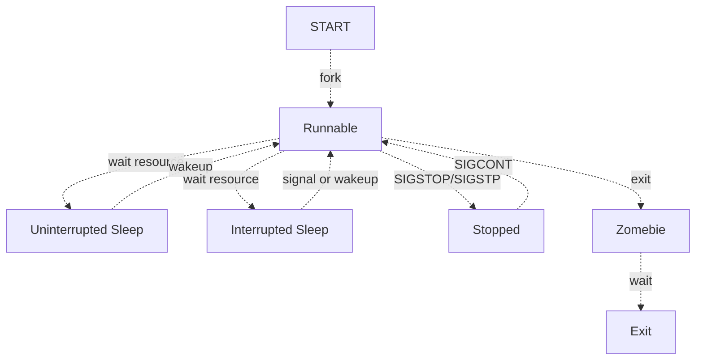

# Task的生命周期

所谓的`Linux`内核调度就是管理`CPU`硬件资源，决定多任务系统中的每一个`task`应该什么时候获得`CPU`的执行权、获得多久的执行权。因此内核的调度机制涉及到两个方面一个是`task`，一个是`CPU`。任务是被管理的对象，会随着调度和系统运行不断改变状态。

## Task的状态变迁

首先在`Linux`系统中，一个`task`从创建到退出会经过一系列的`task`状态变化。`Linux`中进程常见的状态有五种:

* `R(Running or Runnable)`: 进程通过`fork`系统调用创建，新的进程会根据调度规则查看能否抢占当前任务，如果可以则获取`CPU`执行权，如果不可以则加入就绪任务队列等待调度，在运行中的任务和在队列中等待运行的任务都属于`R`状态。
* `D(Uninterrupted Sleep)`和`S(Interrupted Sleep)`: 当进程运行过程中需要等待外部资源时进程会主动让出`CPU`并且进入睡眠状态。睡眠分为两种，一种是不可中断的睡眠，只能被资源就绪唤醒，一般出现在等待`IO`资源时，为的是避免和`IO`设备交互过程被信号干扰(比如`SIGINT`)出现非预期的行为，此时会不响应信号。另一种是可中断的睡眠，在睡眠过程中可以被信号唤醒。
* `T(Stopped)`: 有两种信号可以导致进程进入`Stopped`状态。第一种是`SIGSTOP`信号，该信号无法被进程忽略并且是可编程使用的。另一种是`SIGSTP`信号，该信号通过`Ctrl+Z`触发，进程可以忽略该信号。 处于`Stopped`状态的进程在收到`SIGCONT`信号后可以恢复到`R`状态。
* `Z(Zombie)`: 进程执行`exit()`后会进入`Zombie`状态，此时进程不会继续执行但是进程占用的内核资源还没有被系统回收，需要`parent`进程调用`wait()`或者`waitpid()`接收子进程的结束状态后内核才会完全抹除进程信息。

Linux进程生命周期

可以看到`Runnable`就是`task`状态的中转站，因此调度子系统最核心的部分就是管理`Runable task`，也就是就绪队列管理。
  
