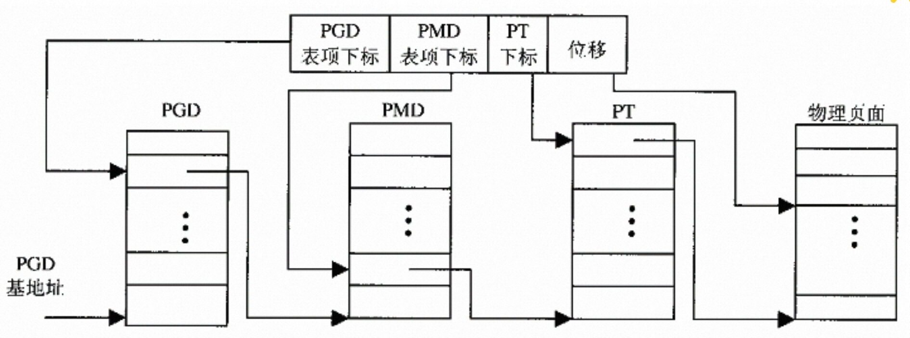

# Linux内存管理的基本框架

我发现按照这本书直接对照高版本的内核代码实在还是有一些困难，因此还是选择按照书中的低版本内核代码先理解内核的基本设计原理再考虑现代Linux内核的特性。

## 虚拟内存管理基础

在32位地址空间上，内核采取了通过页面目录和页面表的两层设计，这是因为在虚拟地址空间中存在着大量的空洞，进程一般只能使用很少的地址空间，因此为这些空洞建立页面表项是极度浪费物理内存的，两层设计可以只为页面目录中使用的地址空间建立页面表节约了内存。

但是还是存在一定的问题，当地址空间超过32位以后，两层的设计方式就有点不够用了，此时可以三层的映射机制，在现代Linux内存管理上甚至有五层、六层等映射机制，用以满足64位地址空间的需要。

因此为了满足除了i386以外的CPU，linux提供的通用内存映射机制有三层，在页面目录（Page Directory，PGD）和页面表（Page Table，PT）之间加上了中间页面目录（Page Middle Directory，PMD）。

因此虚拟地址到物理地址的映射过程就变成了三层：
    

虚拟地址被划分为PGD偏移、PMD偏移、PT偏移以及Page内偏移，通过PGD基地址找到PGD，按照PGD偏移找到PMD的基地址，通过PMD偏移在PMD中找到PT基地址，按照PT偏移找到Page的物理地址，加上偏移后得到物理地址。

至此，虚拟地址到物理地址的映射流程基本清楚。

此外还需要关注一下，虚拟地址的划分，在32位系统中可用的虚拟地址空间有4G，其中低地址的3G内存为用户地址空间，每个进程独占该段空间，高地址的1G空间为内核地址空间，被所有进程共享。因此在内核地址空间的起始地址为`__PAGE_OFFSET（0xC0000000）`，但是在物理地址上，所有的内核空间内存都是从0开始的直接映射，因此在想要得到一个内核虚拟地址的物理地址只需要用虚拟地址减去PAGE_OFFSET,想要得到一个物理地址的虚拟内核地址只需要加上PAGE_OFFSET，在kernel中通过__pa和__va两个宏来完成。

```c
#define __PAGE_OFFSET  (0xC0000000)
#define __pa(x)   ((unsigned long)(x)-PAGE_OFFSET)
#define __va(x)   ((void *)((unsigned long)(x)+PAGE_OFFSET))
```

在进程切换是需要在CR3寄存器中写入换入进程的PGD基地址，但是该值是一个虚拟地址，想要得到物理地址只需要通过__pa完成映射。

## i386地址映射

在i386 CPU上采取的是段式+页式内存管理，但是linux实际上只需要页式管理就足够了，但是CPU上需要先进行一次虚拟地址到线性地址的映射，具体过程就是通过段寄存器实现，但是在linux实现上得到的线性地址和虚拟地址相同，然后再通过页式内存管理的地址映射流程得到物理地址。

## 数据结构

### 物理内存管理

在内核中物理页面page通过`struct page`表示，

```c
// include/linux/mm.h
typedef struct page {
    struct list_head list;  /* ->mapping has some page lists. */
    struct address_space *mapping; /* The inode (or ...) we belong to. */
    unsigned long index;  /* Our offset within mapping. */
    struct page *next_hash;  /* Next page sharing our hash bucket in
                       the pagecache hash table. */
    atomic_t count;   /* Usage count, see below. */
    unsigned long flags;  /* atomic flags, some possibly
                       updated asynchronously */
    struct list_head lru;  /* Pageout list, eg. active_list;
                       protected by pagemap_lru_lock !! */
    struct page **pprev_hash; /* Complement to *next_hash. */
    struct buffer_head * buffers; /* Buffer maps us to a disk block. */
} mem_map_t;
```

当page的内容来自文件时，index指向page在文件中的偏移；当page被换出到交换区，但是还保留着缓冲内容时，index指明了page的去向。

在系统初始化时，内核会初始化一个代表物理内存大小的page数组`mem_map`，通过物理页面的序号就能在mem_map中找到对应的page结构体。mem_map中的物理页面被划分为ZONE_DMA、ZONE_NORMAL以及ZONE_HIGHMEM。其中ZONE_DMA专用于DMA设备，这是由于以下几个原因：

1. DMA用于磁盘IO，如果DMA时内存不足就会导致无法进行swap
2. 一些设备由于限制，无法访问太高的物理地址。
3. 在i386中DMA访问内存不需要通过MMU机制，因此在需要超过页面的内存时需要页面在物理上连续，但是DMA无法通过使用MMU得到不连续的内存空间。

因此对于DMA的物理页面需要单独管理。

对于每一个管理区通过zone_struct进行管理。

```c
/*
 * On machines where it is needed (eg PCs) we divide physical memory
 * into multiple physical zones. On a PC we have 3 zones:
 *
 * ZONE_DMA   < 16 MB ISA DMA capable memory
 * ZONE_NORMAL 16-896 MB direct mapped by the kernel
 * ZONE_HIGHMEM  > 896 MB only page cache and user processes
 */
typedef struct zone_struct {
    spinlock_t  lock;
    unsigned long  free_pages;
    
    zone_watermarks_t       watermarks[MAX_NR_ZONES];

    unsigned long           need_balance;
    unsigned long           nr_active_pages, nr_inactive_pages;
    unsigned long           nr_cache_pages;

    free_area_t  free_area[MAX_ORDER];

    wait_queue_head_t * wait_table;
    unsigned long  wait_table_size;
    unsigned long  wait_table_shift;

    struct pglist_data *zone_pgdat;
    struct page  *zone_mem_map;
    unsigned long  zone_start_paddr;
    unsigned long  zone_start_mapnr;

    char   *name;
    unsigned long  size;
    unsigned long  realsize;
} zone_t;

typedef struct free_area_struct {
    struct list_head    free_list;
    unsigned long       *map;
} free_area_t;
```

每一个zone包含一个`free_area_t free_area`成员，free_area是一组队列管理，这组队列管理固定大小的内存块，内存块的大小由下标决定，分别管理连续长度为1、2、4...2的MAX_ORDER次方大小物理页面。

在创痛的计算机结构中所有的物理内存都是均匀的，也就是一致性内存架构（Uniform Memory Architecture，UMA）。但是在一些CPU架构下，内存实际上是不均匀的，在一个多CPU系统中，每个CPU访问内存分为本地内存和远端内存，访问本地内存的速度更快，但是也可以通过总线访问别的CPU模块的内存，这种架构称为非一致性内存架构（Non-Uniform Memory Architecture，NUMA）。因此需要再上一层再加一层node的抽象，每个node包含多个zone。node由`struct pglist_data`表示.

```c
typedef struct pglist_data {
    zone_t node_zones[MAX_NR_ZONES];
    zonelist_t node_zonelists[GFP_ZONEMASK+1];
    int nr_zones;
    struct page *node_mem_map;
    unsigned long *valid_addr_bitmap;
    struct bootmem_data *bdata;
    unsigned long node_start_paddr;
    unsigned long node_start_mapnr;
    unsigned long node_size;
    int node_id;
    struct pglist_data *node_next;
} pg_data_t;
```

因此一个系统中对物理内存的管理架构如下：

1. pg_data_t：对NUMA架构进行抽象，每个node包含多个zone
2. zone_t：对DMA、NORMAL、HIGHMEM区域进行抽象，每个zone_t按采取伙伴系统模型进行内存管理，将内存区域分为多个空闲链表。
3. free_area_t：链表，管理大小固定的连续内存块。
4. mem_map： 一个页面数组，管理所有的页面。

### 虚拟内存管理

物理内存是通过供给的角度进行管理，通过一个factory的概念，管理所有的内存存量。虚拟地址空间按照地址空间划分为系统空间和用户空间，其中用户空间是per-task的，每个task有自己独立的地址空间，但是每个task一般不会使用所有的虚拟地址空间，因此虚拟地址空间是非连续的，就需要一个数据结构对每一段虚拟内存地址空间进行描述。在kernel中就是`vm_area_struct`。

```c
struct vm_area_struct {
    struct mm_struct * vm_mm; /* The address space we belong to. */
    unsigned long vm_start;  /* Our start address within vm_mm. */
    unsigned long vm_end;  /* The first byte after our end address
                       within vm_mm. */

    /* linked list of VM areas per task, sorted by address */
    struct vm_area_struct *vm_next;

    pgprot_t vm_page_prot;  /* Access permissions of this VMA. */
    unsigned long vm_flags;  /* Flags, listed below. */

    struct rb_node vm_rb;

    /*
     * For areas with an address space and backing store,
     * one of the address_space->i_mmap{,shared} lists,
     * for shm areas, the list of attaches, otherwise unused.
     */
    struct list_head shared;

    /* Function pointers to deal with this struct. */
    struct vm_operations_struct * vm_ops;

    /* Information about our backing store: */
    unsigned long vm_pgoff;  /* Offset (within vm_file) in PAGE_SIZE
                       units, *not* PAGE_CACHE_SIZE */
    struct file * vm_file;  /* File we map to (can be NULL). */
    void * vm_private_data;  /* was vm_pte (shared mem) */
};
```

- `vm_mm`指向当前结构体所属的`task_struct`中`mm_struct`。
- `vm_start`和`vm_end`就决定了这段地址空间的范围，是一个左闭右开的区间。
- `vm_next`：用户地址空间中有很多的非连续vm_area_strcut通过链表，按照地址顺序连接在一起。
- `vm_page_prot`和`vm_flags`表示地址空间的权限和类型等。
- `vm_rb`：由于经常需要对虚拟地址空间进行搜索，因此除了使用链表外，还需要使用`rb-tree`对`vm_area_struct`进行管理，提高搜索效率。
- `vm_ops`：是一个`struct vm_operations_struct`，由于address的类型不同需要的操作也是不一样的。
  
```c
struct vm_operations_struct {
    void (*open)(struct vm_area_struct * area);
    void (*close)(struct vm_area_struct * area);
    struct page * (*nopage)(struct vm_area_struct * area, unsigned long address, int unused);
    int (*populate)(struct vm_area_struct * area, unsigned long address, unsigned long len, pgprot_t prot, unsigned long pgoff, int nonblock);
};
```

进程的内存类型按照是否共享、是否基于文件划分为四类，对于不同类型的内存在map、unmap、缺页异常处理上存在一定的差异。

```bash
                         Private | Shared
                     1           |          2
Anonymous  . stack               |
           . malloc()            |
           . brk()/sbrk()        | . POSIX shm*
           . mmap(PRIVATE, ANON) | . mmap(SHARED, ANON)
          -----------------------+----------------------
             . mmap(PRIVATE, fd) | . mmap(SHARED, fd)
File-backed  . pgms/shared libs  |
                     3           |          4

```

以上就是task的一段地址空间的抽象，而对这些`vm_area_struct`进行管理的结构体为`mm_struct`，在`vm_area_strcut`中的`vm_mm`就是这个类型。

```c
struct mm_struct {
    struct vm_area_struct * mmap;  /* list of VMAs */
    struct rb_root mm_rb;
    struct vm_area_struct * mmap_cache; /* last find_vma result */
    unsigned long free_area_cache;  /* first hole */
    pgd_t * pgd;
    atomic_t mm_users;   /* How many users with user space? */
    atomic_t mm_count;   /* How many references to "struct mm_struct" (users count as 1) */
    int map_count;    /* number of VMAs */
    struct rw_semaphore mmap_sem;
    ...
};
```

- `mmap`：VMAs链表
- `mm_rb`：VMAs的rb-tree
- `mmap_cache`：最近一次访问的VMA缓存
- `pgd`：页目录表地址，在task换入时会将pgd地址转换为物理地址并写入CR3寄存器。

通过对以上内容的总结，一个task拥有的资源的架构如下：

```text
task_struct-->mm_struct-->vm_area_struct
                  |
                  |
                  V
                pgd_t
```

vm_area_struct负责task的用户地址空间管理，pgd_t则负责实现虚拟地址到物理地址的转换。
