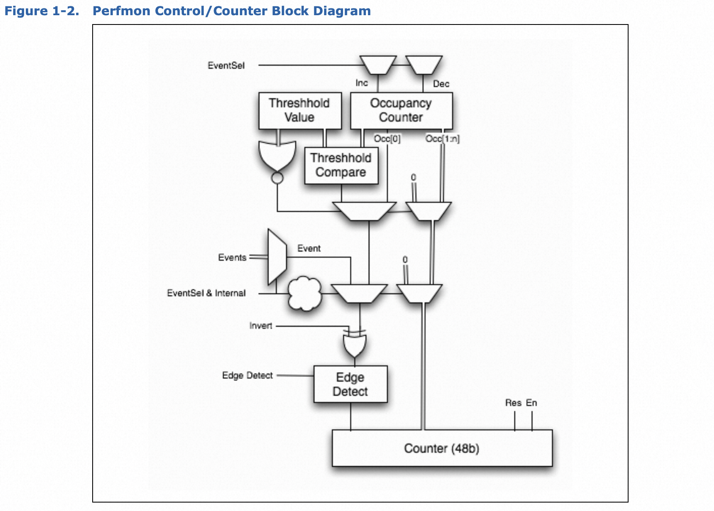

# uncore

最近在做uncore-imc的内存延迟指标的采集，涉及到了intel芯片的uncore事件，因此对intel的硬件能力进行了学习，做一个总结。

## uncore简介

硬件事件按照处于的位置划分为core、offcore和uncore事件，core事件指的是最小的逻辑核上的事件，比如cycle或者instruciton；由于每个物理核会有多个逻辑核，同一物理核上的不同逻辑核会有一些资源在共享，比如访存等，同一物理核的多个逻辑核走的就是相同的通道，属于offcore事件；uncore是多个物理核之间共享的资源的事件，比如LLC，这些资源被划分到uncore。
uncore子系统的组件很多，包括：

1. CBox caching agent
2. power controller unit-PCU
3. integrated memory controller-iMC
4. home agent-HA
5. ...

## PMON

uncore的性能监控能力通过per-component的性能监控单元支持，这种组件内的监控单元也被称作PMON，每一个组件内的PMON包含一个或者多个register集合。UBox是一个例外，每个PMON但愿提供了一个unit-level的控制寄存器去同步UBox中的多个计数器。

通过读取local 计数器寄存器可以收集事件信息，每一个计数器寄存器都有一个配对的控制寄存器，通过改变event select/umask指定对什么事件计数以及如何计数，一些unit还提供了一些额外信息去`filter`监控事件。

需要注意的是，uncore监控的是socket级别的事件，uncore事件不受到内核调度的线程迁移的影响，因此建议为task绑定亲和性到socket上，避免线程跨socket计数到不同的uncore PMU上。

uncore的计数寄存器和控制寄存器的可编程接口分种地址空间：

1. Cbo Units、PCU以及U-Box的PMON寄存器通过MSR地址空间访问
2. HA、iMC、Intel QPI、R2PCIe以及R3QPI单元通过PCI device configuration地址空间（PCICFG）访问

## uncore PMON的控制/计数寄存器的逻辑

下面这个图展示了计数寄存器中event信息是如何流转以及存储的，以及控制寄存器如何进行event选择和过滤信息的。

控制寄存器最主要的功能就是去配置监控的事件，通过设置`.ev_sel`和`.umask`字段实现对事件的选择。

配置了事件以后需要通知硬件控制器寄存器被修改，`.en`位必须被设置为1去开启计数。一旦box和全局级别的计数被使能，对应的数据寄存器就可以开始收集事件了。

在事件收集的过程中还可以设置threshold，在一些事件中每次计数的值可能超过1，打比方一个内存的读写字节数，想要统计每次读写超过128KB的事件数，此时通过设置`.thresh`为非零数，只有到来的事件超过或者低于这个阈值的事件才会被计数加一。`.invert`和`.edge_det`发生在`.thresh`比较之后，`.invert`用于取反，表示小于。`.edge_det`统计事件状态变化的次数，比如从没有事件发生到事件触发的次数。

## Refreence

[1] xeon-e5-2600-uncore-guide
[2] [PERF EVENT 硬件篇续](https://ata.alibaba-inc.com/articles/104772)