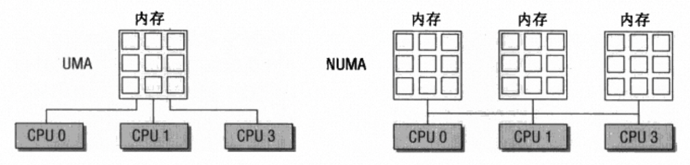

# NUMA

NUMA是非一致性内存访问(Uon-Uniform Memory Access)的缩写，与之相反的是一致性内存访问UMA。在多核的UMA架构的机器上，CPU视角下所有的内存都是均匀的，对内存的访问延迟是相同；而在NUMA架构的机器上内存被划分为不同的区域，对CPU来说内存是不均匀的，存在着远端内存和本地内存的区别，访问远端内存的代价更高。



## 内核对NUMA的支持

为了支持NUMA内核使用Node这个概念表示一块均匀的内存，这样NUMA系统的多个内存区域就可以用多个Node来表示，这样做有两个优点：

1. 对于UMA架构可以只用一个Node表示就可以了，架构上完全兼容
2. 对于物理内存区域存在空洞的情况（一种不均匀内存的特殊情况），也可以使用Node概念进行抽象

在内核中使用`pg_data_t`结构描述一个Node，在内核中使用链表串联所有的Node用于遍历访问。

每个Node中的内存又被划分为多个Zone，被称为内存域。

## 内存域（Zone）

在讲Zone之前需要先描述一下虚拟地址空间的划分，在32位系统上可寻址的地址空间为4GB，一般会按照3:1的比例划分为用户地址和内核地址。对于不超过内核地址空间范围的物理内存访问可以通过虚拟内存减去内核地址偏移的方式得到物理地址，这种地址映射方式被称为**直接映射**，对于超过内核地址空间范围的物理内存则需要通过**高端内存映射**实现地址转换。

Zone的类型与其物理地址范围有关，从低地址高地址划分为`ZONE_DMA`、`ZONE_DMA32`、`ZONE_NORMAL`、`ZONE_HIGHMEM`。

- `ZONE_DMA`: DMA寻址需要，一些外设设备能够访问的地址空间有限，因此需要预留一部分物理内存地址空间给DMA使用。
- `ZONE_DMA32`: 在64位系统上与ZONE_DMA有区别，在32位系统该内存区域为0MB。
- `ZONE_NORMAL`: 能够由内核段直接映射的地址空间，但是该段地址空间不一定有实际的物理内存对应。比如64位系统中只有2GB的物理内存，这两GB物理内存都属于了ZONE_DMA32范围。
- `ZONE_HIGHMEM`: 物理地址空间范围超过了内核段长度的部分。

这里的Zone指的是**物理内存的地址范围**，并不一定存在对应的物理内存。

除此之外，内核还提供了一个伪内存区域`ZONE_MOVEABLE`，在减少内存碎片的机制中会涉及。

每个Zone提供了一个数组来管理该内存区域内的所有页帧，每个页帧通过`Page`结构体来描述。

为了满足性能需要，内存分配会优先从当前CPU所属的Node中分配内存，但是该操作不一定保证成功，因此每个Node提供了备选列表存放可选的Node以及相关的Zone，列表中越靠后的Node和Zone越不适合进行分配。该备用列表在内核中使用`zonelist`表示。

## Node和Zone的数据结构

### Node

```c
typedef struct pglist_data {
    struct zone node_zones[MAX_NR_ZONES];        
    struct zonelist node_zonelists[MAX_ZONELISTS]; 
    int nr_zones;
#ifdef CONFIG_FLAT_NODE_MEM_MAP
    struct page *node_mem_map;
#endif
    struct bootmem_data *bdata;

    unsigned long node_start_pfn;
    unsigned long node_present_pages; /* total number of physical pages */
    unsigned long node_spanned_pages; /* total size of physical page
                         range, including holes */
    int node_id;
    wait_queue_head_t kswapd_wait;
    struct task_struct *kswapd;
    int kswapd_max_order;
} pg_data_t;

```

- `node_zones`: 内存区域数组
- `node_zonelists`: 备选Node和Zone列表
- `nr_zones`: 内存区域个数
- `node_mem_map`: Node中的所有页帧
- `bdata`: `struct bootmem_data`是内核启动时使用的自举内存分配器boot memory allocator，`bdata`指向该实例。
- `node_start_pfn`: Node中第一个page的逻辑编号，page的逻辑编号是**全局唯一**。
- `node_present_pages`: Node中的page数目。
- `node_spanned_pages`: Node以地址长度和page大小计算的page数目（包括空洞），和`node_present_pages`不一定相同。
- `node_id`: 全局的Node ID
- `kswapd_wait`: kswapd的等待队列
- `kswapd`: 负责该Node的kswapd进程的`task_struct`
- `kswapd_max_order`: 页交换子系统实现相关。

在内核所有Node的状态通过位图来表示，每一个状态对应一个位图，位图中的每一个bit对应Node。

```c
enum node_states {
    N_POSSIBLE,		/* The node could become online at some point */
    N_ONLINE,		/* The node is online */
    N_NORMAL_MEMORY,	/* The node has regular memory */
#ifdef CONFIG_HIGHMEM
    N_HIGH_MEMORY,		/* The node has regular or high memory */
#else
    N_HIGH_MEMORY = N_NORMAL_MEMORY,
#endif
    N_CPU,		/* The node has one or more cpus */
    NR_NODE_STATES
};

```

- `N_POSSIBLE`: 某个时刻后能够变成ONLINE状态
- `N_ONLINE`: 在线状态
- `N_NORMAL_MEMORY`: Node包含普通内存域
- `N_HIGH_MEMORY`: Node包含高端内存或者普通内存域
- `N_CPU`: Node包含一个或者多个cpus

`N_POSSIBLE`、`N_ONLINE`、`N_CPU`会用于内存、cpu的热插拔。`N_NORMAL_MEMORY`、`N_HIGH_MEMORY`与内存管理相关。

### Zone

```c
struct zone {
    /* Fields commonly accessed by the page allocator */
    unsigned long		pages_min, pages_low, pages_high;
    unsigned long		lowmem_reserve[MAX_NR_ZONES];

#ifdef CONFIG_NUMA
    int node;
    unsigned long		min_unmapped_pages;
    unsigned long		min_slab_pages;
    struct per_cpu_pageset	*pageset[NR_CPUS];
#else
    struct per_cpu_pageset	pageset[NR_CPUS];
#endif

    struct free_area	free_area[MAX_ORDER];

    spinlock_t		lock;
    ZONE_PADDING(_pad1_)

    /* Fields commonly accessed by the page reclaim scanner */
    spinlock_t		lru_lock;	
    struct list_head	active_list;
    struct list_head	inactive_list;
    unsigned long		nr_scan_active;
    unsigned long		nr_scan_inactive;
    unsigned long		pages_scanned;	   /* since last reclaim */
    unsigned long		flags;		   /* zone flags, see below */

    /* Zone statistics */
    atomic_long_t		vm_stat[NR_VM_ZONE_STAT_ITEMS];

    
    int prev_priority;


    ZONE_PADDING(_pad2_)
    /* Rarely used or read-mostly fields */

    wait_queue_head_t	* wait_table;
    unsigned long		wait_table_hash_nr_entries;
    unsigned long		wait_table_bits;

    /*
     * Discontig memory support fields.
     */
    struct pglist_data	*zone_pgdat;
    /* zone_start_pfn == zone_start_paddr >> PAGE_SHIFT */
    unsigned long		zone_start_pfn;

    unsigned long		spanned_pages;	/* total size, including holes */
    unsigned long		present_pages;	/* amount of memory (excluding holes) */

    /*
     * rarely used fields:
     */
    const char		*name;
} ____cacheline_internodealigned_in_smp;
```

在zone中使用了两个自旋锁，`lock`和`lru_lock`，这两个锁的使用频率很高，为了降低锁的并发压力，结构体中通过`ZONE_PADDING`填充直接让两个锁进入不同的cache line，降低对cache line的冲突，`____cacheline_internodealigned_in_smp`编译器关键字提示最优化的cache line对齐。

- `pages_min`, `pages_low`, `pages_high`: `内存水线，用于触发不同操作。高于pages_high`此时**内存域**状态理想。低于`pages_low`触发swap。低于`pages_min`页回收压力较大。
- `lowmem_reserve`: 每个内存域的保留内存页，用于完成一些不能失败的分配，每个内存域的保留内存不同。
- `pageset`: 一个per-cpu数组，`struct per_cpu_pageset`存储了per-cpu的冷热页信息，热页指page内容仍在cache中，可以快速访问，冷页即内容不在cache中。
- `free_area`: 数组，每个`free_area`存放了分配阶大小的page，和伙伴系统相关。
- `active_list`, `inactive_list`: 访问频繁的page看作active。访问不频繁的page为inactive的。在回收时应该优先回收inactive状态的page。`active_list`和`inactive_list`对应两种状态page的列表。
- `nr_scan_active`, `nr_scan_inactive`: 指定在回收时需要扫面的活跃和非活跃page数
- `pages_scanned`: 指定了上次换出一页以来有多少页未成功扫描。
- `flags`: 内存域状态。`ZONE_ALL_UNRECLAIMABLE`表示所有的pages都被钉住不可回收，出现在页面回收时。`ZONE_RECLAIM_LOCKED`避免SMP系统多个CPU同时回收。`ZONE_OOM_LOCKED`在处理OOM时设置，避免多CPU进行该操作。
  
```c
typedef enum {
    ZONE_ALL_UNRECLAIMABLE,		/* all pages pinned */
    ZONE_RECLAIM_LOCKED,		/* prevents concurrent reclaim */
    ZONE_OOM_LOCKED,		/* zone is in OOM killer zonelist */
} zone_flags_t;
```

- `prev_priority`: 存储了上一次扫描该内存区域时的优先级，扫描操作由`try_to_free_pages`进行，该值与页的换出有关。
- `wait_table`，`wait_table_hash_nr_entries`，`wait_table_bits`: 等待队列，用于进程等待某个页成为可用，但事件发生用于唤醒进程恢复工作。
- `zone_pgdat`: 指向所属的Node实例。
- `zone_start_pfn`: 第一个页帧的编号。
- `spanned_pages`，`present_pages`，`name`: 不重要，`spanned_pages`和`present_pages`含义与Node中相同。

## reference

《深入Linux内核架构》