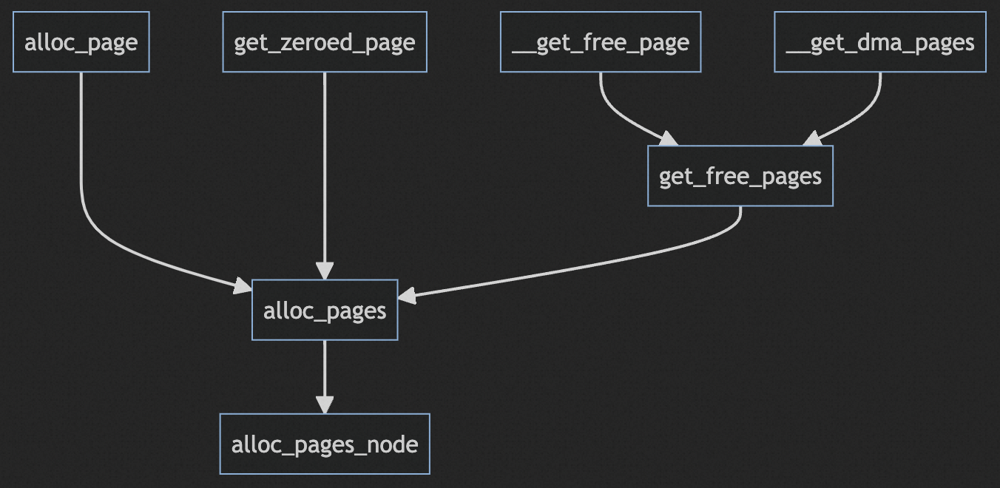
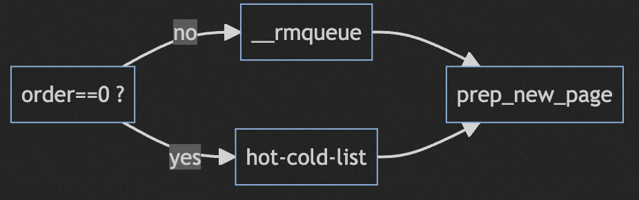
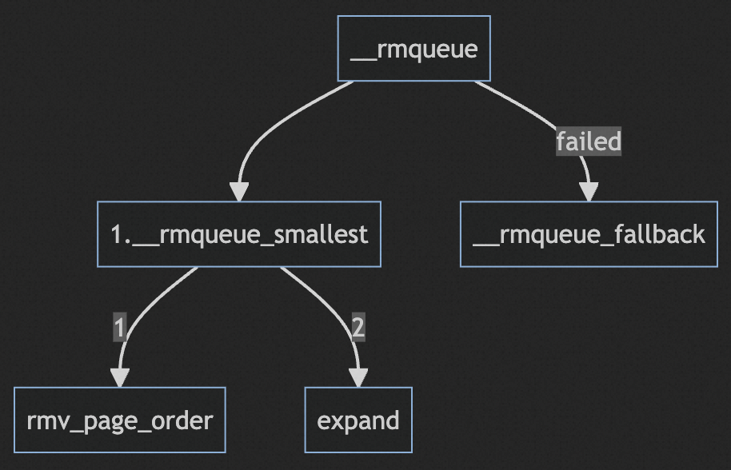

# 伙伴系统API-内存分配

## GFP_MASK

GFP是get free page的缩写，GFP_MASK是一系列内存分配的掩码，指导伙伴系统寻找合适的内存块进行分配，同时在分配过程中按照掩码的指示进行内存相关的操作，比如内存回收、分配失败后的行为等。

以下四个GFP_MASK指示了优先从哪个zone上进行内存分配。有个点可能会被注意到`zone_type`中包含的`ZONE_NORMAL`和`ZONE_MOVABLE`两种区域在标志中未出现。这个不必担心，内核提供了`gfp_zone`函数负责转换GFP_MASK为`zone_type`。

当同时指定`__GFP_HIGHMEM`和`__GFP_MOVABLE`时会返回`ZONE_MOVABLE`，表示从虚拟区域`ZONE_MOVABLE`中分配内存，该区域和内存碎片以及虚拟化中内存的热插拔相关。

当条件都不满足时就会返回`ZONE_NORMAL`。

按照返回的`zone_type`内存分配API就能确定需要扫描的内存区域有哪些，内存区域按照珍贵程度由低到高排序为HIGHMEM、NORMAL、DMA，当返回类型为ZONE_NORMAL时扫描的区域包括NORMAL和DMA，返回类型为HIGHMEM时扫描的区域则包括HIGHMEM、NORMAL、DMA，以此类推。

比较特殊的是当返回`ZONE_MOVABLE`时会在特殊的虚拟内存区进行内存分配。

```c
#define __GFP_DMA ((__force gfp_t)0x01u)
#define __GFP_HIGHMEM ((__force gfp_t)0x02u)
#define __GFP_DMA32 ((__force gfp_t)0x04u)
#define __GFP_MOVABLE ((__force gfp_t)0x100000u)  /* Page is movable */

static inline enum zone_type gfp_zone(gfp_t flags)
{
#ifdef CONFIG_ZONE_DMA
    if (flags & __GFP_DMA)
        return ZONE_DMA;
#endif
#ifdef CONFIG_ZONE_DMA32
    if (flags & __GFP_DMA32)
        return ZONE_DMA32;
#endif
    if ((flags & (__GFP_HIGHMEM | __GFP_MOVABLE)) ==
            (__GFP_HIGHMEM | __GFP_MOVABLE))
        return ZONE_MOVABLE;
#ifdef CONFIG_HIGHMEM
    if (flags & __GFP_HIGHMEM)
        return ZONE_HIGHMEM;
#endif
    return ZONE_NORMAL;
}
```

其他用于指挥内存分配操作的flag如下:

```c
#define __GFP_WAIT ((__force gfp_t)0x10u) /* Can wait and reschedule? */
#define __GFP_HIGH ((__force gfp_t)0x20u) /* Should access emergency pools? */
#define __GFP_IO ((__force gfp_t)0x40u) /* Can start physical IO? */
#define __GFP_FS ((__force gfp_t)0x80u) /* Can call down to low-level FS? */
#define __GFP_COLD ((__force gfp_t)0x100u) /* Cache-cold page required */
#define __GFP_NOWARN ((__force gfp_t)0x200u) /* Suppress page allocation failure warning */
#define __GFP_REPEAT ((__force gfp_t)0x400u) /* See above */
#define __GFP_NOFAIL ((__force gfp_t)0x800u) /* See above */
#define __GFP_NORETRY ((__force gfp_t)0x1000u)/* See above */
#define __GFP_COMP ((__force gfp_t)0x4000u)/* Add compound page metadata */
#define __GFP_ZERO ((__force gfp_t)0x8000u)/* Return zeroed page on success */
#define __GFP_NOMEMALLOC ((__force gfp_t)0x10000u) /* Don't use emergency reserves */
#define __GFP_HARDWALL   ((__force gfp_t)0x20000u) /* Enforce hardwall cpuset memory allocs */
#define __GFP_THISNODE ((__force gfp_t)0x40000u)/* No fallback, no policies */
#define __GFP_RECLAIMABLE ((__force gfp_t)0x80000u) /* Page is reclaimable */
#define __GFP_MOVABLE ((__force gfp_t)0x100000u)  /* Page is movable */
```

- `__GFP_WAIT`: 允许中断
- `__GFP_HIGH`: 分配内存很紧急
- `__GFP_IO`: 分配过程允许IO，内存回收时只有设置该标志才能将内存刷到磁盘
- `__GFP_FS`: 允许vfs操作，在vfs相关子系统中需禁用，否则可能引起vfs递归调用。
- `__GFP_COLD`: 分配冷页
- `__GFP_NOWARN`: 分配失败时不告警
- `__GFP_REPEAT`: 分配失败时尝试几次后再放弃
- `__GFP_NOFAIL`: 分配失败后不断尝试直到成功
- `__GFP_NORETRY`: 分配失败后不重试
- `__GFP_COMP`: 分配复合页
- `__GFP_ZERO`: 分配成功后将page清零
- `__GFP_NOMEMALLOC`: 不使用紧急保留链表（MIGRATE_RESERVER）
- `__GFP_HARDWALL`: 只在当前进程允许运行的cpu所在node上进行内存分配
- `__GFP_THISNODE`: 只允许在当前node上分配，不使用node的备选列表
- `__GFP_RECLAIMABLE` & `__GFP_MOVABLE`: 分配的页是可回收或者可移动的，需要在对应的空闲链表中分配。

在进行内存分配时会用到以上以下划线开头的多个flag的组合，常用的GFP_MASK如下:

```c

#define __GFP_BITS_SHIFT 21 /* Room for 21 __GFP_FOO bits */
#define __GFP_BITS_MASK ((__force gfp_t)((1 << __GFP_BITS_SHIFT) - 1))

/* This equals 0, but use constants in case they ever change */
#define GFP_NOWAIT (GFP_ATOMIC & ~__GFP_HIGH)
/* GFP_ATOMIC means both !wait (__GFP_WAIT not set) and use emergency pool */
#define GFP_ATOMIC (__GFP_HIGH)
#define GFP_NOIO (__GFP_WAIT)
#define GFP_NOFS (__GFP_WAIT | __GFP_IO)
#define GFP_KERNEL (__GFP_WAIT | __GFP_IO | __GFP_FS)
#define GFP_TEMPORARY (__GFP_WAIT | __GFP_IO | __GFP_FS | \
             __GFP_RECLAIMABLE)
#define GFP_USER (__GFP_WAIT | __GFP_IO | __GFP_FS | __GFP_HARDWALL)
#define GFP_HIGHUSER (__GFP_WAIT | __GFP_IO | __GFP_FS | __GFP_HARDWALL | \
             __GFP_HIGHMEM)
#define GFP_HIGHUSER_MOVABLE (__GFP_WAIT | __GFP_IO | __GFP_FS | \
                 __GFP_HARDWALL | __GFP_HIGHMEM | \
                 __GFP_MOVABLE)
#define GFP_NOFS_PAGECACHE (__GFP_WAIT | __GFP_IO | __GFP_MOVABLE)
#define GFP_USER_PAGECACHE (__GFP_WAIT | __GFP_IO | __GFP_FS | \
                 __GFP_HARDWALL | __GFP_MOVABLE)
#define GFP_HIGHUSER_PAGECACHE (__GFP_WAIT | __GFP_IO | __GFP_FS | \
                 __GFP_HARDWALL | __GFP_HIGHMEM | \
                 __GFP_MOVABLE)

#ifdef CONFIG_NUMA
#define GFP_THISNODE (__GFP_THISNODE | __GFP_NOWARN | __GFP_NORETRY)
#else
#define GFP_THISNODE ((__force gfp_t)0)
#endif

/* This mask makes up all the page movable related flags */
#define GFP_MOVABLE_MASK (__GFP_RECLAIMABLE|__GFP_MOVABLE)

/* Control page allocator reclaim behavior */
#define GFP_RECLAIM_MASK (__GFP_WAIT|__GFP_HIGH|__GFP_IO|__GFP_FS|\
            __GFP_NOWARN|__GFP_REPEAT|__GFP_NOFAIL|\
            __GFP_NORETRY|__GFP_NOMEMALLOC)

/* Control allocation constraints */
#define GFP_CONSTRAINT_MASK (__GFP_HARDWALL|__GFP_THISNODE)

/* Do not use these with a slab allocator */
#define GFP_SLAB_BUG_MASK (__GFP_DMA32|__GFP_HIGHMEM|~__GFP_BITS_MASK)

/* Flag - indicates that the buffer will be suitable for DMA.  Ignored on some
   platforms, used as appropriate on others */

#define GFP_DMA  __GFP_DMA

/* 4GB DMA on some platforms */
#define GFP_DMA32 __GFP_DMA32
```

## alloc_pages_node

所有的对外提供内存分配的API提供的特性都是通过设置相关的flag后使用相同的内存分配函数分配的。



这个函数就是`alloc_pages_node`。在该函数中检查了分配阶以及node id是否合法后调用了`__alloc_pages`进行内存分配。

```c
static inline struct page *alloc_pages_node(int nid, gfp_t gfp_mask,
                        unsigned int order)
{
    if (unlikely(order >= MAX_ORDER))
        return NULL;

    /* Unknown node is current node */
    if (nid < 0)
        nid = numa_node_id();

    return __alloc_pages(gfp_mask, order, node_zonelist(nid, gfp_mask));
}
```

`__alloc_pages`是内存分配的入口，函数中使用了一些重要的辅助函数。

- `get_page_from_freelist`: 遍历zonelist尝试分配内存
- `zone_watermark_ok`: 检查zone是否满足水位要求，出现在`get_page_from_freelist`中。
- `try_to_free_pages`: 尝试回收内存，出现在`__alloc_pages`中。
- `buffered_rmqueue`: 从内存域尝试分配内存块，出现在`get_page_from_freelist`中。。

## 辅助函数

### zone_watermark_ok

`zone_watermark_ok`的参数列表如下：

- `z`: 检查的内存域
- `order`: 尝试分配的分配阶
- `mark`: 需要满足的水位线
- `classzone_idx`: 迁移类型
- `alloc_pages`: 分配的flags

```c
int zone_watermark_ok(struct zone *z, int order, unsigned long mark,
              int classzone_idx, int alloc_flags)
```

在`get_page_from_freelist`调用`zone_watermark_ok`前会按照`alloc_flags`获得希望满足的水位线，并作为参数`mark`传入。

其中分配flag的含义如下:

- `ALLOC_NO_WATERMARKS`: 表示不检查水位线
- `ALLOC_WMARK_MIN`: 使用`zone->pages_min`作为水位线
- `ALLOC_WMARK_LOW`: 使用`zone->pages_low`作为水位线
- `ALLOC_WMARK_HIGH`: 使用`zone->pages_high`作为水位线
- `ALLOC_HARDER`: 更努力的分配内存，可以适当下调水位线
- `ALLOC_HIGH`: 紧急分配内存`__GFP_HIGH`设置时使用
- `ALLOC_CPUSET`: 分配时检查`cpuset`

```c
static struct page *
get_page_from_freelist(gfp_t gfp_mask, unsigned int order,
        struct zonelist *zonelist, int alloc_flags)
{
    ...
    if (!(alloc_flags & ALLOC_NO_WATERMARKS)) {
        //  设置水位
        unsigned long mark;
        if (alloc_flags & ALLOC_WMARK_MIN)
            mark = zone->pages_min;
        else if (alloc_flags & ALLOC_WMARK_LOW)
            mark = zone->pages_low;
        else
            mark = zone->pages_high;
        //  检查水位是否满足要求
        if (!zone_watermark_ok(zone, order, mark,
                classzone_idx, alloc_flags)) {
            if (!zone_reclaim_mode ||
                !zone_reclaim(zone, gfp_mask, order))
                goto this_zone_full;
        }
    }
    ...
}
```

在通过`ALLOC_NO_WATERMARKS`、`ALLOC_WMARK_MIN`、`ALLOC_WMARK_LOW`和`ALLOC_WMARK_HIGH`几个flag确定了需要满足的内存域水位线后，`zone_watermark_ok`会根据`ALLOC_HIGH`和`ALLOC_HARDER`对水位线进一步下调，当只设置`ALLOC_HIGH`时下调1/2，当只设置`ALLOC_HARDER`时下调1/4，同时设置时会下调5/8。

真正需要满足的水位线存储在局部变量`min`中。进行两个检查，首先检查内存区域去除保留内存后伙伴系统内剩余的内存页是否达到水位线，还会遍历所有小于`order`的分配阶检查是否满足水位要求。应该是避免整体水位达标，但是低分配阶内存数量过多的情况，此时当前分配阶以上的内存，能够满足分配要求的内存总量不太充足，会不满足分配条件。

```c
/*
 * Return 1 if free pages are above 'mark'. This takes into account the order
 * of the allocation.
 */
int zone_watermark_ok(struct zone *z, int order, unsigned long mark,
              int classzone_idx, int alloc_flags)
{
    /* free_pages my go negative - that's OK */
    long min = mark;
    long free_pages = zone_page_state(z, NR_FREE_PAGES) - (1 << order) + 1;
    int o;

    // 按照分配的紧急程度下调水线要求
    if (alloc_flags & ALLOC_HIGH)
        min -= min / 2;
    if (alloc_flags & ALLOC_HARDER)
        min -= min / 4;

    // 检查去除保留page的剩余所有page是否高于水线
    if (free_pages <= min + z->lowmem_reserve[classzone_idx])
        return 0;
    
    // 检查去除了不用于当前分配阶的内存块后 剩下的内存块是否满足水线要求
    for (o = 0; o < order; o++) {
        /* At the next order, this order's pages become unavailable */
        free_pages -= z->free_area[o].nr_free << o;

        /* Require fewer higher order pages to be free */
        min >>= 1;

        if (free_pages <= min)
            return 0;
    }
    return 1;
}
```

### buffered_rmqueue

在zone满足水线要求后`buffered_rmqueue`会尝试从zone的自由链表中分配内存块。



冷热链表机制在之前已经描述过了，主要是对分配阶为0的内存分配过程进行了优化。

- `__rmqueue`尝试分配固定分配阶的内存块，并返回第一个page的指针。
- `prep_new_page`对分配的pages进行初始化。

这里我去除了冷热链表、和上下文保存、加锁等操作。

```c
static struct page *buffered_rmqueue(struct zonelist *zonelist,
            struct zone *zone, int order, gfp_t gfp_flags)
{
    unsigned long flags;
    struct page *page;
    int migratetype = allocflags_to_migratetype(gfp_flags);

again:
    cpu  = get_cpu();
    if (likely(order == 0)) {
        // 冷热链表机制
        ...    
    } else {
        // 分配连续多个page
        page = __rmqueue(zone, order, migratetype);
        if (!page)
            goto failed;
    }
    // 检查page 按照分配要求做clear和复合页的操作
    if (prep_new_page(page, order, gfp_flags))
        goto again;
    return page;

failed:
    return NULL;
}
```

`__rmqueue`完成从伙伴系统的自由链表分配阶`order`的内存块，`__rmqueue_smallest`尝试按照满足`order`和迁移类型的自由链表中进行内存块的分配，如果对应分配阶的自由链表为空就会从更大分配阶的自由链表上分配内存块并进行分裂，`expand`负责将分裂后的内存块填入到对应的自由链表中。

如果`__rmqueue_smallest`分配失败，此时会尝试按照迁移类型的备选列表尝试从其他的自由链表分配内存块。迁移类型部分可以可以查看其他文章。



```c
static struct page *__rmqueue(struct zone *zone, unsigned int order,
                        int migratetype)
{
    struct page *page;
    // 找到满足分配要求的最小分配阶的内存块
    page = __rmqueue_smallest(zone, order, migratetype);

    // 从备选迁移列表的其他自由链表偷内存
    if (unlikely(!page))
        page = __rmqueue_fallback(zone, order, migratetype);

    return page;
}
```

在`__rmqueue_smallest`中如果成功找到一个自由链表不为空，则从自由链表上取下该内存块，调用`rmv_page_order`清空第一个page的`PG_buddy`标记，表明该page已不属于伙伴系统，并且清空`private`字段。

```c
static struct page *__rmqueue_smallest(struct zone *zone, unsigned int order,
                        int migratetype)
{
    unsigned int current_order;
    struct free_area * area;
    struct page *page;

    // 找到满足分配需求的最小内存块
    for (current_order = order; current_order < MAX_ORDER; ++current_order) {
        area = &(zone->free_area[current_order]);
        if (list_empty(&area->free_list[migratetype]))
            continue;

        page = list_entry(area->free_list[migratetype].next,
                            struct page, lru);
        list_del(&page->lru);
        // 清零第一个page的private和PG_buddy标记
        rmv_page_order(page);
        area->nr_free--;
        __mod_zone_page_state(zone, NR_FREE_PAGES, - (1UL << order));
        // 将多余的内存块返回给伙伴系统
        expand(zone, page, order, current_order, area, migratetype);
        return page;
    }

    return NULL;
}
```

### __rmqueue_fallback

`__rmqueue_fallback`是内存分配失败时的处理函数，尝试从备用的其他迁移类型的自由链表中分配内存，和`__rmqueue`的一个主要区别在于`__rmqueue_fallback`会优先分配最大的内存块，因为分配小的内存块会更容易在其他迁移类型中引入内存碎片。

此外，为了避免分配的大块内存出现的小自由内存块散布在多个迁移类型列表出现难以合并的情况，分配的内存块如果属于比较大内存块（**大内存块的标准由宏`pageblock_order`定义，在这里比较大的内存块指分配阶超过了pageblock_order的1/2**），或者原本期望分配的内存为可回收类型，此时会尝试将包含即将分配的内存块在内的整个大内存块迁移到期望分配的迁移类型对应的自由链表上。

连续大内存块确实迁移到了新的自由链表上，但是内存块的迁移类型是否需要改变还需要看`move_freepages_block`实际迁移的page数量是否超过了一个大内存块包含页的一半（这是一个固定值），结果会受到这个连续大内存块中属于伙伴系统的page数和内存域的影响，有可能这个连续大内存块已经有大分布被分配出去了，并不属于伙伴系统，或者大内存块包含的大部分内存块属于其他内存域。

迁移结束后将page从自由链表中摘下（可能已经在新自由链表上了），并调用`expand`归还剩下的内存块给伙伴系统。

```c
/* Remove an element from the buddy allocator from the fallback list */
static struct page *__rmqueue_fallback(struct zone *zone, int order,
                        int start_migratetype)
{
    struct free_area * area;
    int current_order;
    struct page *page;
    int migratetype, i;

    // 尝试分配最大的内存块
    for (current_order = MAX_ORDER-1; current_order >= order;
                        --current_order) {
        for (i = 0; i < MIGRATE_TYPES - 1; i++) {
            migratetype = fallbacks[start_migratetype][i];

            // 保留内存最后再分配
            if (migratetype == MIGRATE_RESERVE)
                continue;

            area = &(zone->free_area[current_order]);
            if (list_empty(&area->free_list[migratetype]))
                continue;

            page = list_entry(area->free_list[migratetype].next,
                    struct page, lru);
            area->nr_free--;

            // 如果分配的是较大的内存块或者分配MIGRATE_RECLAIMABLE内存块，将分配的内存块在内的，分配阶为pageblock_order的大内存块一起迁移（只是将该范围内的还未分配的内存块做迁移）
            if (unlikely(current_order >= (pageblock_order >> 1)) ||
                    start_migratetype == MIGRATE_RECLAIMABLE) {
                unsigned long pages;
                pages = move_freepages_block(zone, page,
                                start_migratetype);

                /* Claim the whole block if over half of it is free */
                if (pages >= (1 << (pageblock_order-1)))
                    set_pageblock_migratetype(page,
                                start_migratetype);

                migratetype = start_migratetype;
            }

            // 取下需要的内存块
            list_del(&page->lru);
            rmv_page_order(page);
            __mod_zone_page_state(zone, NR_FREE_PAGES,
                            -(1UL << order));

            if (current_order == pageblock_order)
                set_pageblock_migratetype(page,
                            start_migratetype);

            // 将剩余内存块返回伙伴系统
            expand(zone, page, order, current_order, area, migratetype);
            return page;
        }
    }

    // 所有的迁移类型都无法满足分配时，分配保留内存块
    return __rmqueue_smallest(zone, order, MIGRATE_RESERVE);
}
```

当除`MIGRATE_RESERVE`以外的自由链表都无法满足分配需求时，只有从保留内存中进行分配了。`__rmqueue_smallest`函数在前面已经分析过了。

### prep_new_page

不管是从冷热链表分配单页内存还是从`__rmqueue`多页内存，如果**分配成功**都会调用`prep_new_page`对分配的连续内存块进行初始化。

该函数会对第一个page的指针状态做一些检查，比如分配的page存在映射、引用计数不为0、一些flag不正确等。

如果page指针通过安全检查就设置一些flag，清零第一个page的private，更新page的引用计数为1。

最后如果GFP_MASK设置了`__GFP_ZERO`会对page内容清零。
如果设置了`__GFP_COMP`表明分配的是一个复合页。关于复合页的设计后续再写。

```c
/*
 * This page is about to be returned from the page allocator
 */
static int prep_new_page(struct page *page, int order, gfp_t gfp_flags)
{
    // 安全检查
    if (unlikely(page_mapcount(page) |
        (page->mapping != NULL)  |
        (page_get_page_cgroup(page) != NULL) |
        (page_count(page) != 0)  |
        (page->flags & (
            1 << PG_lru |
            1 << PG_private |
            1 << PG_locked |
            1 << PG_active |
            1 << PG_dirty |
            1 << PG_slab    |
            1 << PG_swapcache |
            1 << PG_writeback |
            1 << PG_reserved |
            1 << PG_buddy ))))
        bad_page(page);

    /*
     * For now, we report if PG_reserved was found set, but do not
     * clear it, and do not allocate the page: as a safety net.
     */
    if (PageReserved(page))
        return 1;

    // 更新page的flag 初始化private和引用计数
    page->flags &= ~(1 << PG_uptodate | 1 << PG_error | 1 << PG_readahead |
            1 << PG_referenced | 1 << PG_arch_1 |
            1 << PG_owner_priv_1 | 1 << PG_mappedtodisk);
    set_page_private(page, 0);
    set_page_refcounted(page);

    arch_alloc_page(page, order);
    kernel_map_pages(page, 1 << order, 1);

    // 清零内容
    if (gfp_flags & __GFP_ZERO)
        prep_zero_page(page, order, gfp_flags);

    // 初始化复合页
    if (order && (gfp_flags & __GFP_COMP))
        prep_compound_page(page, order);

    return 0;
}
```

## __alloc_pages

在看完了所有的辅助函数以后，阅读`__alloc_pages`的实现则会轻松很多。

首先进行了第一次`get_page_from_freelist`，可以看到分配要求有`__GFP_HARDWALL`和`ALLOC_WMARK_LOW|ALLOC_CPUSET`，这说明第一次尝试分配时不允许跨node分配，并且要求内存水位线不低于`pages_low`，以及仅在当前task可以运行的cpu关联的node上分配内存三个条件限制。

正常情况下第一次尝试分配内存就会成功并返回，如果分配失败则检查一下当前是否是NUMA架构并且设置了`GFP_THISNODE`，`GFP_THISNODE`是`__GFP_THISNODE,__GFP_NORETRY，__GFP_NOWARN`的组合，表示仅在当前node上分配并且失败后不重试不告警，此时会返回分配失败。

之后唤醒kswapd进行内存的回收，开始第二次尝试，这次尝试会针对实时任务、设置了`__GFP_HIGH`或者不接受等待和再次调度的请求添加`ALLOC_HARDER`和`ALLOC_HIGH`尝试更努力的分配。

如果再次失败则检查task是否真的非常需要内存，如果task标记了`PF_MEMALLOC`是内存的管理者或者Thread Information Flags标记了`TIF_MEMDIE`即将被OOM kill掉，并且没有要求不从保留内存中分配，此时会放弃内存水位线检查全力分配内存。并且如果标记了`__GFP_NOFAIL`，此时会在分配失败后睡眠等待块设备写完成（等待内存回收）后再次尝试直到成功。

对于普通task来说，此时就判断是否允许重新调度和等待后再次尝试，如果不允许就返回分配失败。如果允许重新调度，此时调用`cond_schedule`让出cpu执行机会。

继续执行后，此时将当前task标记`PF_MEMALLOC`表示为内存管理者，尝试进行直接内存回收，调用`try_to_free_pages`尝试换出内存。如果分配的不是单页，还会调用`drain_all_pages`回收per-cpu缓存。

如果`try_to_free_pages`有一定的效果，则再次尝试分配。如果无效，并且允许重试和调用vfs接口，oom killer开始工作。首先会调用`try_set_zone_oom`尝试获取oom killer锁，如果获取失败说明已经有oom killer在工作，此时睡眠1s后回到`restart`。如果获取锁成功，首先会再次尝试分配内存，如果分配失败判断一下order是否超过`PAGE_ALLOC_COSTLY_ORDER`（内核定义为3），oom killer对大块内存分配没有太大帮助，此时会分配失败。如果分配的是小块内存，此时会调用`out_of_memory`挑选一个占用内存较多的进程并杀死后回到`restart`。

如果`try_to_free_pages`没有效果，又不允许调用vfs配合oom killer释放内存，检查是否允许重试。此时只有分配阶小于等于`PAGE_ALLOC_COSTLY_ORDER`同时设置了`__GFP_REPEAT`的情况，以及设置了`__GFP_NOFAIL`的情况下会回到
`rebalance`进行直接内存回收。其他情况就宣布分配失败。

```c
/*
 * This is the 'heart' of the zoned buddy allocator.
 */
struct page *
__alloc_pages(gfp_t gfp_mask, unsigned int order,
        struct zonelist *zonelist)
{
    const gfp_t wait = gfp_mask & __GFP_WAIT;
    struct zone **z;
    struct page *page;
    struct reclaim_state reclaim_state;
    struct task_struct *p = current;
    int do_retry;
    int alloc_flags;
    int did_some_progress;

    might_sleep_if(wait);

    if (should_fail_alloc_page(gfp_mask, order))
        return NULL;

restart:
    z = zonelist->zones;  /* the list of zones suitable for gfp_mask */

    // 如果在一个没有内存的node上分配 并且不使用备用列表(__GFP_THISNODE)时会出现这种情况
    if (unlikely(*z == NULL)) {
        return NULL;
    }

    // 第一次高要求的内存分配
    page = get_page_from_freelist(gfp_mask|__GFP_HARDWALL, order,
                zonelist, ALLOC_WMARK_LOW|ALLOC_CPUSET);
    if (page)
        goto got_pg;

    // GFP_THISNODE=不跨node+不重试+不告警
    if (NUMA_BUILD && (gfp_mask & GFP_THISNODE) == GFP_THISNODE)
        goto nopage;
    
    // 唤醒kswapd进行内存回收
    for (z = zonelist->zones; *z; z++)
        wakeup_kswapd(*z, order);

    //  降低水位线
    alloc_flags = ALLOC_WMARK_MIN;
    if ((unlikely(rt_task(p)) && !in_interrupt()) || !wait)
        alloc_flags |= ALLOC_HARDER;
    if (gfp_mask & __GFP_HIGH)
        alloc_flags |= ALLOC_HIGH;
    if (wait)
        alloc_flags |= ALLOC_CPUSET;

    // 再次尝试更努力的分配
    page = get_page_from_freelist(gfp_mask, order, zonelist, alloc_flags);
    if (page)
        goto got_pg;

    /* This allocation should allow future memory freeing. */

rebalance:
    // 内存管理相关task和被oom killer标记的task 
    if (((p->flags & PF_MEMALLOC) || unlikely(test_thread_flag(TIF_MEMDIE)))
            && !in_interrupt()) {
        if (!(gfp_mask & __GFP_NOMEMALLOC)) {
nofail_alloc:
            /* go through the zonelist yet again, ignoring mins */
            page = get_page_from_freelist(gfp_mask, order,
                zonelist, ALLOC_NO_WATERMARKS);
            if (page)
                goto got_pg;
            if (gfp_mask & __GFP_NOFAIL) {
                congestion_wait(WRITE, HZ/50);
                goto nofail_alloc;
            }
        }
        goto nopage;
    }

    // 普通task如果不等待就返回分配失败
    if (!wait)
        goto nopage;

    // 给一个调度机会 让其他task执行
    cond_resched();

    // 调度回来后 开始直接内存回收
    cpuset_memory_pressure_bump();
    p->flags |= PF_MEMALLOC;
    reclaim_state.reclaimed_slab = 0;
    p->reclaim_state = &reclaim_state;

    did_some_progress = try_to_free_pages(zonelist->zones, order, gfp_mask);

    p->reclaim_state = NULL;
    p->flags &= ~PF_MEMALLOC;

    cond_resched();

    // 如果分配多页，对per-cpu缓存进行回收
    if (order != 0)
        drain_all_pages();

    // 直接回收有效再次尝试分配
    if (likely(did_some_progress)) {
        page = get_page_from_freelist(gfp_mask, order,
                        zonelist, alloc_flags);
        if (page)
            goto got_pg;
    } else if ((gfp_mask & __GFP_FS) && !(gfp_mask & __GFP_NORETRY)) {
        // 允许vfs操作 开始配合oom killer释放内存后再次分配
        if (!try_set_zone_oom(zonelist)) {
            schedule_timeout_uninterruptible(1);
            goto restart;
        }

        page = get_page_from_freelist(gfp_mask|__GFP_HARDWALL, order,
                zonelist, ALLOC_WMARK_HIGH|ALLOC_CPUSET);
        if (page) {
            clear_zonelist_oom(zonelist);
            goto got_pg;
        }

        // oom killer对大块内存分配没有帮助
        if (order > PAGE_ALLOC_COSTLY_ORDER) {
            clear_zonelist_oom(zonelist);
            goto nopage;
        }

        out_of_memory(zonelist, gfp_mask, order);
        clear_zonelist_oom(zonelist);
        goto restart;
    }

    // try_to_free_pages无效，又无法调用out_of_memory
    // 此时只有__GFP_REPEAT并且分配阶级小于等于3 或者 __GFP_NOFAIL才有机会重试了
    do_retry = 0;
    if (!(gfp_mask & __GFP_NORETRY)) {
        if ((order <= PAGE_ALLOC_COSTLY_ORDER) ||
                        (gfp_mask & __GFP_REPEAT))
            do_retry = 1;
        if (gfp_mask & __GFP_NOFAIL)
            do_retry = 1;
    }
    if (do_retry) {
        congestion_wait(WRITE, HZ/50);
        goto rebalance;
    }

nopage:
    if (!(gfp_mask & __GFP_NOWARN) && printk_ratelimit()) {
        printk(KERN_WARNING "%s: page allocation failure."
            " order:%d, mode:0x%x\n",
            p->comm, order, gfp_mask);
        dump_stack();
        show_mem();
    }
got_pg:
    return page;
}
````

这段代码太长了，写的相当头大。
