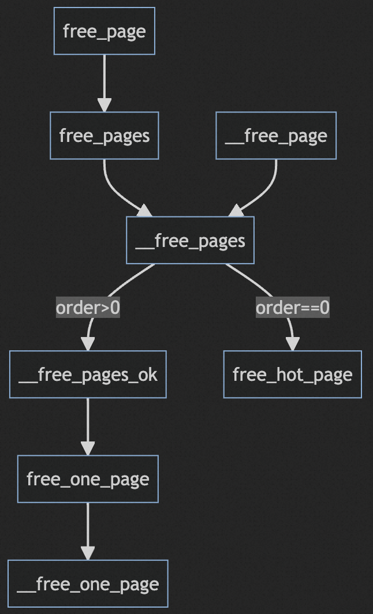

# 伙伴系统API-内存释放



`free_page`和`free_pages`以虚拟地址为参数，`__free_page`和`__free_pages`以page指针为参数，`virt_to_page`实现虚拟地址到page指针的转化。

最终伙伴系统的入口函数为`__free_pages`。

## __free_pages

`__free_pages`接受page指针和order两个参数，指定释放的连续page的第一个page指针和分配阶。`put_page_testzero`会检查引用计数是否正常，确保没有其他用户仍然在使用该page以后才会真正释放该内存块，否则只是将引用计数减.

如果释放的是单个page，会将该page作为热页放入冷热链表中。
释放连续page会调用`__free_pages_ok`进行一些安全检查后调用`free_one_page-->__free_one_page`返回pages给伙伴系统。

```c
void __free_pages(struct page *page, unsigned int order)
{
    if (put_page_testzero(page)) {
        if (order == 0)
            free_hot_page(page);
        else
            __free_pages_ok(page, order);
    }
}
```

`__free_one_page`中`PageCompound & destroy_compound_page`与复合页的释放相关。后续单独写。

`__free_one_page`并不只释放了一个page，而是释放了多个连续内存页，伙伴系统的page释放会有可能多次触发伙伴的合并。`__page_find_buddy`会按照page idx和order计算出对应的buddy的idx。

`page_is_buddy`会检查buddy是否有效，包括是否位于空洞、是否处于伙伴系统中、分配阶是否相同、是否处于同一个zone等等。

如果是有效伙伴则将两个内存块合并为高一阶的内存块，并进入下一次的循环。

关于查找伙伴的idx，计算合并后的page的idx等计算的细节这里就不展开了。

```c
static inline void __free_one_page(struct page *page,
        struct zone *zone, unsigned int order)
{
    unsigned long page_idx;
    int order_size = 1 << order;
    int migratetype = get_pageblock_migratetype(page);
    
    // 复合页相关
    if (unlikely(PageCompound(page)))
        destroy_compound_page(page, order);

    page_idx = page_to_pfn(page) & ((1 << MAX_ORDER) - 1);

    VM_BUG_ON(page_idx & (order_size - 1));
    VM_BUG_ON(bad_range(zone, page));

    // 连续合并
    __mod_zone_page_state(zone, NR_FREE_PAGES, order_size);
    while (order < MAX_ORDER-1) {
        unsigned long combined_idx;
        struct page *buddy;

        // 查找伙伴
        buddy = __page_find_buddy(page, page_idx, order);

        // 检查能否合并
        if (!page_is_buddy(page, buddy, order))
            break;  /* Move the buddy up one level. */

        // 合并
        list_del(&buddy->lru);
        zone->free_area[order].nr_free--;
        rmv_page_order(buddy);
        combined_idx = __find_combined_index(page_idx, order);
        page = page + (combined_idx - page_idx);
        page_idx = combined_idx;
        order++;
    }
    set_page_order(page, order);
    list_add(&page->lru,
        &zone->free_area[order].free_list[migratetype]);
    zone->free_area[order].nr_free++;
}
```
