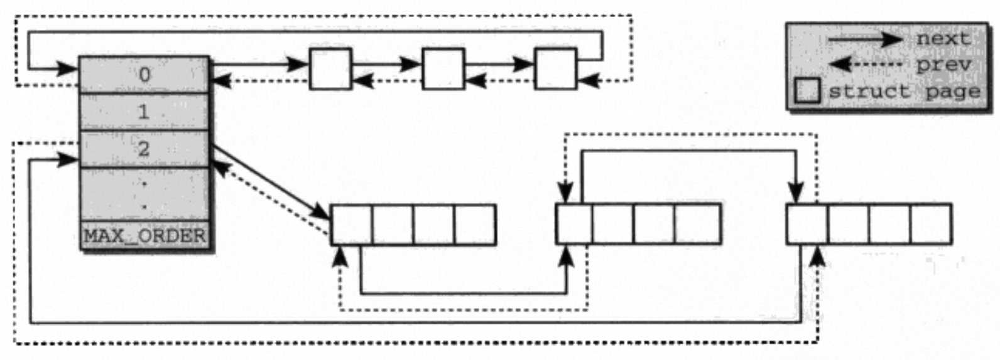

# 伙伴系统

Linux内存管理的精华部分，所有的内存域zone的囊括的pages都是用伙伴系统进行管理。伙伴系统保障了内存分配的速度和效率，同时思想又相当简单。

## 伙伴系统结构

在zone中有成员`free_area`是伙伴系统的实现部分，`free_area`是一个`struct free_area`数组。

每一个`struct free_area`管理了一组不同迁移类型的自由链表。迁移类型和减少内存碎片相关这里先忽略，可以视为管理了一个自由链表。自由链表中管理着大小相同的内存块，每个内存块由固定数目的连续page组成，内存块的大小和`struct free_area`在数组中的偏移有关，偏移代表了内存块的分配阶。`nr_free`表示自由链表中的内存块个数。因此每个自由链表管理的pages总数为`nr_free * (2 ^ order)`。

```c
struct zone {
    struct free_area free_area[MAX_ORDER];
}

struct free_area {
    struct list_head	free_list[MIGRATE_TYPES];
    unsigned long		nr_free;
};

```

`MAX_ORDER`表示系统支持的最大分配阶，通常情况下是11，表示伙伴系统支持分配的最大内存块为`2^10=1024`pages。在一些特定系统架构下该值也可以被修改。

```c
#ifndef CONFIG_FORCE_MAX_ZONEORDER
#define MAX_ORDER 11
#else
#define MAX_ORDER CONFIG_FORCE_MAX_ZONEORDER
#endif
#define MAX_ORDER_NR_PAGES (1 << (MAX_ORDER - 1))
```

一个伙伴系统的内存组织方式如下图所示。伙伴系统的内存块之间不一定是相邻的，由于内存的分配较大的内存块会被切分成多个较小的内存块放入对应的自由链表中。可以根据内存块的地址推算出伙伴的地址，当内存释放时可以检查伙伴是否也处于空闲状态从而触发合并。
