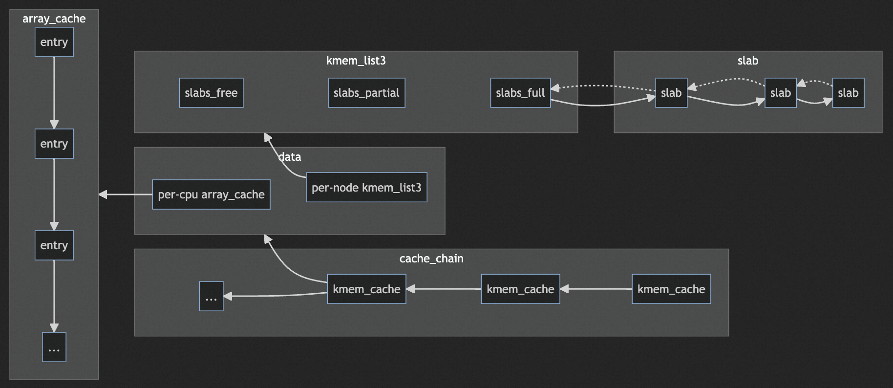
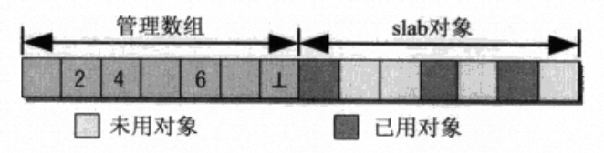
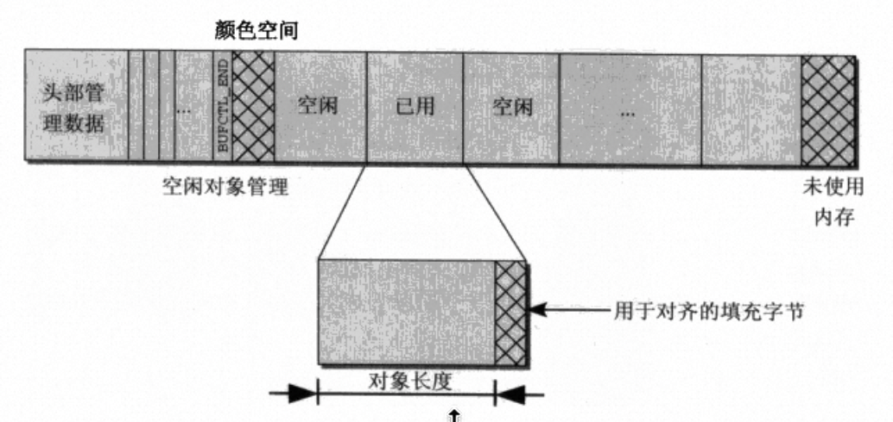
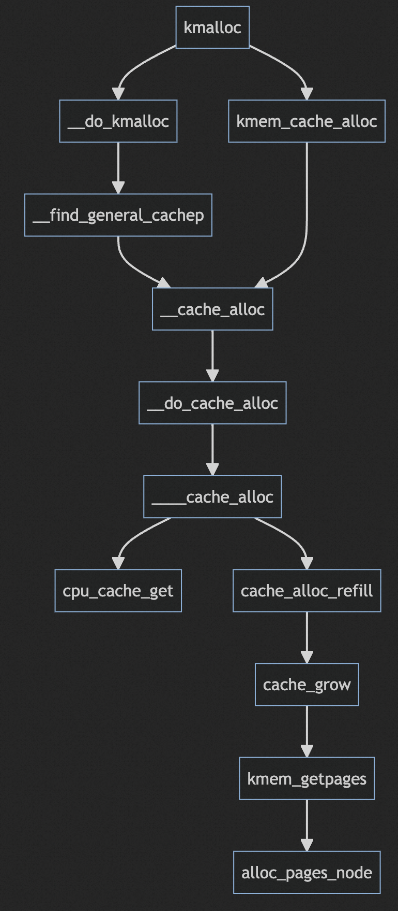

# slab

slab分配器从伙伴系统获取页帧进行管理，对外为一些固定size的小内存块和特定内核数据结构提供缓存和分配。

slab分配器为的是满足内核中小内存块的分配需求，毕竟伙伴系统的内存分配以page为单位实在太大了。

使用slab带来以下几个好处:

- 减少了伙伴系统的访问次数，小内存的分配在slab分析器中就可以完成分配，释放的小内存也会回到slab分配器中，并不返回给伙伴系统。加快了分配和释放速度，同时提高了分配的内存在cache中驻留的概率。
- 减少伙伴系统操作污染cpu的数据和指令cache。
- 数据如果直接存储在伙伴系统提供的页中会出现对象地址经常处于二的幂次方附近，造成某些cache line成为热点，cache line存在不均衡。slab提供了着色机制，以实现对象在cache line分布均匀。

## slob & slab & slub

slab分配器存在两个问题，在嵌入式系统上slab分配器的代码量和逻辑过于复杂，在超大计算机系统上slab分配器所需要的元数据会占用大量的内存。因此为了满足这两种场景的小内存分配需求内核提供了slob和slub分配器。

- slob: 使用最先适配优先算法+单链表实现，以满足代码量小+简单这个需求。
- slub: 为了减少元数据的空间占用，slub在`struct page`中的一些未使用的字段中存放信息，虽然增加了复杂性，但是确实能够在大型计算机上提供更好的性能。

虽然在实现上三种分配器存在区别，但是在对外提供的接口上却完全一致。

## slab使用接口

slab提供两种服务，第一种以`kmalloc&kfree`为入口，分配指定size的小内存块。第二种提供特定类型的对象缓存服务，但是这种使用方式需要手动创建缓存，相关API有
`kmem_cache_create`、`kmem_cache_alloc`、`kmem_cache_free`。

通过`cat /proc/slvbinfo`查看slab信息。

```c
[sudo] password for weizhen.zt: 
slabinfo - version: 2.1
# name            <active_objs> <num_objs> <objsize> <objperslab> <pagesperslab> : tunables <limit> <batchcount> <sharedfactor> : slabdata <active_slabs> <num_slabs> <sharedavail>
kcopyd_job             0      0   3312    9    8 : tunables    0    0    0 : slabdata      0      0      0
io                     0      0     64   64    1 : tunables    0    0    0 : slabdata      0      0      0
dm_uevent              0      0   2632   12    8 : tunables    0    0    0 : slabdata      0      0      0
dm_old_clone_request      0      0    320   25    2 : tunables    0    0    0 : slabdata      0      0      0
dm_rq_target_io        0      0    120   34    1 : tunables    0    0    0 : slabdata      0      0      0
                                                    ...
kmalloc-8192         122    140   8192    4    8 : tunables    0    0    0 : slabdata     35     35      0
kmalloc-4096         746    760   4096    8    8 : tunables    0    0    0 : slabdata     95     95      0
kmalloc-2048         906   1008   2048   16    8 : tunables    0    0    0 : slabdata     63     63      0
kmalloc-1024        3089   3472   1024   16    4 : tunables    0    0    0 : slabdata    217    217      0
                                                    ...
kmalloc-8           4608   4608      8  512    1 : tunables    0    0    0 : slabdata      9      9      0
kmem_cache_node      384    384     64   64    1 : tunables    0    0    0 : slabdata      6      6      0
kmem_cache           231    231    384   21    2 : tunables    0    0    0 : slabdata     11     11      0
```

`kmalloc`就会在命名为`kmalloc-size`中的slab分配器中分配内存块。而其他命名的slab分配器则是对应的一些内核对象slab缓存。

## slab设计



全局的`cache_chain`链表管理所有的缓存，每一个缓存用`struct kmem_cache`实现，负责某个size或者某个特定内核结构体的分配和释放。

每个`kmem_cache`中有两个关键机制，`array_cache`是一个栈，并且是一个per-cpu的数据结构，其思想和冷热链表很像，就是为了提高满足每个cpu上进行内存的分配释放时的速度，冷热链表避免了访问伙伴系统，`array_cache`则是避免了操作slab。同时这两种机制设计为per-cpu的能够提高CPU的cache的命中率，因为内存对象释放后又再次被分配其内容在cache中依然可能有效。

`struct kmem_list3`则负责管理从伙伴系统分配的页帧以及页帧内的对象。`kmem_list3`是一个per-node的数据结构，毕竟跨node分配内存会带来性能损失，对于不同node上的缓存对象还是需要做区分。每个`kmem_list3`和其名字一样包含三个链表`slabs_free`、`slabs_partial`、`slabs_full`分别对应空闲、部分分配以及全分配。分配时会优先分配partial分配的slab。

每一个slab分配器都由一个头部的管理数据+slab对象数据构成，头部的管理数据可能和slab对象数据存放在一起，也有可能单独存放在`kmalloc`分配小内存块中，不管哪种方式头部管理数据都可以通过指针找到slab对象数据区。



管理数据中的管理数组通过一个位图对应所有的slab对象，位图中的每一个位是一个`kmem_bufctl_t（unsiged int）`，记录当前空闲对象的下一个空闲对象的下标。通过阅读源码，每个空闲对象的下一个空闲对象的下标不一定是递增的。

比如当前slab中记录的空闲对象的下标（`slab->free`）是4，此时归还给slab分配器一个对象其下标为6，此时更新`slab->free`为6，并且对象6的下一个空闲对象下标为4。（和链表的头插法很像，只是形式上使用的不是地址指针）。

此外在slab对象区还存在着色机制（让slab内的对象整体产生一定的偏移）、对齐机制（每个小对象会补充一定字节以满足对齐需求）。



着色机制用以均衡cache line使用，提高cache性能。对齐机制也是类似，提高内存对象的访问速度，减少内存跨cache line的情况。

## slab API分析

### slab初始化

内核初始化时会出现伙伴系统已经可用但是slab分配器还未启动的情况，此时是无法调用`kmalloc`分配小内存块的，但是slab机制相关数据存放又需要使用slab分配器来进行分配，这就陷入了一个互相依赖的局面。为了解决这个问题，slab分配器的初始化操作由`kmem_cache_init`来完成。

内核中所有的`kmem_cache`都在链表`cache_chain`中，初始化slab分配器只需要手动初始化一个`kmem_cache`数据结构，并对其中的`array_cache`、`kmem_list3`做好初始化即可，但是这些数据无法使用slab分配器进行分配，在内核启动时使用静态数据临时使用，将初始化好的`kmem_cache`加入`cache_chain`以后就可以使用`kmem_cache_create`完成其他`kmem_cache`的创建。这个最初的`kmem_cache`命名为是`cache_cache`。

slab不论是小内存块的分配还是固定内核数据结构的分配都使用相同的机制，但是在使用方式上存在一定区别。

分配小块内存可以通过`kmalloc`，指定希望分配的字节数就足够了，剩下的交给内核的slab分配器完成。

而固定类型的内核数据结构一般需要手动调用`kmem_cache_create`创建一个`kmem_cache`缓存，然后使用`kmem_cache_alloc`从指定`kmem_cache`实例中进行分配。

### slab创建

创建`kmem_cache`的函数为`kmem_cache_create`。只需要指定`kmem_cache`的名字、对象尺寸、对齐方式、Slab的flag以及构造函数就可以完成创建。创建过程完成了以下几件事：

- 计算slab的分配阶、对齐值、着色的偏移、对象的大小和个数等等信息
- 分配相应的结构体并初始化
- 加入`cache_chain`

比较迷惑性的是，**`kmem_cache_create`并不从伙伴系统申请内存**，这个操作会延迟到第一次从`kmem_cache`中分配缓存对象时触发。

```c
struct kmem_cache *
kmem_cache_create (const char *name, size_t size, size_t align,
    unsigned long flags,
    void (*ctor)(struct kmem_cache *, void *));
```

### slab内存分配



`kmalloc`如果分配的size正好是内核已经存在的size缓存，此时直接将对应的`kmem_cache`作为参数调用`kmem_cache_alloc`分配。但如果是一个一般size的内存块，此时会通过`__find_general_cachep`找到一个适合大小的`kmem_cache`去分配。

最后所有的分配都会落到`__cache_alloc`上。分配有两种路径，第一种直接从`per-cpu`的`array_cache`上分配。如果缓存中没有尝试从slab中查找缓存对象放入`array_cache`中后再次进行分配。

如果slab中的对象也不足了，`cache_grow`则会补充一定的`pgae`创建新的slab。可以看到在`cache_grow`中才会真正向伙伴系统申请页帧。

### slab内存释放

`kmalloc`的返回值为虚拟地址，那么释放该块内存时内核是如何知道内存块的大小和内存块属于的`kmem_cache`呢？

slab获取的页帧都来自于NORAML内存域，虚拟地址都属于直接映射区，因此可以直接通过虚拟地址映射到物理地址，将物理地址转化为`pfn`，从而找到对应的页帧的`struct page`。

在向伙伴系统申请页帧时slab选择的是复合页，复合页的tail page可以通过`first page`指针找到head page，而在head_page中的`lru.next`指针中存放了`kmem_cache`的地址。这个地址是slab在申请内存时设置好的。

在`cache_grow`中调用`kmem_getpages`成功申请到复合页以后，`slab_map_pages`会对所有的page调用`page_set_cache`和`page_set_slab`，设置`lru.prev`为slab管理头部的`struct slab`指针，设置`lru.next`为`kmem_cache`指针。

```c
static int cache_grow(struct kmem_cache *cachep,
        gfp_t flags, int nodeid, void *objp)
{
    ...
    if (!objp)
        objp = kmem_getpages(cachep, local_flags, nodeid);
    ...
    slab_map_pages(cachep, slabp, objp);
}

static void slab_map_pages(struct kmem_cache *cache, struct slab *slab,
               void *addr)
{
    ...
    do {
        page_set_cache(page, cache);
        page_set_slab(page, slab);
        page++;
    } while (--nr_pages);
}

```

之前了解过复合页设计的同学知道第一个tail page中`lru.next`和`lru.prev`存放了`order`和析构函数`dtor`，在这里似乎被完全覆盖了。这是因为，后续归还复合页给伙伴系统时在`kmem_cache`的`gfp_order`中已经有该信息，不再需要`order`了；有无析构函数也没关系了，因为复合页的析构函数主要就是从第一个tail page中获取了其`order`信息，以保证所有的page都被一起释放，slab分配器也保证了这一点。

剩下的就交给`__cache_free`。