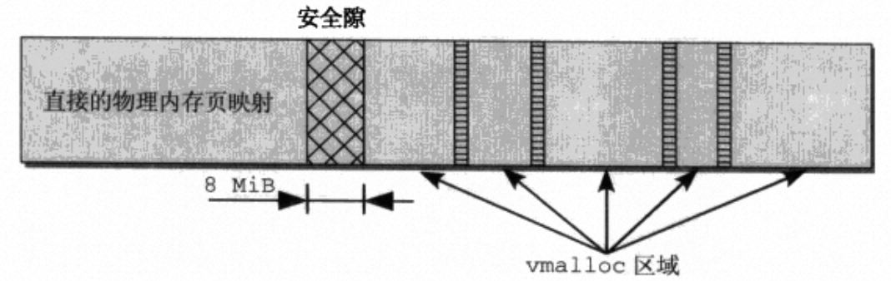
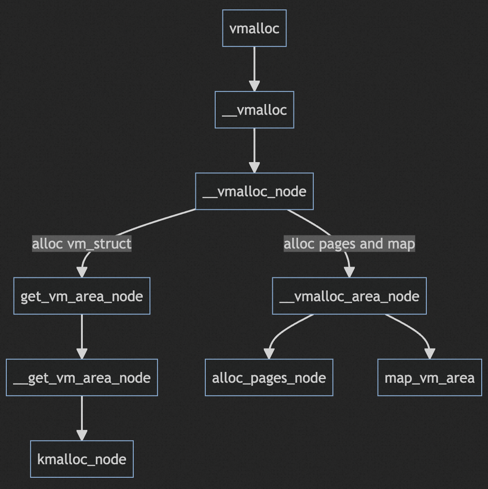
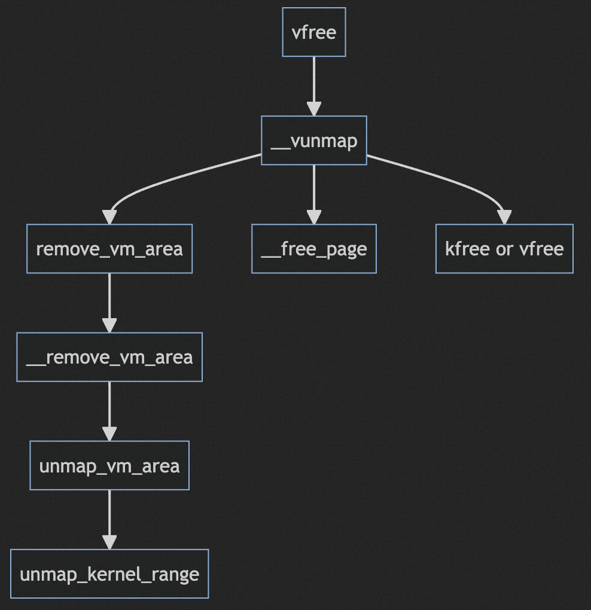

# vmalloc

我们已经了解了伙伴系统的管理机制，以及伙伴系统提供的内存分配API，伙伴系统提供了以分配阶为参数的连续page的分配接口。但是在内核中并不是在所有时候都要求分配的内存在物理上连续，只需要在逻辑上连续即可。

随着系统的使用，分配连续的大的内存块由于内存碎片是有可能失败的。因此分配逻辑连续物理上不连续的内存块也是一种需求，`vmalloc`函数实现了分配逻辑上连续但是物理上不要求连续的内存。

`vmalloc`以字节数为参数分配内存，这和用户态的`malloc`很相似。所以有可能引起混淆，我们知道`malloc`作为一个C库函数分配小块内存实际上会申请大的内存块放入内存池进行管理，后续再分配内存时就不需要向内核提出分配申请，在缓冲池中就可以完成分配，减少进入内核态的次数。而`vmalloc`每次调都会从伙伴系统分配内存，并且分配是以page为单位的。分配几字节的内存也会导致分配一整个page，多余的内存也不能被访问，会出现大量的浪费。因此需要搞清楚`vmalloc`的使用场景，**`vmalloc`用于分配大的逻辑上连续的内存，分配小的内存时应该使用`kmalloc`**，这个与slab相关后续再写.

```c
void *vmalloc(unsigned long size)
{
    return __vmalloc(size, GFP_KERNEL | __GFP_HIGHMEM, PAGE_KERNEL);
}
```

在内核地址空间中低地址部分采取的是直接映射的方式，通过虚拟地址减去地址偏移就能得到物理地址，`vmalloc`区域和直接映射区域之间通过8MB的安全间隙隔开，`vmalloc`在每次调用时都会找到一片连续的内核虚拟地址空间满足分配要求，之后分配物理内存并建立页表映射。



因此，vmalloc分配内存有三步：

1. 找到空闲的连续的虚拟地址
2. 分配n个pages满足size
3. 在页表中建立起虚拟地址到物理地址的映射

因此，为了方便查找满足需求的虚拟地址，并记录`vmalloc`区域需要有对应的数据结构。在内核中由`struct vm_struct`实现。

```c
struct vm_struct {
    /* keep next,addr,size together to speedup lookups */
    struct vm_struct *next; // next vmalloc area
    void   *addr; // 虚拟地址
    unsigned long  size; // vmalloc area 大小
    unsigned long  flags; 
    struct page  **pages; // 不连续的page指针数组
    unsigned int  nr_pages; // page个数
    unsigned long  phys_addr; // ioremap相关的物理地址
};
```

所有的`vma_struct`通过单链表进行管理，flags中存放vmalloc区域的类型。

- `VM_ALLOC`: 由vmalloc分配
- `VM_MAP`: 通过vmap()将已有的pages映射到虚拟地址空间
- `VM_IOREMAP`: IO地址空间映射相关，实现和特定体系结实现有关系
- `VM_VPAGES`: 区域用于存放vmalloc过程中存放pages指针对应空间。

`vmalloc`有关的只有`VM_ALLOC`，`vmalloc`分配的`vm_struct`会在flags中标记`VM_ALLOC`。

## vmalloc实现

`vmalloc`的实现细节我觉得并不是很重要，比如边界的处理、有效地址范围的查找等等。更重要的是`vmalloc`的流程。



`vmalloc`最后会进入`__vmalloc_node`。

首先调用`get_vm_area_node`，该函数查找有效的连续虚拟地址空间，如果找到就分配一个`struct vm_struct`并初始化`addr`、`size`、`flags`、`next`等成员。需要注意的是分配`struct vm_struct`的动作由`kmalloc`完成，也就是交给slab分配器。

第二步，调用`__vmalloc_area_node`做了三件事。

第一件分配`pages`指针需要的空间，`pages`是`vm_struct`中记录所有`page*`的数组。`pages`空间的分配和`nr_pages`有关，如果需要分配的页帧很多，对应的指针数组大小不小于PAGE_SIZE，此时就会调用`__vmalloc_node`，这个函数刚好又是调用`__vmalloc_area_node`的函数，但是不需要担心会引起循环调用，毕竟分配的空间会越来越小，此外为了后续可以正常释放该块内存需要再加一个标记`VM_VPAGES`，表示`pages`空间由`__vmalloc_node`分配。如果小于PAGE_SIZE则通过`kmalloc`分配空间。

第二件，对`pages`中的每一个指针依次分配一个page并让指针指向该page。分配page的操作由`alloc_pages_node`完成，这部分内容其他文章已经提过，最后会通过per-cpu的冷热链表完成分配。

第三件，建立起虚拟地址空间和物理地址page的映射，由`map_vm_area`完成。涉及到页目录、页表项的分配和赋值。

## vfree

`vfree`从逻辑上说只是`vmalloc`的逆操作，实现上调用了`__vunmap`，该函数有一个`deallocate_pages`表示是否释放内存，否则就只取消映射关系。对于`vfree`来说自然是要释放内存。

- `remove_vm_area`: 首先查找到地址对应的`vm_struct`从链表中删除并调用`kfree`释放该对象，然后取消地址映射。
- `__free_page`: 释放`pages`中的每一个page，注意释放`vm_struct`的时候并没有释放`pages`指向的空间，该空间是单独分配的。
- `kfree` or `vfree`: `pages`指针数组由`__vmalloc_node`或者`kmalloc_node`分配，按照flags是否标记`VM_VPAGES`区分。


