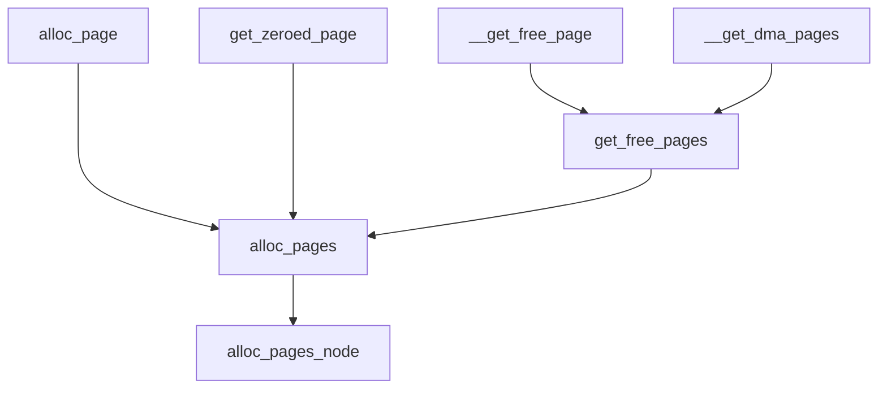
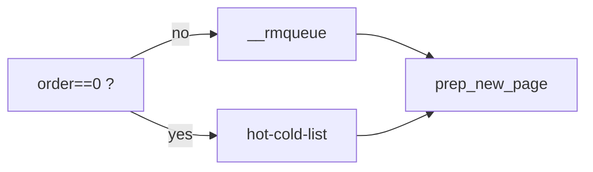
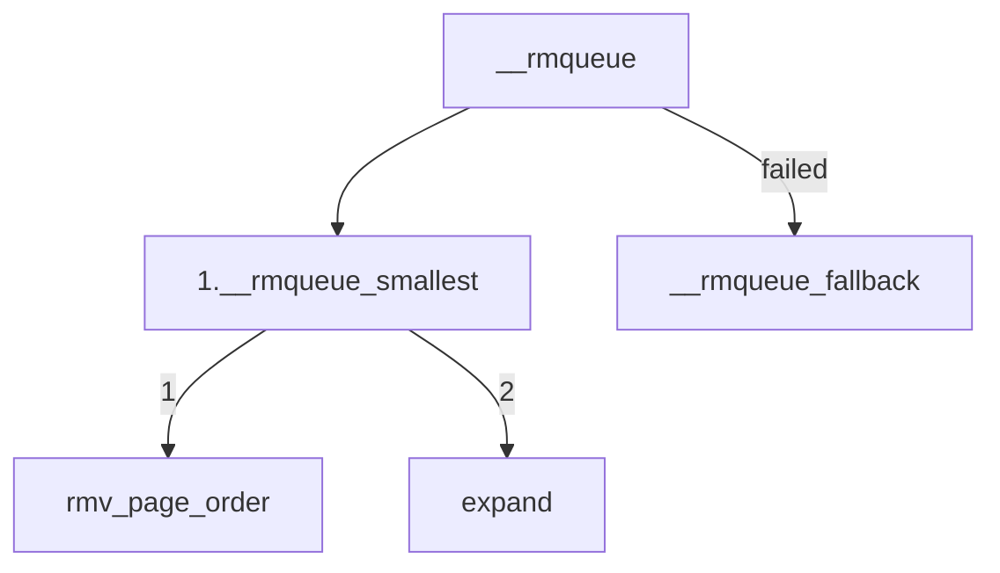
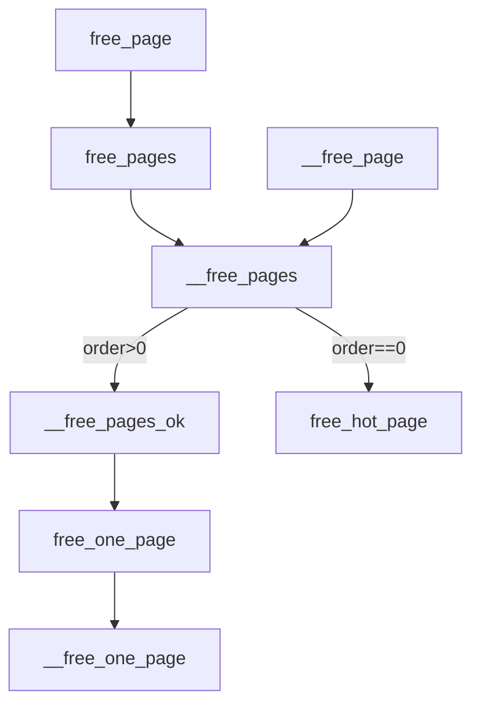
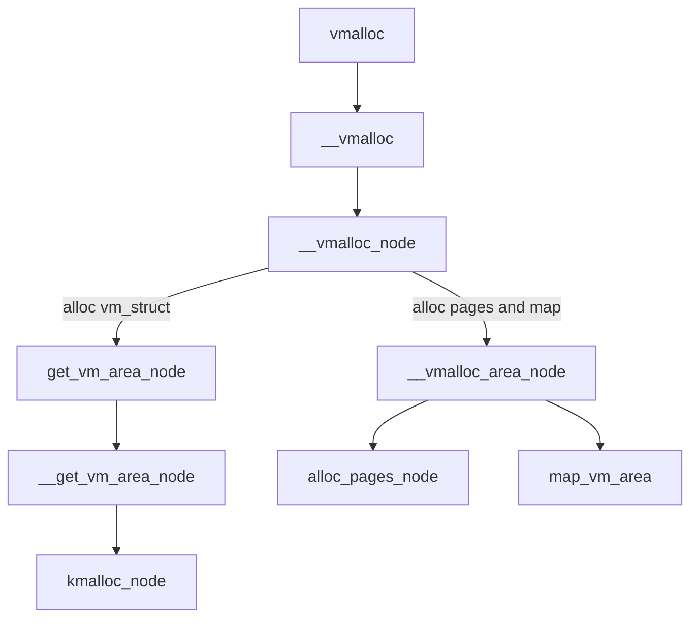

--------------------------------------

-----------------------------------

-------------------------------------

----------------------------------------------

----------------------------

:::mermaid

graph

A[vfree]
B[__vunmap]
C[remove_vm_area]
D[__free_page]
E[kfree or vfree]
F[__remove_vm_area]
G[unmap_vm_area]
H[unmap_kernel_range]

A --> B --> C --> F --> G --> H
B --> D
B --> E

:::
--------------------------
:::mermaid

flowchart LR

A[直接映射]
B[vmalloc]
C[持久映射]
D[固定映射]

A -.- B -.- C -.- D

:::