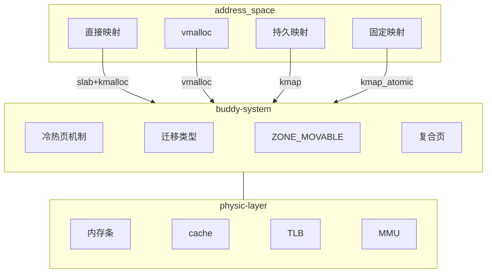

# 内存管理

内存管理相关的知识以文章的形式沉淀下来，这里作为一个目录，管理成果和TODO。

## 物理内存管理

1. NUMA架构
2. Page
3. 冷热页机制
4. 伙伴系统
5. 迁移类型
6. ZONE_MOVEABLE
7. 伙伴系统API-概述
8. 伙伴系统API-内存分配
9. 伙伴系统API-内存释放
10. 复合页机制

## 内核态内存使用

1. 内核地址空间
2. vmalloc  
3. 直接映射与固定映射
4. kmalloc与slab分配器
5. 内核的缺页异常
6. 内核页表

## 用户态内存使用

1. 用户地址空间

## 硬件

1. 页表+MMU
2. 内存管理（十三）TLB和cache
