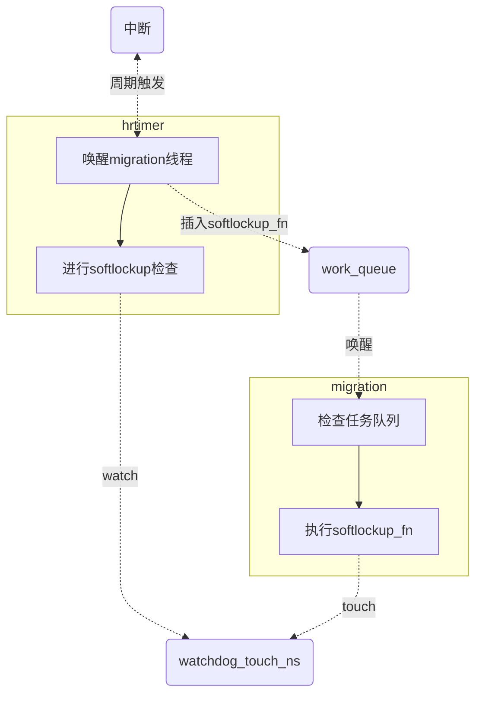

<!-- Softlockup&Hardlockup检测机制 -->
## 前言 

`Linux`自身具备一定的异常检测机制，`softlockup`和`hardlockup`是典型的两种，`softlockup`检测内核是否出现了长时间不调度其他任务执行的异常情况。`hardlockup`则更进一步检测内核是否出现了长时间不响应中断的异常情况。`softlockup`和`hardlockup`的定义如下：
> A 'softlockup' is defined as a bug that causes the kernel to loop in kernel mode for more than 20 seconds, without giving other tasks a chance to run.
> A 'hardlockup' is defined as a bug that causes the CPU to loop in kernel mode for more than 10 seconds, without letting other interrupts have a chance to run.

这两种异常检测机制具有一定的相似性，因此设计的思路是一体的。但是在检测的目标上又存在差异，所以实现上有一些不同。

## watchdog

`watchdog`机制是一种常见的`keep-alive`方法，其原理是周期性的执行一个任务检查某个值是否已经更新，这个检查过程称之为`watch dog`，而更新值的动作被称为`touch dog`。
`softlockup`和`hardlockup`机制针对的是单核的检测，因此对于每一个CPU内核都有两个`dog`分别对应`softlockup`和`hqrdlockup`。

- `softlockup`的`dog`是`watchdog_touch_ts`，记录了上一次`touch dog`的时间戳。
- `hardlockup`的`dog`是`hrtimer_interrupts`，记录`hrtimer`高精度定时器中断发生的次数。

```c
static DEFINE_PER_CPU(unsigned long, watchdog_touch_ts);
static DEFINE_PER_CPU(unsigned long, hrtimer_interrupts);
```

在内核中存在三类程序可以被执行的，按照优先级从高到底分别是`NMI`处理函数、`Normal Interrupt`处理函数和`Task`。从本质上来说，`softlockup`检测的是`NMI`和`Normal Interrupt`正常响应的情况下，`Task`之间的调度能否正常发生，`hardlockup`检测的是`NMI`正常响应的情况下，`Normal Interrupt`能否正常响应和被调度执行。

**Note**：`NMI`作为不可屏蔽中断，保证了任何条件下都能执行。


### softlockup

为了满足检测目标，`softlockup`需要有一个内核线程能够`touch dog`（更新`watchdog_touch_ns`），并且该线程必须在`softlockup`检查时启动。同时还需要一个周期定时器任务，检查`watchdog_touch_ts`与`now`之间的距离是否超过门限，如果超过就认为发生了`softlockup`。默认超时时长`softlockup_thresh`是`20s(2 * watchdog_thresh)`。`softlockup`检查在`is_softlockup`（`kernel/watchdog.c`）中实现：

```c
static int is_softlockup(unsigned long touch_ts)
{
    unsigned long now = get_timestamp();

    if ((watchdog_enabled & SOFT_WATCHDOG_ENABLED) && watchdog_thresh){
        /* Warn about unreasonable delays. */
        if (time_after(now, touch_ts + get_softlockup_thresh()))
            return now - touch_ts;
    }
    return 0;
}
```

为了保证`softlockup`的有效性，更新`watchdog_touch_ns`的`Task`必须拥有最高的任务优先级，否则即使正常发生调度低优先级任务也无法及时更新时间戳。因此在老的内核版本更新`watch_touch_ns`的`Task`是`[watchdog/x]`，随着`STOP`调度类（比实时任务的优先级更高）的引入，更新线程变成了`[migration/x]`。

`migration`线程作为内核中优先级最高的线程，负责内核热插拔、停止`CPU`运行等工作。`migration`线程管理了一个`work_queue`，当有任务需要执行时`migration`就会进入`RUNNABLE`状态等待调度，一旦发生调度`migration`一定能够拿到执行权更新`watchdog_touch_ns`，保证了`softlockup`检查的有效性。

而检查`softlockup`的任务必须交给优先级更高的中断，内核中的`hrtimer`可以周期性的触发中断，在`hrtimer`的处理函数`watchdog_timer_fn`中可以检查`[migration/x]`是否正常更新了`watchdog_touch_ns`，`hrtimer`定时器的触发周期是`softlockup_thresh / 5`（默认值是`4s`）。

`softlockup`检查机制的整体流程如下：
- `hrtimer`周期性的触发执行中断处理程序`watchdog_timer_fn`：
  1. 向`work_queue`插入任务`softlockup_fn`
  2. 检查`watchdog_touch_ns`是否异常
  3. 睡眠，等待下一次触发
- `migration`线程
  1. 被`work_queue`唤醒
  2. 检查队列，取出`softlockup_fn`执行
  3. 更新`watchdog_touch_ns`
  4. `work_queue`为空，进入睡眠

如果`migration`线程在任务队列中长时间没有被调度执行（核上的任务长时间的占据了`CPU`），则说明出现了`softlockup`异常，需要对现场进行`dump`。





<center>softlockup检查机制的整体流程</center>

### hardlockup
`hardlockup`的检测机制和`softlockup`类似，但是检测的目标不同，`hardlockup`检测的是普通中断长时间不响应，`hardlockup`的检查在`kernel/watchdog.c`的`is_hardlockup`中实现，判断`hrtimer_interrupts`是否在进行递增，如果没有递增则认为发生了`hardlockup`。

```c
/* watchdog detector functions */
bool is_hardlockup(void)
{
    unsigned long hrint = __this_cpu_read(hrtimer_interrupts);

    if (__this_cpu_read(hrtimer_interrupts_saved) == hrint)
        return true;

    __this_cpu_write(hrtimer_interrupts_saved, hrint);
    return false;
}
```

`hardlockup`的默认超时时长`watchdog_thresh`是`10s`，是`softlockup`的一半。和`softlockup`不一样的是`hrtimer_interrupts`没有记录时间戳信息，如何判断是否超时呢？
`Linux`使用的是周期性的`NMI`。基于`perf subsystem`的`cycles`事件，`perf`的`counter`可以设置溢出阈值，当`perf event`的发生次数达到阈值时会触发一次`NMI`中断，同时`cycles`与时间存在一定的关系，具体可以看`kernel/watchdog.c`的`watchdog_nmi_enable`函数。顺着调用链可以看到`hardlockup_detector_event_create`函数（在`kernel/watchdog_hld.c`中）调用了`hw_nmi_get_sample_period`（在`arch/x86/kernel/apic/hw_nmi.c`中），这个函数是一个体系结构相关的函数，在这里获取了`cycles`溢出的`NMI`中断的触发周期`watchdog_thresh`。

```c
u64 hw_nmi_get_sample_period(int watchdog_thresh)
{
    return (u64)(cpu_khz) * 1000 * watchdog_thresh;
}
```

周期性的`NMI`触发执行回调函数进行`watch`（检查`hrtimer_interrupts`是否递增），`hrtimer`则负责定期的`touch`（增加`hrtimer_interrupts`）。

`hardlockup`和`softlockup`之间通过`hrtimer`产生了交集，所以`hrtiemr`的处理函数不仅要`watch watchdog_touch_ts`进行`softlockup`检查，同时还需要`touch hrtimer_interrupts`更新中断触发次数。

## watchdog相关配置接口

启用或禁用`watchdog`:
- `/proc/sys/kernel/soft_watchdog`：启用或禁用`softlockup`
- `/proc/sys/kernel/nmi_watchdog`：启用或禁用`hardlockup`
- `/proc/sys/kernel/watchdog`: 同时启用或禁用`softlockup` 和 `hardlockup`，读取的返回值是`soft_watchdog`和`nmi_watchdog`取或。

设置哪些`core`启用`watchdog`:
- `/proc/sys/kernel/watchdog_cpumask`

设置`lockup`超时门限：
- `/proc/sys/kernel/watchdog_thresh`:设置`NMI watchdog`超时门限，`softlockup_thresh`是`2 * watchdog_thresh`

设置超时的处理：
- `/proc/sys/kernel/hardlockup_panic`：出现`hardlockup`时是否`panic`

## 相关源码
### watchdog初始化

`watchdog_enable`（`kernel/watchdog.c`）执行流程：
1. 启动`hrtimer`
   - 设置`hrtimer`的中断处理函数`watchdog_timer_fn`
   - 设置定时器触发周期为`2 * watchdog_thresh / 5`
2. 创建`cycles perf event`：`watchdog_nmi_enable -> hardlockup_detector_perf_enable -> hardlockup_detector_event_create`
   - 设置NMI中断触发周期为`watchdog_thresh`
   - 设置中断处理函数`watchdog_overflow_callback`

```c
static void watchdog_enable(unsigned int cpu)
{   
    ...
    hrtimer_init(hrtimer, CLOCK_MONOTONIC, HRTIMER_MODE_REL_HARD);
    hrtimer->function = watchdog_timer_fn;
    hrtimer_start(hrtimer, ns_to_ktime(sample_period),
              HRTIMER_MODE_REL_PINNED_HARD);
    ...
    if (watchdog_enabled & NMI_WATCHDOG_ENABLED)
        watchdog_nmi_enable(cpu);
    ...
}
```

### hrtimer

`watchdog_timer_fn`（`kernel/watchdog.c`）执行流程：
1. 递增`hrtimer_interrupts`
2. 向`migration`线程的`work_queue`插入`softlockup_fn`，让`migration`进入调度队列
3. 检查`softlockup`

```c
/* watchdog kicker functions */
static enum hrtimer_restart watchdog_timer_fn(struct hrtimer *hrtimer)
{
    ...
    /* kick the hardlockup detector */
    watchdog_interrupt_count();
    ...
    /* kick the softlockup detector */
    if (completion_done(this_cpu_ptr(&softlockup_completion))) {
        reinit_completion(this_cpu_ptr(&softlockup_completion));
        stop_one_cpu_nowait(smp_processor_id(),
                softlockup_fn, NULL,
                this_cpu_ptr(&softlockup_stop_work));
    }
    duration = is_softlockup(touch_ts);
    if (unlikely(duration)) {
        ....
    }
    return HRTIMER_RESTART;
}
```

### cycles NMI

在`cycles`计数器溢出触发`NMI`回调函数`watchdog_overflow_callback`（`kerne/watchdog_hld.c`）中检查`hardlockup`。

```c
static void watchdog_overflow_callback(struct perf_event *event,
                       struct perf_sample_data *data,
                       struct pt_regs *regs)
{
    if (is_hardlockup()) {
        ....
    }
    ...
    return;
}
```

## References

[1] [lockup-watchdogs](https://www.kernel.org/doc/Documentation/lockup-watchdogs.txt?spm=ata.21736010.0.0.60dd60d4ZqBUmK&file=lockup-watchdogs.txt)