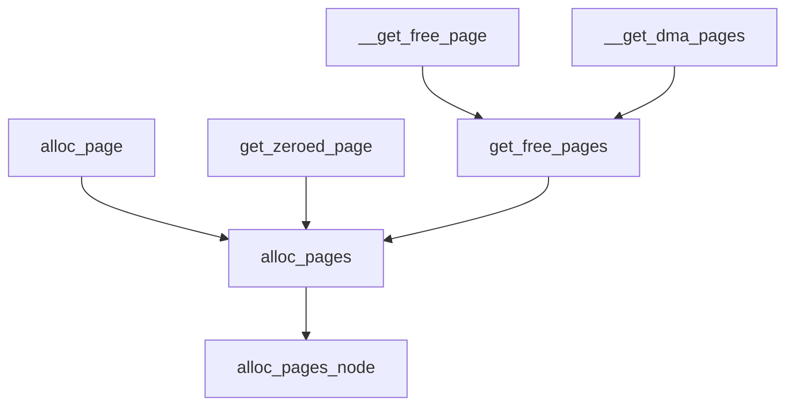

<!-- alloc_page  get_zeroed_page     __get_free_page__get_dma_pages
    \            /                   \                 /
     \          /                      get_free_pages
      \        /                     /
       \      /                     /
      alloc_pages    <-------------
          |
          |
          v
   alloc_pages_node -->

