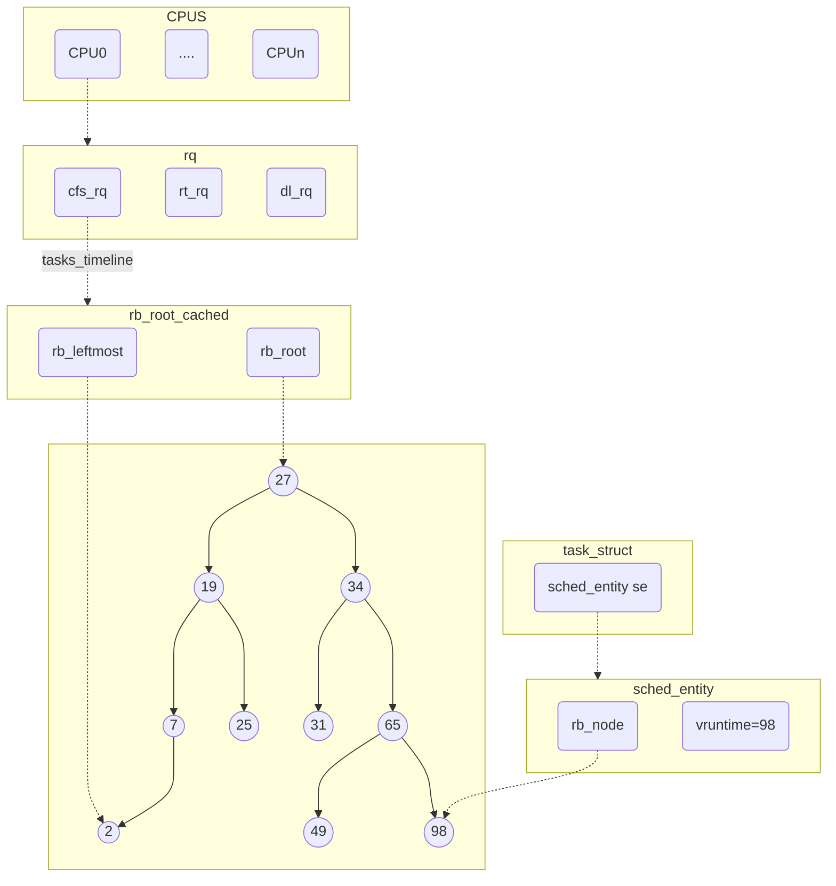

<!-- 设计理念与代码架构 -->
## 前言

本文对CFS的基础的设计理念以及在内核实现上的基本代码架构进行了分析，从宏观上梳理调度和CFS的脉络。本文所有的代码基于Linux 4.19。

## CFS的设计理念和目标

CFS（Completely Fair Scheduler）完全公平调度器，从字面上看定义的很清晰，首先CFS的本质是一个调度器，所谓调度就是决定CPU的执行权在每个时刻的归属，调度管理的对象就是CPU资源。所谓完全公平追求的是一种理想的多任务CPU模型，CPU资源能够平等分配给每一个任务，比如有两个任务，每个任务能够得到50%的CPU资源，但是这是一个不可能完成的任务，首先，对于CPU来说一个时刻只能有一个任务在执行，不存在并行执行；第二点，在执行的过程中不断地有任务的加入和退出。在这样的复杂场景下只能追求近似的完全公平。

## 设计中的关键点

CFS调度器在Linux 2.6中被引入，CFS在设计上有一些关键的点，提前了解可以有助于后续阅读源码：
1. 虚拟时间（`vruntime`）：在CFS中使用`vruntime`来表示一个task在该CPU上的运行时间，`vruntime`累计值的计算与任务的优先级（权重）以及runq中的任务数量有关。CFS的调度逻辑也很简单，当一个调度时机出现时选择当前runq中`vruntime`最少的任务获得CPU。`vruntime`可以说是CFS调度器的灵魂，通过`vruntime`CFS间接实现了任务优先级，高优先级能够得到更多的CPU时间。
2. runq的实现基于红黑树实现，从逻辑上说任何能实现虚拟时间排序的数据结构都是可以作为runq的，但是红黑树在内存、性能的综合考虑下表现最好，在查找、删除、插入等场景下性能表现稳定。
3. cgroup：支持按group来分配时间片，以组为单位划分CPU资源。

## CFS内核实现的相关数据结构

### 调度类

任何机制都是对数据的操作，在理解或者了解一项技术前需要先纵览它的设计架构。首先，在内核中CFS只是调度器中的一种，还有针对于实时系统的实时调度器，同时为了满足调度器的可拓展性，调度器被抽象为调度类（Scheduling Class），类似于C++中的虚基类只定义函数的类型，具体的实现交给真正的子类，CFS就是其子类之一。

`sched_class`定义了一个调度器应该具备的基本操作，CFS调度器的实现在`fair.c`中，`fair_sched_class`变量就是CFS的调度类对象，初始化了所有的函数指针。

```c
const struct sched_class fair_sched_class = {
    .next			= &idle_sched_class,
    .enqueue_task		= enqueue_task_fair,
    .dequeue_task		= dequeue_task_fair,
                    ....
    .update_curr		= update_curr_fair,
};
```
在`sched_class`中的`next`指针指向下一个调度类，所有的调度类按照优先级从高到低存放在单链表中。优先级从高到底依次是`stop_sched_class`、`dl_sched_class`、`rt_sched_class`、`fair_sched_class`以及`idle_sched_class`。不同的调度类实现了不同的调度策略，在本文中只需要关注`fair_sched_class`，但是需要清楚存在这样一个逻辑，调度时会优先选择高优先级调度器中的任务获取CPU执行权。


<center>调度类优先级</center>

### 就绪队列

在调度类中只定义了CFS的基本操作，这些函数的操作对象包括就绪队列和任务。在内核中就绪队列通过`struct rq`实现。`struct rq`是一个per-cpu的数据结构，可以看到`struct rq`下包含了`cfs`、`rt`、`dl`三个队列对应着三个不同的调度类。

**NOTE**：1. 不同调度类的就绪队列实现是不同的，与其策略相关。2. 每一个CPU上的就绪队列是独立的。

```c
struct rq {
    struct cfs_rq		cfs;
    struct rt_rq		rt;
    struct dl_rq		dl;
    ....
    struct task_struct	*curr; // 当前在运行的task
    struct task_struct	*idle; // idle task
    struct task_struct	*stop; // stop task	
};
```

这里存在一个问题，为什么调度类有五个只有三个就绪队列，因为stop和idle两个调度类只执行固定的进程，stop调度类用于`stop_machine.c`，stop线程的优先级高于所有的task，主要用于负载均衡、热插拔等场景强行停止cpu上执行的任务，这也是stop调度类的优先级最高的原因。idle调度类执行的是固定的idle线程。因此这两个调度类不需要就绪队列。


<center>CFS数据组织结构</center>

这里我们重点关注的是CFS的就绪队列`struct cfs_rq`。`cfs_rq`的核心作用就是存放调度实体，也就是上述的红黑树数据结构`struct rb_root_cached`。在内核中实现的红黑树有一点优化，在`rb_root_cached`中不仅存放了红黑树的根节点，还缓存了最小元素的节点指针，这样将访问最小元素的操作简化到O(1)。除此之外，内核中实现的红黑树是一个通用数据结构，具体的实现细节这里不详细说明，只需要明确通过`rb_leftmost`这个`struct rb_node`指针我们可以找到其对应的调度实体即可，然后通过调度实体`se`，可以找到其所属的`task_struct`，但是中间的转化会涉及一些编译器与指针的trick。

```c
struct cfs_rq {
    struct rb_root_cached	tasks_timeline;
    ...
}

struct rb_root_cached {
    struct rb_root rb_root;
    struct rb_node *rb_leftmost;
};
```

## 题外话

### 编译器与指针转化的trick

在内核中经常会有从一个结构体成员找到其所属结构体指针的操作，比如从红黑树的`rb_node`找到对应的`sched_entity`，以及从`sched_entity`找到对应的`task_struct`。

这里我先罗列出其实现结构。
```c
struct task_struct {
    ...
    struct sched_entity		se;
    ...
}

struct sched_entity {
    ...
    struct rb_node	run_node;
    ...
}
```

以从`sched_entity*`找到`task_struct`为例，其实现函数为`task_of`，在`task_of`中用到了一个关键的宏定义`container_of`。
```c
static inline struct task_struct *task_of(struct sched_entity *se)
{
	return container_of(se, struct task_struct, se);
}
```
`container_of`计算`type`结构体的`member`成员变量在结构体内的偏移，然后用`member`的指针减去偏移得到`type`的指针。
```c
#define container_of(ptr, type, member) \
    (type *)((char *)(ptr) - (char *) &((type *)0)->member)
```

以`task_of`为例。`container_of(se, struct task_struct, se)`展开后为`(struct task_struct *)((char *)(se) - (char *) &((struct task_struct *)0)->se)`，其中计算偏移的部分`(char *) &((struct task_struct *)0)->se`，这里利用将`NULL`指针转化为`(struct task_struct *)`然后取变量的方式得到结构体内部的变量偏移。将原始指针减去偏移自然得到了`struct task_struct *`的地址。
```c
container_of(se, struct task_struct, se)
// 展开后
(struct task_struct *)((char *)(se) - (char *) &((struct task_struct *)0)->se)
// 去掉最外层类型转化
(char *)(se) - (char *) &((struct task_struct *)0)->se
// 计算偏移的部分
(char *) &((struct task_struct *)0)->se
```

红黑树的通用性也是基于这个原理，其管理的真实对象只需要在结构体内添加一个`struct rb_node`变量，然后利用`container_of`这个宏就能访问到背后的真正对象，当然在转化前需要知道管理对象的真实类型。

## 总结

通过本篇文章应该能了解CFS的基本设计理念、内核的调度器设计框架以及CFS内核实现的基本框架。内核中的调度在每一个cpu上是独立的，每个cpu有自己就绪队列`struct rq`，`rq`内部按照调度类的需要分为`dl_rq`、`rt_rq`和`cfs_rq`。而管理这些就绪队列需要的操作集合定义在调度类中，内核中总共有五种调度类，CFS是其中的一种，每一种调度类实现了不同的调度策略。此外，`cfs_rq`的实现基于一种带缓存的红黑树数据结构。