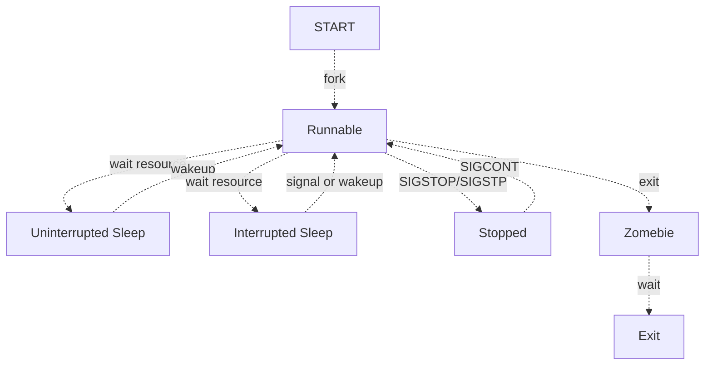

# task的生命周期

Linux内核调度就是管理CPU硬件资源，同时决定多任务系统的每一个task应该什么时候上CPU，上CPU运行多久的一个机制。因此调度的机制涉及到两个方面一个是task侧，一个是CPU侧，任务是被管理的对象之一，会随着调度和运行改变状态。因此从task的角度来理解调度机制我认为是一个比较合理的方向。

## Linux task状态变迁

首先在Linux系统中，一个task从创建到退出运行会经过一系列的task状态变化。Linux中进程状态常见有五种：

用户进程：
* R（Running or Runnable）：进程通过fork系统调用创建，新的进程会根据调度规则查看能否抢占当前任务，如果可以则获取CPU执行权，如果不可以则加入就绪任务队列，等待调度。
* D（Uninterrupted Sleep）和S（Interrupted Sleep）：当进程运行到需要等待资源就绪时，比如IO waiting或者等待网络请求，此时进程会主动让出CPU 并且进入睡眠状态。睡眠分为两种，一种是不可中断的睡眠，只能被资源就绪唤醒，一般出现在等待IO资源时，为的是避免和IO设备交互过程，被中断干扰（比如SIGINT）出现非预期的行为，此时会不响应信号。另一种是可中断的睡眠，在睡眠过程中可以响应信号从而被唤醒。
* T（Stopped）：在收到SIGSTOP信号时，进程会进入Stopped状态，并且信号无法忽略，该信号是可编程使用的。而SIGSTP通过Ctrl+Z触发，进程可以忽略该信号。 进入Stopped状态的进程，在收到SIGCONT信号可以恢复到R状态。
* Z（Zombie）：进程运行到exit后进入Zombie状态，此时进程不会继续执行了。但是进程的内核资源还没有被系统回收，需要parent进程调用wait或者waitpid接收子进程结束状态后才会完全抹除进程信息。

进程的状态流转

可以看到Runnable就是task状态的中转站，因此调度子系统最核心的部分就是管理Runbale task，也就是就绪队列管理。
  

